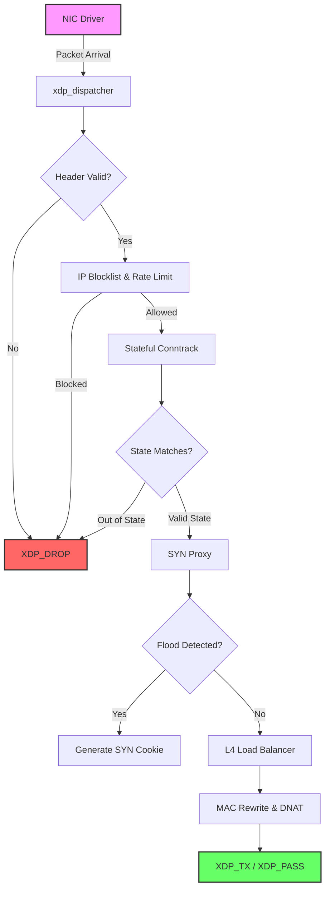

**الجزء من مشروع: Enterprise bunyanx NGFW**

---

## 1. المقدمة (Introduction)

## 1. المقدمة (Introduction)

تُعد وحدة `acceleration` إحدى الركائز الأساسية للأداء الشبكي في نظام **BUNYANX – Intelligent Response System to Cyberattacks**. تم تصميم هذه الوحدة بالاعتماد على تقنيات النواة المتقدمة **eBPF** ومسار البيانات السريع **XDP (eXpress Data Path)**، لتمكين النظام من التقاط ومعالجة وتصفية وتوجيه الحزم الشبكية (Packets) في مراحل مبكرة من مسار الشبكة، بما يقلل من زمن المعالجة ويحسن كفاءة التعامل مع حركة البيانات قبل انتقالها إلى طبقات الشبكة التقليدية في نواة لينكس (Linux Networking Stack).

**الهدف الأساسي:** توفير مسار معالجة شبكي عالي الكفاءة يدعم مكونات الحماية والتحليل والاستجابة في BUNYANX، ويسهم في التعامل مع حركة الشبكة ذات الأحجام المرتفعة، وتطبيق سياسات الفلترة المبكرة، والمساعدة في الحد من تأثير أنماط الهجمات الشبكية مثل الهجمات الموزعة لحجب الخدمة (DDoS)، مع تقليل الحمل على المعالج المركزي (CPU).

---

## 2. مسؤوليات الوحدة (Module Responsibilities)

تتولى هذه الوحدة المهام الحرجة التالية:

- **التخفيف المُبكر للهجمات (Early Mitigation):** إسقاط الحزم الخبيثة أو غير المصرح بها (XDP_DROP) بناءً على قواعد ديناميكية محددة من مساحة المستخدم (Userspace).
- **التتبع المُستدام للاتصالات (Stateful Conntrack):** رصد وتحديث حالة بروتوكول TCP بشكل مستقل في النواة لتجنب هجمات الـ Evasion.
- **توازن الأحمال (L4 Load Balancing):** توزيع حركة المرور على الخوادم الخلفية عبر تعديل عناوين (MAC & IP) فوراً، وإعادة إرسال الحزم (XDP_TX).
- **التشخيص الآني (Live Telemetry):** تصدير الأحداث الأمنية بشكل فوري إلى مستوى الـ Userspace لاتخاذ قرارات مدعومة بالذكاء الاصطناعي (ML Analytics).

---

## 3. التحليل (Module Analysis)

### مشكلة التصميم الكلاسيكي

جدران الحماية التقليدية (مثل iptables / Netfilter) تعتمد على تحويل كل حزمة واردة إلى هيكل بيانات ضخم في النواة يُسمى `sk_buff`. تحت الهجمات الضخمة (High PPS)، تنفد الذاكرة وقدرات المعالج في بناء هذه الهياكل فقط، مما يؤدي إلى سقوط النظام.

### الحل المتبنى

يتم حقن برامج eBPF مُجمّعة مسبقاً داخل النواة باستخدام JIT Compiler. تقرأ الوحدة الحزم ككتلة خام من الذاكرة (Raw Memory Buffer)، تتخذ القرار، ثم تنهي العملية بـ (O(1) Complexity) دون تخصيص أي ذاكرة إضافية.

**المدخلات الأساسية:** عناوين الذاكرة الخام (`data`, `data_end`) التي تمثل الحزمة.
**المخرجات:** قرار حاسم (Verdict): إما `XDP_DROP` (إسقاط)، أو `XDP_TX` (إعادة توجيه)، أو `XDP_PASS` (تحويل للنظام الأعلى).
**القيود (Constraints):** تخضع الوحدة لرقابة الـ eBPF Verifier، الذي يمنع الحلقات اللانهائية، ويحصر حجم المكدس (Stack Size) بـ 512 بايت، ويمنع العمليات الحسابية العائمة (Floating-point).

---

## 4. التصميم (Design)

تم بناء الوحدة على معمارية الأنابيب المتسلسلة (Pipelined Architecture) باستخدام تقنية **Tail Calls** (عبر `BPF_MAP_TYPE_PROG_ARRAY`). هذا يكسر حاجز التعقيد البرمجي عبر تقسيم المنطق إلى مراحل (Stages).

### الهياكل البيانية (Data Structures)

1. **خرائط الذاكرة المستدامة (LRU Hash Maps):**
   تُستخدم للبيانات المتنامية كقوائم الحظر (`blocked_ips`)، حيث تضمن خوارزمية (Least Recently Used) استبدال البيانات القديمة عند امتلاء الخريطة، لتجنب `-E2BIG Error`.
2. **الخرائط متعددة الأنوية (Per-CPU Hash Maps):**
   تُستخدم في `ct_fast` (Conntrack)، حيث يمتلك كل معالج خريطته الخاصة لتجنب التنافس (Lock Contention) أثناء التحديث اللحظي لحالة الاتصال.
3. **البيانات الوصفية (Metadata Pipeline):**
   تُمرر عبر `xdp_md.data_meta`، وهو هيكل `struct pipeline_meta` يحتوي على (IPs, Ports, TCP Flags, Verdict)، لتجنب إعادة تحليل ترويسة الحزمة (Re-parsing) في كل مرحلة.

---

## 5. آلية العمل (Workflow)

تسير العملية ضمن مخطط متسلسل يضمن الكفاءة العالية وإسقاط الحزم غير المرغوب فيها في أسرع نقطة ممكنة.



---

## 6. الإعدادات والتكوين (Configuration)

تدار إعدادات الوحدة مركزياً من الـ Userspace لتُطبق لحظياً داخل Kernel:

- **وضع التشغيل (XDP Mode):**
  - `Native` (موصى به): يعمل داخل مشغل كرت الشبكة.
  - `Offload`: ينقل المعالجة لشريحة كرت الشبكة (SmartNIC).
- **معدلات الحد (Rate Limits):** `pps_limit` لتحديد السقف الآمن للطلبات المسموحة لكل عنوان IP لمنع الاستنزاف المبطن.
- **مهل التتبع (TCP Timeouts):** `ESTABLISHED=300s` و `SYN=10s`. يتم إدارتها خارجياً عبر جامع النفايات (Garbage Collector) لتفريغ مساحة الذاكرة بانتظام.

---

## 7. هيكل الملفات (File Structure)

```text
F:\enterprise_ngfw\acceleration\
├── ebpf\
│   ├── pipeline\
│   │   ├── dispatcher.c       # (الموزع الرئيسي: Parsing & Stage Routing)
│   │   ├── stage_conntrack.c  # (تتبع حالة TCP وإسقاط محاولات Evasion)
│   │   ├── stage_l4_lb.c      # (موزع الأحمال: MAC/IP Rewriting & XDP_TX)
│   │   └── stage_syn_proxy.c  # (الحماية ضد SYN Floods)
│   ├── port_filter.c          # (فلترة المنافذ بخرائط Array O(1))
│   ├── xdp_engine.py          # (واجهة التحكم الرئيسية وتحميل البرامج)
│   ├── conntrack_manager.py   # (جامع النفايات Userspace GC للـ State)
│   └── ring_buffer_consumer.py# (نظام استهلاك الأحداث متعدد الطبقات)
```

---

## 8. التكامل مع باقي النظام (Integration)

يمثل التواصل بين مساحة النواة (Kernel Space) والنظام المركزي (Python Userspace) تحدياً هندسياً تمت معالجته كالتالي:

- **نقل الأحداث (Ring Buffers):** تم تصميم ثلاث قنوات خلفية (Critical, Warning, Info). القناة الحرجة تستخدم `BPF_RB_FORCE_WAKEUP` لإيقاظ البايثون في أقل من `1ms`، بينما تتجنب القنوات الأخرى الـ (Wakeups) لاستهلاك أقل لـ CPU.
- **توافقية البيانات (Endianness):** نظراً لاختلاف معمارية الشبكة (Big-Endian) عن معمارية المضيف (Little-Endian)، تم تصميم `xdp_engine.py` لمعالجة الـ (IP Bytes) عبر `struct.unpack("<I")`، مما يضمن خلو النظام من أخطاء التطابق، ومنع قراءة الـ IP بشكل معكوس.
- **واجهة الجسر (AccelerationBridge):** تقوم باستلام الـ `SecurityEvent` المحلول من الـ Ring Buffer وتحويله إلى كائنات يفهمها موديول الاستقصاء والذكاء الاصطناعي (`ML_Core`).

---

## 9. التحليل الأمني (Threat Model)

| التهديد (Threat) | آلية الحماية داخل الوحدة (Mitigation Mechanism) |
| :--- | :--- |
| **IP Options Bypass** | حساب طول الترويسة الديناميكي (`iph->ihl * 4`) وتخطيه أمنياً للوصول לـ L4 Header. |
| **IPv6 Extension Flood** | حلقة تكرارية محددة (`#pragma unroll`) لقص ترويسات التمديد، والسقوط (`XDP_DROP`) حال تجاوز الحد. |
| **State Evasion (NULL/XMAS)** | تطبيق سياسة المنع الافتراضي (Default Deny)، حيث تُسقط أي حزمة لا تتبع اتصالاً مسبقاً. |
| **Map Memory Exhaustion** | التخلص من الـ HASH التقليدي لصالح `BPF_LRU_HASH` لتجنب خنق الذاكرة تحت ضغط الـ DDoS. |
| **Memory Corruption** | الفحص الدقيق لحجم الحدث (`size != _EVENT_SIZE`) في الـ Ring Buffer Consumer. |

---

## 10. الخلاصة (Conclusion)

تُمثل وحدة `acceleration` تحفة هندسية في معالجة الشبكات الحديثة. من خلال دمج مرونة eBPF مع قوة XDP، لا يقوم المشروع بتصفية الحزم فحسب، بل يتخطى ذلك لإدارة الحمل وتتبع الحالة بأسلوب خفي عن نواة نظام التشغيل القياسية. التعديلات المعمارية التي طرأت على توافقية البيانات (Endianness) وإصلاحات الاستهلاك المفرط للموارد (Busy Wait Fixes)، ضمنت أن الوحدة ليست سريعة فحسب، بل مستقرة رياضياً وتقنياً ببيئة الإنتاج (Production-ready).

**اقتراحات مستقبلية:** يمكن توسيع الوحدة مستقبلاً لدعم `XDP_REDIRECT` لنقل الحزم مباشرة بين كروت الشبكة المختلفة (Virtual Functions)، أو إضافة دعم `AF_XDP` لتوصيل الحزم المشفرة إلى برامج الـ Userspace للفحص المتقدم (DPI) دون المرور بطبقات النواة.

---

## المراجع الأكاديمية والصناعية (Academic & Industry References)

1. Matteo Bertrone, Sebastiano Miano, Fulvio Risso, et al., "Accelerating Linux Security with eBPF iptables,"  2018. <https://doi.org/10.1145/3234200.3234228>
2. Amin Sadiq, Hassan Jamil Syed, Asad Ahmed Ansari, et al., "Detection of Denial of Service Attack in Cloud Based Kubernetes Using eBPF," in Applied Sciences, 2023. <https://doi.org/10.3390/app13084700>
3. David Soldani, Petrit Nahi, Hami Bour, et al., "eBPF: A New Approach to Cloud-Native Observability, Networking and Security for Current (5G) and Future Mobile Networks (6G and Beyond)," in IEEE Access, 2023. <https://doi.org/10.1109/access.2023.3281480>
4. Alessandro Rivitti, Roberto Bifulco, Angelo Tulumello, et al., "eHDL: Turning eBPF/XDP Programs into Hardware Designs for the NIC,"  2023. <https://doi.org/10.1145/3582016.3582035>
5. Toke Høiland-Jørgensen, Jesper Dangaard Brouer, Daniel Borkmann, et al., "The eXpress data path,"  2018. <https://doi.org/10.1145/3281411.3281443>
6. João P. Monteiro, Bruno Sousa, "eBPF Intrusion Detection System with XDP Offload support,"  2024. <https://doi.org/10.1109/nfv-sdn61811.2024.10807487>
7. Sebastiano Miano, Xiaoqi Chen, Ran Ben Basat, et al., "Fast In-kernel Traffic Sketching in eBPF," in ACM SIGCOMM Computer Communication Review, 2023. <https://doi.org/10.1145/3594255.3594256>
8. Takanori Hara, Masahiro Sasabe, "Practicality of in-kernel/user-space packet processing empowered by lightweight neural network and decision tree," in Computer Networks, 2024. <https://doi.org/10.1016/j.comnet.2024.110188>
