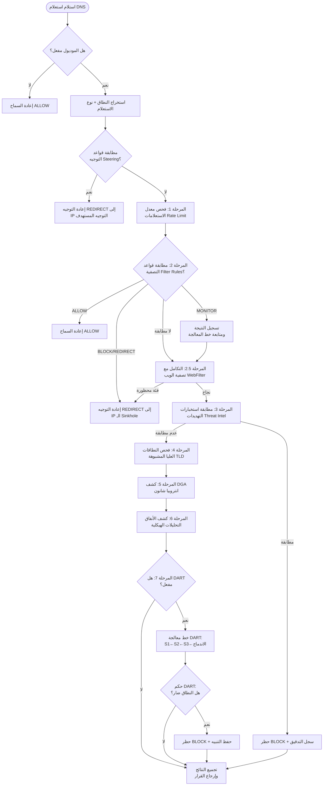
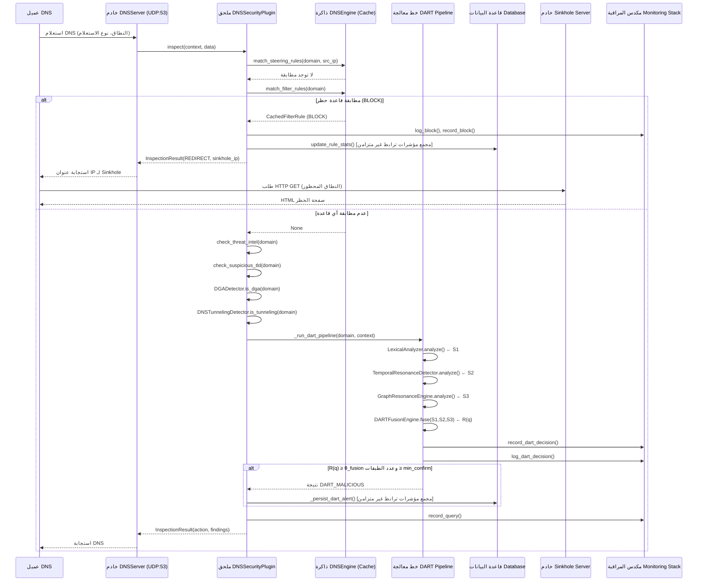

# bunyanx — وحدة أمان نظام اسم المجال (DNS Security Module)

## التوثيق الأكاديمي الشامل

> **الموديول**: `dns_security`  
> **المسار**: `F:\enterprise_ngfw\modules\dns_security`  
> **المنظومة**: Enterprise bunyanxs NGFW v2.1  
> **محرك الفحص**: DART-DNS v2.1  

---

## 1. المقدمة (Introduction)

تُعد **وحدة أمان DNS (DNS Security Module)** مكونًا متقدمًا للفحص العميق داخل منظومة الجدار الناري المتقدم للجيل الجديد Enterprise bunyanxs NGFW. تعمل هذه الوحدة كملحق (plugin) ضمن خط معالجة الفحص متعدد المراحل، حيث تقوم باعتراض وتحليل جميع استعلامات DNS التي تعبر محيط الشبكة.

**صياغة المشكلة الأساسية**: تم تصميم نظام اسم المجال (DNS) في عام 1983 دون مراعاة الجوانب الأمنية (RFC 1035). يستغل المهاجمون المحدثون نظام DNS كسطح هجوم من خلال خوارزميات توليد النطاقات (DGA)، والأنفاق البرمجية لنقل البيانات خفية (DNS Tunneling) لمغادرة البيانات (مثل iodine و dnscat2)، والإشارات الدورية للتحكم والسيطرة (C2 Beaconing)، والدقة في دمج النطاقات الضارة في شبكات البوتنت. تفشل أنظمة الكشف التقليدية القائمة على التواقيع أمام هذه التهديدات المتغيرة لأن كل هجوم ينشئ أسماء نطاقات فريدة ومختلفة لم تُشاهد من قبل.

**غرض الموديول**: يطبق هذا الموديول خط معالجة كشف متعدد الطبقات مدعومًا بالتعلم الآلي يُسمى **DART-DNS** (Domain Anomaly Resonance Triangulation - تثليث رنين شذوذ النطاق)، والذي يدمج ثلاث طبقات إشارة مستقلة إحصائيًا — التحليل اللغوي (Lexical Analysis)، ورنين التدفق الزمني (Temporal Flow Resonance)، والربط البياني عبر الأجهزة (Cross-Host Graph Correlation) — لتحقيق كشف عن التهديدات بمستوى مؤسسي مع صفر إنذارات كاذبة تؤدي إلى الحظر على الحركة المباشرة (Zero false-positive inline blocking).

**الدور الاستراتيجي داخل NGFW**: تحتل وحدة أمان DNS موقعًا ممتازًا في خط معالجة الفحص (الأولوية 20 — تعمل قبل معظم الموديولات الأخرى) لأن تحليل أسماء النطاقات يسبق جميع بروتوكولات الطبقات العليا. من خلال اعتراض النطاقات الخبيثة في طبقة DNS، تمنع الوحدة إنشاء الاتصالات من الأساس، مما يقلل من سطح الهجوم لجميع الموديولات اللاحقة (مثل فحص HTTP، والمنع من تسريب البيانات DLP، وجدار حماية التطبيقات WAF، وغيرها).

---

## 2. الأهداف الأعمال والتنفيذية (Business & Technical Objectives)

| الفئة | الهدف | المعيار / المقياس |
| ---------- | ----------- | -------- |
| **وظيفي** | كشف وحظر نطاقات DGA، والأنفاق (Tunneling)، ونطاقات C2 بشكل مباشر inline | F1 ≥ 0.76، FPR = 0.00 (تم التحقق منها عبر دراسة الاستئصال ablation) |
| **وظيفي** | توجيه النطاقات المحظورة إلى الخادم الخفي (Sinkhole) الخاص بالمؤسسة | تغطية 100% للـ Sinkhole لإجراءات الحظر BLOCK |
| **أمني** | عدم حظر أي حركة مرور شرعية بإنذار كاذب | الدقة Precision = 1.00 (قيود اندماج DART) |
| **أمني** | حماية سجلات DNS من تسريب البيانات المستخرجة | قناع النطاق (Domain masking) في جميع المخرجات (SEC-9) |
| **تشغيلي** | فحص الحزم بدون الوصول إلى قاعدة البيانات لكل حزمة | جميع القرارات تتم من ذاكرة RAM (نسخ عند الكتابة copy-on-write) |
| **الأداء** | زمن استجابة للفحص أقل من ميلي ثانية لكل استعلام | P95 < 0.05ms (حسب اختبارات الأداء) |
| **الأداء** | التعامل مع فيضان استعلامات DNS دون استهلاك الذاكرة أو انفجار المهام | سقف التزامن محدد بـ asyncio.Semaphore(256) |
| **المراقبة** | قابلية ملاحظة كاملة: المقاييس، والتتبعات، والسجلات الهيكلية | تكامل شامل مع Prometheus + OpenTelemetry + Loki |
| **الامتثال** | دورة ملاحظات لمحللي مركز العمليات الأمنية SOC للتنبيهات | تتبع الإنذارات الكاذبة عبر عمود خاص `false_positive` |

---

## 3. مسؤوليات الوحدة (Module Responsibilities)

| # | المسؤولية | الوصف | القيمة |
| --- | --------------- | ------------- | ------- |
| 1 | تصفية استعلامات DNS | مطابقة النطاقات مع قواعد EXACT/WILDCARD/REGEX المخصصة | تطبيق السياسات في طبقة DNS |
| 2 | كشف نطاقات DGA | انتروبيا شانون + التحليل اللغوي لـ DART | حظر النطاقات المولدة خوارزميًا لاتصالات C2 |
| 3 | كشف أنفاق DNS | التحليلات الهيكلية (طول الملصق، الطول الكلي، نوع الاستعلام) | منع تسريب البيانات عبر بروتوكول DNS |
| 4 | كشف الإشارات الزمنية | تحليل التوقيت بين الاستعلامات (معامل التباين CV، التردد) | كشف أنماط نبضات القلب لاتصالات C2 |
| 5 | الربط البياني عبر الأجهزة | كشف قائم على الرسوم البيانية لعمليات البحث عن النطاقات المنسقة | التحديد الباكر لأنماط تنشيط شبكات البوتنت |
| 6 | مطابقة استخبارات التهديدات | مطابقة فورية لموجزات التهديدات مع البحث عن اللاحقة للنطاق الأب | حظر النطاقات الضارة المعروفة |
| 7 | التوجيه الخفي (Sinkholing) | اعادة توجيه النطاقات المحظورة إلى خادم Sinkhole HTTP(S) بالمؤسسة | جمع الأدلة الجنائية الرقمية |
| 8 | توجيه حركة DNS (Steering) | إعادة توجيه النطاقات وفق السياسات مع دعم نطاقات CIDR | توجيه الخدمات الداخلية |
| 9 | تحديد معدل الاستعلامات | تطبيق حدود معدل الاستعلامات حسب عنوان IP المصدر | الحماية من هجمات حظر الخدمة DoS |
| 10 | حظر النطاقات العليا TLD | حظر نطاقات المستوى الأعلى المشبوهة | تقليل سطح الهجوم |
| 11 | إدارة تنبيهات SOC | حفظ تنبيهات DART مع تتبع الإنذارات الكاذبة | دعم سير عمل محللي الأمن |
| 12 | التكامل مع تصفية الويب | التوجيه الخفي عبر الموديولات بواسطة WebFilterEngine | حظر موحد قائم على الفئات |

---

## 4. تحليل المشكلة (Problem Analysis)

### 4.1 طبيعة المشكلة

تستغل الهجمات القائمة على DNS نموذج الثقة الأساسي للبروتوكول: يمكن لأي عميل تحليل أي اسم نطاق. يستغل المهاجمون ذلك من أجل:

- **DGA**: إنشاء آلاف النطاقات المرشحة يوميًا؛ يكفي تحليل نطاق واحد فقط ليستعيد المهاجم السيطرة.
- **Tunneling**: ترميز بيانات تعسفية داخل استعلامات DNS (حتى 253 بايت لكل ملصق)، متجاوزة جدران الحماية التي تسمح بحركة مرور DNS.
- **Beaconing**: استعلامات DNS دورية لسيرفرات C2 مع انتظام زمني مميز.

### 4.2 التحديات التقنية

1. **معدل مرور عالي (High Throughput)**: تنتج شبكات المؤسسات 10,000 إلى 100,000+ استعلام DNS في الثانية؛ يجب ألا يضيف الفحص أكثر من 1 ميلي ثانية لكل استعلام.
2. **تكلفة الإنذارات الكاذبة (False Positive Cost)**: أي إنذار كاذب واحد يحظر استخدام نطاق شرعي لجميع المستخدمين — وهو أمر غير مقبول في بيئات الإنتاج.
3. **تنوع الإشارات (Signal Diversity)**: لا توجد طريقة كشف واحدة تلتقط جميع عائلات هجمات DNS (DGA العشوائي ≠ DGA القاموسي ≠ الأنفاق ≠ الإشارات الزمنية).
4. **الحالة (Statefulness)**: تتطلب الإشارات الزمنية والبيانية حالة لكل تدفق، والتي يجب أن تكون محدودة الذاكرة وآمنة لمؤشرات الترابط (thread-safe).

### 4.3 افتراضات التصميم

- يتم التعرف على حركة مرور DNS بواسطة `protocol="dns"`، أو `metadata.is_dns=True`، أو البورت `dst_port=53/UDP`.
- يوفر خط معالجة الفحص كائن `InspectionContext` يحتوي على `src_ip` و `domain` و `query_type`.
- لا يُضمن التوافر الدائم لقاعدة البيانات؛ يجب أن تتراجع الوحدة بسلاسة إلى البيانات المخزنة مؤقتًا في الذاكرة.
- التبعيات الخارجية (مثل Redis و Prometheus و OpenTelemetry) اختيارية؛ وتتراجع جميعها إلى محاكيات نمطية لا تفعل شيئًا (no-op shims) في حال غيابها.

---

## 5. تحليل المتطلبات (Requirements Analysis)

### المتطلبات الوظيفية (Functional Requirements)

| المعرف | المتطلب | الأولوية |
| ---- | ------------- | ---------- |
| FR-1 | تصفية استعلامات DNS بناءً على قواعد EXACT و WILDCARD و REGEX | إجباري (Must) |
| FR-2 | كشف نطاقات DGA عبر تحليل الانتروبيا والتحليل اللغوي | إجباري (Must) |
| FR-3 | كشف أنفاق DNS عبر التحليلات الهيكلية | إجباري (Must) |
| FR-4 | كشف أنماط الإشارات الزمنية الدورية (Beaconing) | إجباري (Must) |
| FR-5 | كشف عمليات البحث المنسقة عبر أجهزة متعددة | موصى به (Should) |
| FR-6 | مطابقة الاستعلامات مع موجزات استخبارات التهديدات | إجباري (Must) |
| FR-7 | إعادة توجيه النطاقات المحظورة إلى خادم Sinkhole | إجباري (Must) |
| FR-8 | توجيه النطاقات الداخلية إلى عناوين IP محددة مع نطاق CIDR | موصى به (Should) |
| FR-9 | توفير واجهة برمجة CRUD لقواعد التصفية والتكوين وتنبيهات DART | إجباري (Must) |
| FR-10 | حفظ قرارات تنبيهات DART لمراجعة فريق SOC | إجباري (Must) |

### المتطلبات غير الوظيفية (Non-Functional Requirements)

| المعرف | المتطلب | الهدف |
| ---- | ------------- | -------- |
| NFR-1 | زمن استجابة الفحص لكل استعلام | P95 < 1ms |
| NFR-2 | عدم الوصول لقاعدة البيانات لكل حزمة | صفر استعلامات لقاعدة البيانات أثناء تنفيذ `inspect()` |
| NFR-3 | فحص آمن للتزامن ومؤشرات الترابط | قراءات بدون أقفال قائمة على النسخ عند الكتابة |
| NFR-4 | التراجع السلس عند فشل قاعدة البيانات | استخدام البيانات القديمة المخزنة + قاطع الدورة (circuit breaker) |
| NFR-5 | تتبع حالة محدد الذاكرة | استخدام `deque(maxlen=...)` والخلفية للإخلاء |

### المتطلبات الأمنية (Security Requirements)

| المعرف | المتطلب |
| ---- | ------------- |
| SR-1 | الحماية من هجمات ReDoS لقواعد التعبير النمطي (التحقق من الطول والنمط) |
| SR-2 | منع هجمات XSS في استجابات HTML للـ Sinkhole |
| SR-3 | اخفاء النطاقات (Domain masking) في جميع السجلات لمنع تسريب البيانات إلى SIEM |
| SR-4 | التحقق من صحة عنوان IP للـ Sinkhole (رفض عناوين Multicast و Loopback) |
| SR-5 | تقوية CORS (أصول قابلة للتكوين عبر البيئة) |
| SR-6 | تقوية مجموعات التشفير لـ TLS في خادم Sinkhole HTTPS (منع الشفرات الفارغة NULL) |

---

## 6. تحليل البنية الهندسية (Architecture Analysis)

### 6.1 البنية متعددة الطبقات

تتبع الوحدة **بنية هندسية مكونة من أربع طبقات**:

1. **طبقة واجهة البرمجة (API Layer)** (`api/router.py`) — نقاط نهاية REST عبر FastAPI لعمليات CRUD، والتكوين، وتنبيهات DART.
2. **طبقة المحرك (Engine Layer)** (`engine/`) — منطق الفحص الأساسي، ومحركات الكشف، وخوادم DNS/Sinkhole.
3. **طبقة النماذج (Model Layer)** (`models/`) — نماذج SQLAlchemy ORM والتعدادات.
4. **طبقة الملاحظة (Observability Layer)** (`monitoring/`) — مقاييس Prometheus، وتتبعات OpenTelemetry، والسجلات الهيكلية.

### 6.2 مخطط المكونات (Component Architecture Diagram)

```mermaid
graph TB
    subgraph "API Layer"
        R[router.py<br/>FastAPI Endpoints]
    end

    subgraph "Engine Layer"
        P[DNSSecurityPlugin<br/>InspectorPlugin]
        E[DNSEngine<br/>Singleton Cache]
        
        subgraph "Detection Engines"
            DGA[DGADetector<br/>Shannon Entropy]
            TUN[DNSTunnelingDetector<br/>Structural Heuristics]
            WF[WebFilterEngine<br/>Category Filter]
        end
        
        subgraph "DART Engines"
            L1[LexicalAnalyzer<br/>Layer 1: S1]
            L2[TemporalResonanceDetector<br/>Layer 2: S2]
            L3[GraphResonanceEngine<br/>Layer 3: S3]
            FU[DARTFusionEngine<br/>Resonance Fusion]
        end
        
        subgraph "Servers"
            DNS[DNSServer<br/>UDP:53]
            SH[SinkholeServer<br/>HTTP/HTTPS]
        end
    end
    
    subgraph "Model Layer"
        M1[DNSModuleConfig]
        M2[DNSFilterRule]
        M3[DARTAlert]
        M4["ActionEnum<br/>FilterType"]
    end
    
    subgraph "Observability"
        MET[DNSMetrics<br/>Prometheus]
        TRC[DNSTracer<br/>OpenTelemetry]
        LOG[DNSLogger<br/>Structured JSON]
    end
    
    R -->|CRUD| E
    R -->|Query| M1 & M2 & M3
    P -->|inspect()| E
    P --> DGA & TUN & WF
    P --> L1 & L2 & L3
    L1 & L2 & L3 --> FU
    P --> MET & TRC & LOG
    E -->|reload()| M1 & M2
    P -->|persist| M3
    SH -->|block page| P
```

### 6.3 رسم خرائط التبعيات (Dependency Mapping)

| المكون | التبعيات الداخلية | التبعيات الخارجية |
| ----------- | ---------------------- | ---------------------- |
| [plugin.py](file:///F:/enterprise_ngfw/modules/dns_security/engine/plugin.py) | DNSEngine، جميع كواشف DART والتراثية، WebFilterEngine، المراقبة | system.core.framework.plugin_base |
| [dns_engine.py](file:///F:/enterprise_ngfw/modules/dns_security/engine/dns_engine.py) | models (ORM)، system.database | SQLAlchemy، PyYAML |
| [router.py](file:///F:/enterprise_ngfw/modules/dns_security/api/router.py) | DNSEngine، models، المراقبة | FastAPI، Pydantic |
| [graph.py](file:///F:/enterprise_ngfw/modules/dns_security/engine/dart/graph.py) | لا يوجد (مستقل) | redis (اختياري) |
| [dns_metrics.py](file:///F:/enterprise_ngfw/modules/dns_security/monitoring/metrics/dns_metrics.py) | لا يوجد | prometheus_client (اختياري) |
| [dns_tracer.py](file:///F:/enterprise_ngfw/modules/dns_security/monitoring/tracing/dns_tracer.py) | لا يوجد | opentelemetry (اختياري) |

---

## 7. القرارات الهندسية والتصميمية (Architectural Decisions)

### 7.1 قرار: ذاكرة التخزين المؤقت المعتمدة على النسخ عند الكتابة (DNSEngine)

**السبب**: إضافة استعلامات قاعدة بيانات لكل حزمة يضيف من 5 إلى 50 ميلي ثانية تأخير — وهو أمر غير مقبول إطلاقًا لفحص DNS المباشر على مستوى المؤسسات.  
**الخيار البديل**: ذاكرة قراءة مؤقتة مع زمن صلاحية (TTL). تم رفضه لأن قواعد DNS تتغير نادراً (كل دقائق أو ساعات)، وليس كل ثانية.  
**التضحية**: تقتضي التغييرات في التكوين استدعاءً صريحًا لـ `reload()`؛ توجد نافذة بيانات قديمة قصيرة بين التعديل عبر الواجهة والتحديث.  
**الأثر**: زيادة كبيرة جداً في الأداء ↑↑، تعقيد أعلى قليلاً ↑، تأخير طفيف في المزامنة.

### 7.2 قرار: معادلة الاندماج القائمة على حاصل ضرب المتممات

**السبب**: تتعامل الصيغة \( R(q) = 1 - \prod (1 - w_i \cdot S_i) \) بسلاسة مع الإشارات المرتبطة جزئيًا دون فرض استقلالية إحصائية صارمة.  
**الخيار البديل**: شبكات بايز (Bayesian Network). تم رفضه لشدة التعقيد ومتطلبات جداول الاحتمالات الشرطية المدربة مسبقًا.  
**الدليل**: أظهرت دراسة الاستئصال (n=6000) أن المعلومات المتبادلة MI(S1, S2) = 0.0001 bits، و MI(S1, S3) = 0.0000 bits — وهي مستقلة إحصائيًا تقريبًا.  
**التضحية**: التضحية ببعض معدل الاستدعاء (recall) مقابل تحقيق دقة Precision = 1.00 (صفر حظر كاذب).

### 7.3 قرار: نمط الكائن المنفرد Singleton لـ DNSEngine و GraphResonanceEngine

**السبب**: يتم مشاركة حالة واحدة في الذاكرة بين جميع مهام الفحص المتزامنة. إنشاء نسخ متعددة سيؤدي إلى تجزئة ذاكرة التخزين المؤقت.  
**الخيار البديل**: حقن التبعيات مع نسخة مشتركة (Dependency Injection). تم رفضه لأن إطار عمل NGFW لا يوفر حاوية DI.  
**المحدودية**: يتطلب اختباك الوحدات (Unit Testing) إدخال حالة يدوية (راجع `_make_engine_with_rules()` في الاختبارات).

### 7.4 قرار: التبعيات الخارجية الاختيارية مع المحاكيات النمطية No-Op Shims

**السبب**: يجب ألا ينهار خط معالجة الفحص أبدًا بسبب فشل مكتبة مراقبة. تتحول مكتبات `prometheus_client` و `opentelemetry` و `redis` و `numpy` تلقائيًا إلى كائنات محاكاة لا تفعل شيئًا في حال عدم وجودها.  
**الأثر**: يعمل الموديول في أي بيئة بيثون دون وجود حزم خارجية إجبارية.

---

## 8. التصميم الداخلي (Internal Design)

### 8.1 الفئات وأدوارها

| الفئة | الملف | الدور |
| ------- | ------ | ------ |
| `DNSSecurityPlugin` | [plugin.py](file:///F:/enterprise_ngfw/modules/dns_security/engine/plugin.py#L100) | الملحق الرئيسي للفحص — يدير خط معالجة الكشف المكون من 7 مراحل |
| `DNSEngine` | [dns_engine.py](file:///F:/enterprise_ngfw/modules/dns_security/engine/dns_engine.py#L92) | ذاكرة التخزين المؤقت المفرودة (Singleton) — يحمل القواعد من DB ويقدم قراءات آمنة بدون أقفال |
| `LexicalAnalyzer` | [lexical.py](file:///F:/enterprise_ngfw/modules/dns_security/engine/dart/lexical.py) | الطبقة الأولى لـ DART — التقييم اللغوي متعدد المكونات (الانتروبيا + n-gram + ماركوف) |
| `TemporalResonanceDetector` | [temporal.py](file:///F:/enterprise_ngfw/modules/dns_security/engine/dart/temporal.py) | الطبقة الثانية لـ DART — تحليل التوقيت ذو النافذة المنزلقة لكشف الإشارات والتعدين |
| `GraphResonanceEngine` | [graph.py](file:///F:/enterprise_ngfw/modules/dns_security/engine/dart/graph.py) | الطبقة الثالثة لـ DART — الربط البياني عبر الأجهزة باستخدام ذاكرة أو محرك Redis |
| `DARTFusionEngine` | [fusion.py](file:///F:/enterprise_ngfw/modules/dns_security/engine/dart/fusion.py) | حَكَم الاندماج — يدمج نتائج S1/S2/S3 إلى قرار DARTDecision النهائي |
| `DGADetector` | [dga_detector.py](file:///F:/enterprise_ngfw/modules/dns_security/engine/legacy/dga_detector.py) | كاشف DGA التراثي القائم على انتروبيا شانون (مرشح سريعة مسبق) |
| `DNSTunnelingDetector` | [tunneling_detector.py](file:///F:/enterprise_ngfw/modules/dns_security/engine/legacy/tunneling_detector.py) | التحليلات الهيكلية التراثية لأنفاق DNS |
| `DNSServer` | [dns_server.py](file:///F:/enterprise_ngfw/modules/dns_security/engine/servers/dns_server.py) | مستمع UDP DNS مع حماية من الفيضان |
| `SinkholeServer` | [sinkhole_server.py](file:///F:/enterprise_ngfw/modules/dns_security/engine/servers/sinkhole_server.py) | خادم Sinkhole HTTP/HTTPS مع صفحة حظر معتمدة |
| `DNSMetrics` | [dns_metrics.py](file:///F:/enterprise_ngfw/modules/dns_security/monitoring/metrics/dns_metrics.py) | سجل مقاييس وعدادات Prometheus |
| `DNSTracer` | [dns_tracer.py](file:///F:/enterprise_ngfw/modules/dns_security/monitoring/tracing/dns_tracer.py) | مدير تتبعات OpenTelemetry |
| `DNSLogger` | [dns_logger.py](file:///F:/enterprise_ngfw/modules/dns_security/monitoring/logging/dns_logger.py) | منبع الأحداث الهيكلية بصيغة JSON لـ Loki |

---

## 9. نماذج البيانات (Data Models)

### 9.1 نماذج قاعدة البيانات

| النموذج | الجدول | الملف | الحقول |
| ------- | ------- | ------ | -------- |
| `DNSModuleConfig` | `dns_module_config` | [module_config.py](file:///F:/enterprise_ngfw/modules/dns_security/models/module_config.py) | 12 علم تكوين وعتبات + `is_active` و `sinkhole_ip` و `updated_at` |
| `DNSFilterRule` | `dns_filter_rules` | [filter_rule.py](file:///F:/enterprise_ngfw/modules/dns_security/models/filter_rule.py) | `domain_pattern` و `filter_type` (ENUM) و `action` (ENUM) و `enabled` و `blocked_count` و `last_triggered` |
| `DARTAlert` | `dart_alerts` | [dart_alert.py](file:///F:/enterprise_ngfw/modules/dns_security/models/dart_alert.py) | `domain` و `src_ip` و `resonance_score` و `layers_fired` و `s1/s2/s3_score` و `verdict` و `evidence` (JSON) و `reviewed` و `false_positive` |

### 9.2 نماذج الذاكرة المؤقتة (In-Memory Cache Models)

| فئة البيانات Dataclass | الغرض |
| ----------- | --------- |
| `CachedConfig` | نسخة مجردة من `DNSModuleConfig` — تتجنب مشاكل الجلسات الفصلية لـ ORM |
| `CachedFilterRule` | قاعدة غير قابلة للتعديل تحتوي على التعبير النمطي المجمع مسبقًا (لقواعد REGEX) |
| `SteeringRule` | قاعدة توجيه DNS تحتوي على كائنات IPv4Network مجمعة مسبقًا |

### 9.3 كائنات بيانات إشارات DART

| فئة البيانات Dataclass | الطبقة | الحقول |
| ----------- | ------- | -------- |
| `TemporalSignal` | S2 | `score`, `cv`, `mean_interval`, `variance`, `query_count` |
| `GraphSignal` | S3 | `score`, `unique_hosts`, `backend` |
| `DARTDecision` | الاندماج | `domain`, `resonance_score`, `is_malicious`, `layers_triggered`, `evidence` |

### 9.4 التعدادات (Enums)

| التعداد Enum | القيم | الملف |
|------|--------|------|
| `FilterType` | EXACT, WILDCARD, REGEX | [enums.py](file:///F:/enterprise_ngfw/modules/dns_security/models/enums.py) |
| `ActionEnum` | ALLOW, BLOCK, REDIRECT, MONITOR | [enums.py](file:///F:/enterprise_ngfw/modules/dns_security/models/enums.py) |

---

## 10. هيكل الملفات (File Structure)

```
dns_security/
├── __init__.py                          # معرف الموديول
├── api/
│   └── router.py                        # نقاط نهاية FastAPI REST (484 سطر)
├── config/
│   └── __init__.py                      # مكان مخصص لم حملي التكوين المستقبليين
├── engine/
│   ├── dns_engine.py                    # محرك ذاكرة التخزين المؤقت Singleton (أكثر من 380 سطر)
│   ├── plugin.py                        # الملحق الرئيسي للفحص (592 سطر)
│   ├── dart/
│   │   ├── __init__.py                  # تصدير DARTFusionEngine و DARTDecision
│   │   ├── lexical.py                   # الطبقة 1 لـ DART: المحلل اللغوي (199 سطر)
│   │   ├── temporal.py                  # الطبقة 2 لـ DART: الرنين الزمني (130 سطر)
│   │   ├── graph.py                     # الطبقة 3 لـ DART: الربط البياني (184 سطر)
│   │   ├── fusion.py                    # محرك اندماج DART (171 سطر)
│   │   └── markov_cache.json            # مصفوفة الانتقال ثنائية الأحرف المحسوبة مسبقًا
│   ├── legacy/
│   │   ├── dga_detector.py              # كاشف DGA بانتروبيا شانون (57 سطر)
│   │   └── tunneling_detector.py        # التحليلات الهيكلية للأنفاق (65 سطر)
│   └── servers/
│       ├── dns_server.py                # مستمع UDP DNS مع حماية الفيضان
│       └── sinkhole_server.py           # خادم Sinkhole HTTP/HTTPS
├── evaluation/
│   ├── ablation_runner.py               # منفذ دراسة الاستئصال لـ DART (283 سطر)
│   ├── dataset_manager.py               # تحميل البيانات الاصطناعية والحقيقية (127 سطر)
│   └── metrics.py                       # مقاييس التقييم (TP/TN/FP/FN/F1/FPR) (55 سطر)
├── models/
│   ├── __init__.py                      # تصدير كافة نماذج ORM والتعدادات
│   ├── enums.py                         # FilterType, ActionEnum
│   ├── filter_rule.py                   # نموذج SQLAlchemy لـ DNSFilterRule
│   ├── module_config.py                 # نموذج SQLAlchemy لـ DNSModuleConfig
│   └── dart_alert.py                    # نموذج SQLAlchemy لـ DARTAlert
├── monitoring/
│   ├── __init__.py                      # مصنع Singleton: dns_logger, dns_metrics, dns_tracer
│   ├── logging/dns_logger.py            # أحداث JSON الهيكلية ← Loki (197 سطر)
│   ├── metrics/dns_metrics.py           # عدادات وخرائط Prometheus (173 سطر)
│   └── tracing/dns_tracer.py            # نطاقات OpenTelemetry ← Tempo (133 سطر)
├── policy/
│   └── __init__.py                      # إشعار تفويض السياسات
├── templates/
│   └── block_page.html                  # صفحة حظر Sinkhole المخصصة للمؤسسة (178 سطر)
└── tests/
    ├── test_dns_engine.py               # اختبارات وحدة DNSEngine (174 سطر)
    ├── test_dart.py                     # اختبارات الطبقتين 1 و 2 لـ DART (100 سطر)
    ├── test_dart_fusion.py              # اختبارات محرك الاندماج
    ├── test_dart_graph.py               # اختبارات المحرك البياني
    ├── test_api_router.py               # اختبارات نقاط نهاية API
    └── test_sinkhole.py                 # اختبارات خادم Sinkhole
```

---

## 11. تحليل سياق العمل والمراحل (Workflow Analysis)

### 11.1 خط معالجة الفحص عبر 7 مراحل (Inspection Pipeline - 7 Stages)



---

## 12. مخطط التتابع (Sequence Diagram)



---

## 13. تحليل تدفق البيانات (Data Flow Analysis)

```mermaid
flowchart LR
    subgraph المصادر Sources
        NET[حركة مرور الشبكة<br/>UDP:53]
        API_IN[واجهة المشرف API<br/>نقاط REST]
        FEED[موجز التهديدات<br/>رابط خارجي]
        YAML[base.yaml<br/>قواعد التوجيه]
    end

    subgraph المعالجة Processing
        PLUGIN[DNSSecurityPlugin<br/>خط معالجة من 7 مراحل]
        ENGINE[DNSEngine<br/>ذاكرة التخزين المؤقت]
        DART[DART Pipeline<br/>S1←S2←S3←الاندماج]
    end

    subgraph التخزين Storage
        DB[(PostgreSQL/SQLite<br/>dns_module_config<br/>dns_filter_rules<br/>dart_alerts)]
    end

    subgraph المخرجات Outputs
        PROM[Prometheus<br/>:9090/metrics]
        LOKI[Loki<br/>dns_events.jsonl]
        TEMPO[Tempo<br/>OTLP gRPC]
        SINK[خادم Sinkhole<br/>صفحة الحظر]
        RESP[استجابة DNS<br/>للعميل]
    end

    NET --> PLUGIN
    API_IN -->|CRUD| DB
    API_IN -->|reload()| ENGINE
    FEED -->|_load_threat_intel_feed| PLUGIN
    YAML -->|_load_steering_rules| ENGINE
    DB -->|reload()| ENGINE
    ENGINE -->|مطابقة القواعد| PLUGIN
    PLUGIN --> DART
    DART --> DB
    PLUGIN --> PROM & LOKI & TEMPO
    PLUGIN --> SINK & RESP
```

---

## 14. تحليل الإعدادات والتكوينات (Configuration Analysis)

| المعامل | النوع | الافتراضي | الأثر والوظيفة |
| ----------- | ------ | --------- | -------- |
| `is_active` | bool | `True` | مفتاح الإيقاف العام — يعطل خط المعالجة بأكمله عند إيقافه |
| `enable_dga_detection` | bool | `True` | تفعيل المرشح المسبق لكشف DGA بانتروبيا شانون |
| `enable_tunneling_detection` | bool | `True` | تفعيل التحليلات الهيكلية لكشف أنفاق DNS |
| `enable_threat_intel` | bool | `True` | تفعيل مطابقة موجز استخبارات التهديدات |
| `enable_rate_limiting` | bool | `True` | تفعيل حد معدل الاستعلامات لكل عنوان IP |
| `enable_tld_blocking` | bool | `True` | تفعيل حظر نطاقات المستوى الأعلى المشبوهة |
| `enable_dart_detection` | bool | `True` | تفعيل خط التثليث الكامل لـ DART |
| `dga_entropy_threshold` | float | `3.8` | عتبة انتروبيا شانون (أقل = حساسية أعلى وزيادة الإنذارات الكاذبة) |
| `tunneling_query_threshold` | int | `50` | الحد الأقصى لطول النطاق قبل وضع علم الأنفاق |
| `rate_limit_per_minute` | int | `100` | الحد الأقصى للاستعلامات لكل IP مصدر في نافذة 60 ثانية |
| `suspicious_tlds` | str | `.tk,.ml,...` | قائمة مفصولة بفواصل للنطاقات العليا المحظورة |
| `sinkhole_ip` | str | `10.0.0.1` | عنوان IP الذي يُرجع للنطاقات المحظورة |

### معاملات دمج DART والتعديل (Hardcoded Hyperparameters)

| المعامل | القيمة | المعنى |
| ----------- | ------- | --------- |
| `w1` (وزن الطبقة اللغوية) | 0.50 | الوزن الأعلى — الإشارة الأكبر موثوقية بشكل مستقل |
| `w2` (وزن الطبقة الزمنية) | 0.30 | متوسط — الإشارة الأقوى على بيانات حركة المرور الحقيقية pcap |
| `w3` (وزن طبقة الرسم البياني) | 0.20 | الأقل — تقتضي وجود حركة مرور عبر أجهزة متعددة |
| `theta_fusion` | 0.55 | الحد الأدنى للنتيجة المركبة لإصدار حكم بالضرر |
| `theta_s1` | 0.60 | عتبة إطلاق إشارة الطبقة اللغوية |
| `theta_s2` | 0.45 | عتبة إطلاق إشارة الطبقة الزمنية |
| `theta_s3` | 0.45 | عتبة إطلاق إشارة طبقة الرسم البياني |
| `min_layers_confirm` | 1 | الحد الأدنى للطبقات التي يجب أن تطلق (جنبًا إلى جنب مع R ≥ θ) |

---

## 15. تحليل التكامل مع الأنظمة الأخرى (Integration Analysis)

| النظام | نوع التكامل | الآلية |
| -------- | ----------------- | ----------- |
| **خط المعالجة الأساسي** | تسجيل الملحقات Plugin | يرث `InspectorPlugin`؛ ويُسجل بالأولوية 20 |
| **تصفية الويب Web Filter** | استدعاء عبر الموديولات | يتم استدعاء `WebFilterEngine.evaluate()` لإجراء التوجيه الخفي لـ DNS |
| **قاعدة البيانات** | ORM | نماذج SQLAlchemy للتكوين والقواعد والتنبيهات |
| **نظام المصادقة Auth System** | البرمجيات الوسيطة Middleware | `require_admin` و `make_permission_checker("dns")` من `api.core.auth` |
| **Prometheus** | جمع المقاييس Scrape | 7 أدوات مقاييس يتم تصديرها عبر `/metrics` |
| **OpenTelemetry** | التتبع الموزع Tracing | أكثر من 10 أنواع نطاقات لكل فحص (هيكلية شجرية) |
| **Loki** | التسجيل الهيكلي Logging | أحداث JSON عبر مسجل الأسماء `dns_security.events` |
| **Redis** | محرك الرسم البياني Backend | ربط اختياري عبر العقد للطبقة الثالثة (S3) |
| **base.yaml** | التكوين الثابت | قواعد التوجيه ومنافذ الـ Sinkhole تُقرأ من ملف YAML |

---

## 16. تحليل واجهات البرمجة (API Analysis)

| المسار Endpoint | طريقة HTTP | المصادقة | المدخلات | المخرجات | الغرض |
| ---------- | -------- | ------ | ------- | -------- | --------- |
| `/api/v1/dns_security/status` | GET | `require_dns` | — | حالة صحة الموديول والمراقبة | فحص السلامة والصحة |
| `/api/v1/dns_security/config` | GET | `require_dns` | — | `DNSModuleConfigSchema` | قراءة التكوين الحالي |
| `/api/v1/dns_security/config` | PUT | `require_admin` | `DNSModuleConfigSchema` | التكوين المحدث | تعديل التكوين (يعيد التحميل تلقائيًا) |
| `/api/v1/dns_security/rules` | GET | `require_dns` | `?limit=&offset=` | `List[DNSFilterRuleResponse]` | عرض قائمة قواعد التصفية |
| `/api/v1/dns_security/rules` | POST | `require_admin` | `DNSFilterRuleCreate` | القاعدة المنشأة | إضافة قاعدة جديدة (مع التحقق من ReDoS) |
| `/api/v1/dns_security/rules/{id}` | PUT | `require_admin` | `DNSFilterRuleUpdate` | القاعدة المحدثة | تعديل قاعدة موجودة |
| `/api/v1/dns_security/rules/{id}` | DELETE | `require_admin` | — | 204 | حذف قاعدة تصفية |
| `/api/v1/dns_security/stats` | GET | `require_dns` | — | `DNSStatsResponse` | الإحصائيات المجمعة |
| `/api/v1/dns_security/dart_alerts` | GET | `require_dns` | `?limit=&offset=` | `List[DARTAlertResponse]` | عرض تنبيهات DART |
| `/api/v1/dns_security/dart_alerts/{id}/false_positive` | PUT | `require_admin` | — | تأكيد العملية | تحديد التنبيه كـ إنذار كاذب (FP) |
| `/api/v1/dns_security/monitoring/status` | GET | `require_dns` | — | حالة ركائز المراقبة | صحة واستجابة المراقبة |

---

## 17. تحليل قاعدة البيانات (Database Analysis)

### الجداول (Tables)

| الجدول | المفتاح الرئيسي | الفهارس Indexes | العلاقات |
| ------- | ------------- | --------- | ----------- |
| `dns_module_config` | `id` (تلقائي) | المفتاح الرئيسي فقط | لا يوجد (صف كائن منفرد) |
| `dns_filter_rules` | `id` (تلقائي) | `domain_pattern` (فريد)، `id` | لا يوجد |
| `dart_alerts` | `id` (تلقائي) | `domain` و `created_at` و `id` | لا يوجد |

### أنماط الاستعلام (Query Patterns)

- **المسار السريع (الفحص المباشر inspect)**: صفر استعلامات قاعدة بيانات — جميع القراءات تتم من ذاكرة RAM.
- **المسار البارد (إعادة التحميل reload)**: مسح كامل لجدول `dns_filter_rules` + قراءة صف واحد من `dns_module_config`.
- **مسار الكتابة (الكتابة)**: تحديث إحصائيات القواعد عبر ThreadPoolExecutor محدود (مؤشران ترابط)؛ وتنبيهات DART تُحفظ بشكل غير متزامن.

---

## 18. السجلات والتجميع والتدقيق (Logging & Auditing)

### دليل الأحداث (Event Catalogue)

| نوع الحدث | المستوى | متى يحدث | المحتوى |
| ------------ | ------- | ------ | --------- |
| `dns.query` | INFO | كل استعلام مَفحوص (أخذ العينات قابل للتكوين) | النطاق، IP المصدر، نوع الاستعلام، الإجراء، زمن التأخير |
| `dns.block` | WARNING | كل نطاق محظور (دائمًا) | النطاق، IP المصدر، الفئة، الشدة، درجة الثقة |
| `dns.dart.decision` | WARNING/DEBUG | كل قرار من DART (ضار=WARNING، نقي=DEBUG) | أدلة XAI الكاملة، الدرجات، الطبقات المفعلة |
| `dns.error` | ERROR | أخطاء المحرك والعمليات | النطاق، IP المصدر، رسالة الخطأ |
| `dns.config.mutation` | INFO | تغيير التكوين عبر واجهة API | الفروقات القديم←الجديد، هوية المشغل |
| `dns.rule.crud` | INFO | إنشاء/تعديل/حذف قاعدة تصفية | نوع العملية، معرف القاعدة، النمط، المشغل |

### مسار التدقيق (Audit Trail)

- جميع تعديلات التكوين تسجل الفروقات بين القيم القديمة والجديدة مع هوية المشغل (LOG-2).
- جميع عمليات قواعد التصفية CRUD تسجل نوع العملية وتفاصيل القاعدة ورمز المسؤول (LOG-3).
- تحديد التنبيهات كإنذارات كاذبة لـ DART يزيد عداد Prometheus لدعم حلقة الملاحظات.

---

## 19. المراقبة القابلة للملاحظة (Monitoring & Observability)

### الركائز الثلاث (Three Pillars)

| الركيزة | الأداة | التكامل |
| -------- | ------ | ------------- |
| **المقاييس Metrics** | Prometheus | 7 أدوات قياس: `dns_queries_total`, `dns_blocked_total`, `dns_inspection_latency_seconds`, `dart_detections_total`, `dart_resonance_score`, `dart_layer_latency_seconds`, `dart_false_positive_total` |
| **التتبع Tracing** | OpenTelemetry ← Tempo | 10+ أنواع نطاقات: `dns.inspect` الجذر ← `dns.prefilter.*` ← `dns.dart` ← `dart.lexical/temporal/graph/fusion` |
| **السجلات Logging** | السجلات الهيكلية ← Loki | مسجل أسماء مخصص `dns_security.events` بصيغة أسطر JSON |

### التراجع السلس (Graceful Degradation)

تستخدم جميع الركائز الثلاث كائنات محاكاة لا تفعل شيئًا (no-op shims) عند غياب مكتباتها. لا ينهار خط معالجة الفحص أبدًا بسبب أعطال أدوات المراقبة.

---

## 20. التحليل الأمني (Security Analysis)

### 20.1 نموذج التهديدات (Threat Model)

| الأصول Asset | التهديد Threat | سيناريو الهجوم Attack Scenario | معالجة التهديد (التخفيف) Mitigation |
| ------- | -------- | ---------------- | ------------ |
| خط فحص DNS | هجمات ReDoS عبر التعبير النمطي | مهاجم يقدم تعبيرًا نمطيًا كارثيًا كقاعدة تصفية | حد الطول (500 حرف) + كشف الأنماط الخطرة + وقت قطع 50ms |
| استجابة Sinkhole HTML | ثغرات XSS عبر ترويسة Host | مهاجم يحلل نطاقًا يحتوي على نصوص برمجية | `html.escape()` لجميع متغيرات القوالب التي يتحكم بها العميل |
| سجلات SIEM | تسريب البيانات المستخرجة | ترميز البيانات المسروقة في ملصقات DNS لظهورها بالسجلات | `_mask_domain()` يحذف ملصقات النطاق الفرعي قبل التسجيل |
| REST API | تعديل التكوين غير المصرح به | مهاجم يغير عنوان sinkhole_ip لتوجيه حركة المرور لسيرفره | `require_admin` + التحقق من IP (رفض multicast/loopback) |
| تشفير Sinkhole TLS | تخفيض التشفير (Cipher downgrade) | مهاجم يتفاوض على مجموعات تشفير NULL فارغة | سلسلة التشفير الصارمة `ALL:!NULL:!eNULL` |
| فيضان DNS | استهلاك الموارد واغراقها | مهاجم يرسل أكثر من 10 آلاف استعلام/ثانية | `asyncio.Semaphore(256)` + تحديد معدل الاستعلامات لكل IP |

### 20.2 الضوابط الأمنية (Security Controls)

| نوع الضابط | الضوابط المطبقة |
| ------------- | ---------- |
| **وقائي (Preventive)** | حماية ReDoS، التحقق من IP الـ Sinkhole، تقوية CORS، تقييد الشفرات، سيمفور الفيضان |
| **كاشف (Detective)** | سجلات التدقيق الهيكلية، حفظ تنبيهات DART، عداد الإنذارات الكاذبة في Prometheus |
| **تصحيحي (Corrective)** | إعادة التحميل التلقائي بعد تغيير التكوين، تحديث موجز التهديدات، قاطع الدورة عند فشل DB |
| **تعويضي (Compensating)** | استخدام البيانات القديمة عند الفشل، محاكيات المراقبة، المعالجة الآمنة لاستثناءات WebFilter |

---

## 21. الضوابط الأمنية التفصيلية (Security Controls Detailed)

> راجع القسم 20.2 أعلاه — تم الدمج للإيجاز.

---

## 22. تحليل الأداء (Performance Analysis)

| البعد | قرار التصميم | الأثر المتوقع |
| ----------- | ----------------- | ----------------- |
| **المعالج CPU** | بحث O(1) للقواعد EXACT عبر فهرس قاموس؛ التعبيرات النمطية تنفذ في مجمع مؤشرات ترابط محدود | وقت ثابت لمعظم عمليات مطابقة القواعد |
| **الذاكرة Memory** | استخدام `deque(maxlen=500)` لكل IP لمحدد المعدل؛ إخلاء الخلفية كل 5 دقائق | نمو ذاكرة محدود تحت أقصى أحمال حركة المرور |
| **التزامن Concurrency** | قراءات ذاكرة مؤقتة قائمة على النسخ عند الكتابة (بدون أقفال)؛ `RLock` فقط أثناء `reload()` | مسار سريع خالٍ من الأقفال لجميع عمليات الفحص المتزامنة |
| **معدل المرور Throughput** | عدم الوصول لقاعدة البيانات مطلقًا لكل حزمة؛ جميع عمليات الكشف عملية حسابية بحتة | عنق الزجاجة هو نظام التشغيل والشبكة، وليس الموديول |
| **زمن التأخير Latency** | خط معالجة DART الكامل: P95 < 0.05ms (حسب دراسة الاستئصال) | ضمان زمن استجابة أقل من ميلي ثانية لكل استعلام |
| **التخزين المؤقت Caching** | محرك DNSEngine يحمل مجموعة القواعد كاملة في RAM؛ مصفوفة ماركوف مخزنة في القرص | صفر حسابات مكررة |
| **القابلية للتوسع Scalability** | محرك GraphResonanceEngine يدعم خادم Redis للربط عبر عقد متعددة | توسع أفقي عبر Redis المشترك |

---

## 23. حالات الاستخدام (Use Cases)

### UC-1: حظر نطاق DGA

- **الجهة الفاعلة**: عميل DNS (جهاز مصاب في الشبكة)
- **الشرط المسبق**: الموديول مفعل، وكشف DGA مفعل
- **التدفق**: العميل يطلب تحليل `qzpwxmncb.org` ← الانتروبيا = 4.1 > العتبة 3.8 ← نتيجة DART S1 = 0.72 > θ_s1=0.60 ← تأكيد DART ← حظر BLOCK ← إعادة التوجيه لـ Sinkhole
- **النتيجة المتوقعة**: يستلم العميل عنوان IP الخاص بالـ Sinkhole؛ ويستلم فريق SOC تنبيه DART مع الأدلة التفسيرية XAI

### UC-2: تسجيل إنذار كاذب من قبل محلل SOC

- **الجهة الفاعلة**: محلل مركز العمليات الأمنية SOC
- **الشرط المسبق**: تنبيه DART موجود في جدول `dart_alerts`
- **التدفق**: إرسال طلب PUT إلى `/dart_alerts/{id}/false_positive` ← تحديث `reviewed=True, false_positive=True` ← زيادة عداد FP في Prometheus
- **النتيجة المتوقعة**: تعليم التنبيه كـ FP؛ وتحديث لوحة معدل الإنذارات الكاذبة في Grafana بشكل لحظي

### UC-3: إنشاء قاعدة تعبير نمطي (Regex Rule) بواسطة المسؤول

- **الجهة الفاعلة**: مسؤول الشبكة Network Admin
- **الشرط المسبق**: امتلاك رمز JWT بصلاحية أدمن
- **التدفق**: طلب POST إلى `/rules` ببيانات `filter_type=REGEX, domain_pattern=^bad.*\.io$` ← يختبر الخادم قابلية التجميع للتعبير النمطي ← يتم فحص النمط ضد أنماط ReDoS الخطرة ← إنشاء القاعدة ← تنفيذ `engine.reload()`
- **النتيجة المتوقعة**: تصبح القاعدة تفعيلة في RAM؛ وتُحظر جميع النطاقات المطابقة اللاحقة

---

## 24. استراتيجية الاختبار (Testing Strategy)

| نوع الاختبار | الملفات | التغطية |
| ----------- | ------- | ---------- |
| **اختبارات الوحدة Unit Testing** | [test_dns_engine.py](file:///F:/enterprise_ngfw/modules/dns_security/tests/test_dns_engine.py) (174 سطر)، [test_dart.py](file:///F:/enterprise_ngfw/modules/dns_security/tests/test_dart.py) (100 سطر) | مطابقة قواعد المحرك، تقييم طبقات DART، الحماية من ReDoS، خصائص التكوين |
| **اختبارات التكامل Integration Testing** | [test_dart_fusion.py](file:///F:/enterprise_ngfw/modules/dns_security/tests/test_dart_fusion.py)، [test_dart_graph.py](file:///F:/enterprise_ngfw/modules/dns_security/tests/test_dart_graph.py) | خط معالجة اندماج DART، والربط البياني |
| **اختبارات الواجهة API Testing** | [test_api_router.py](file:///F:/enterprise_ngfw/modules/dns_security/tests/test_api_router.py) | التحقق من صحة نقاط نهاية REST |
| **اختبارات الخادم Server Testing** | [test_sinkhole.py](file:///F:/enterprise_ngfw/modules/dns_security/tests/test_sinkhole.py) | سلوك واستجابات خادم Sinkhole |
| **دراسة الاستئصال Ablation Study** | [ablation_runner.py](file:///F:/enterprise_ngfw/modules/dns_security/evaluation/ablation_runner.py) (283 سطر) | تقييم خط DART الكامل بمجموعات بيانات اصطناعية (n=6000)، وتحليل المعلومات المتبادلة، وأمثلة أدلة XAI |

---

## 25. سيناريوهات الاختبار (Test Scenarios)

| السيناريو | المدخلات | النتيجة المتوقعة | مستوى الخطورة |
| ---------- | ------- | ----------------- | ------------ |
| مطابقة قاعدة EXACT | `evil.com` | إرجاع القاعدة المطابقة id=1 | منخفض |
| عدم التأثر بالحالة لـ EXACT | `EVIL.COM` | إرجاع القاعدة المطابقة | منخفض |
| مطابقة WILDCARD | `sub.malware.com` مقابل `*.malware.com` | العثور على المطابقة | منخفض |
| مطابقة REGEX | `dga-abcdefghij.tk` مقابل `^dga-[a-z]{10}\.tk$` | العثور على المطابقة | متوسط |
| رفض نمط ReDoS | التعبير النمطي `(a+)+` | الرفض بواسطة واقي الأمان | حرِج |
| كشف DGA مرتفع الانتروبيا | `qzpwxmncb.org` | درجة S1 > 0.5 | عالٍ |
| نتيجة منخفضة لنطاق شرعي | `google.com` | درجة S1 < 0.2 | عالٍ |
| كشف الأنفاق الزمني | 20 استعلامًا بفواصل 0.5 ثانية | درجة > 0 | عالٍ |
| الربط البياني عبر الأجهزة | 5 أجهزة تبحث عن نفس النطاق خلال 30 ثانية | درجة > 0.5 | عالٍ |
| نطاق توجيه CIDR | IP داخلي ضمن نطاق CIDR المسموح | إعادة التوجيه للمستهدف | متوسط |
| IP مصدر غير صالح للتوجيه | `not-an-ip` | إرجاع None (بدون انهيار) | منخفض |

---

## 26. تحليل الأعطال والاستعادة (Failure Analysis)

| نقطة الفشل | السيناريو | آلية الاستعادة والتعافي |
| --------------- | ---------- | ------------------- |
| عدم توافر قاعدة البيانات عند البدء | تعذر اتصال `DNSEngine.__init__` | استخدام try/except ← الاعتماد على CachedConfig الافتراضي ← إعادت المحاولة في reload() القادم |
| عدم توافر قاعدة البيانات أثناء reload | فشل اتصال مؤقت | 3 محاولات إعادة مع تراجع أسي exponential backoff (0.5s, 1s, 2s) |
| استمرار فشل قاعدة البيانات | أكثر من 5 محاولات فشل متتالية | قاطع الدورة: تسجيل لوغ CRITICAL + وضع البيانات القديمة stale mode |
| انهيار WebFilterEngine | استثناء غير معالج في evaluate() | try/except مع exc_info=True ← التراجع للمرحلة التالية في السلسلة |
| فيضان DNS (أكثر من 10K QPS) | انفجار عدد مهام asyncio | السيمفور Semaphore(256) يحدد سقف المعالجات المتزامنة |
| عدم توافر Redis لمحرك الرسم البياني | رفض الاتصال عند البدء | التراجع للذاكرة المحلية مع توثيق المحدودية |
| عدم تثبيت Prometheus/OTEL | استثناء ImportError أثناء التحميل | فئات محاكاة no-op — صفر عبء إضافي |
| تعذر الوصول لموجز التهديدات | انقضاء وقت HTTP على رابط الموجز | التراجع للقائمة الأولية seed list؛ وتكرار المحاولة في الدورة التالية |

---

## 27. التحديات والحلول (Challenges & Solutions)

| التحدي | الحل المطبق | الدرس المستفاد |
| ----------- | ---------- | -------- |
| كواشف DGA أحادية الإشارة تنتج معدل إنذارات كاذبة FPR غير مقبول | دمج إشارات DART المتعددة بمعادلة حاصل ضرب المتممات | الإشارات المستقلة تخفض الإنذارات الكاذبة بشكل تضاعفي |
| الوصول لقاعدة البيانات لكل حزمة يضيف تأخيرًا 5-50ms | ذاكرة تخزين مؤقتة في RAM قائمة على النسخ عند الكتابة مع تبديل النواة ذريًا | ميزة GIL تضمن قراءات ذرية آمنة دون الحاجة لأقفال |
| إعادة بناء قائمة محدد المعدل يستغرق وقتًا O(n) تحت القفل | الاستبدال بـ `deque(maxlen=500)` — إضافة بوقت O(1) | اختيار هيكل البيانات يؤثر مباشرة على تزاحم الأقفال |
| مطابقة قواعد EXACT تستغرق وقت O(n) بحسب عدد القواعد | فهرس قاموس بوقت O(1)؛ بينما المسح الخطي فقط لـ WILDCARD/REGEX | فصل هياكل البيانات للمسار السريع بحسب أنماط الوصول |
| قواعد التعبير النمطي قد تسبب تراجعًا كارثيًا (Backtracking) | حماية ثلاثية: حد الطول + كشف الأنماط + وقت قطع للمؤشر | الدفاع في العمق بالنسبة للأنماط المدخلة من قبل المستخدمين |
| البيانات المستخرجة تظهر في ملصقات DNS ← ترسل لسجلات SIEM | تابع `_mask_domain()` يحذف ملصقات النطاق الفرعي قبل التسجيل | تطهير السجلات متطلب أمني رئيسي وليس خيارًا |

---

## 28. القابلية للتوسع والتطوير والصيانة (Scalability & Maintainability)

### القابلية للتوسع (Scalability)

- **رأسيًا Vertical**: تتوسع الذاكرة المؤقتة مع ذاكرة RAM المتاحة؛ وتمنع قيود deque نفاد الذاكرة OOM.
- **أفقيًا Horizontal**: يدعم GraphResonanceEngine خادم Redis للربط البياني بين أجهزة متعددة وعقد مختلفة. باقي المكونات عديمة الحالة أو ذات كائن منفرد لكل عقدة.
- **توسع القواعد Rule Scale**: بحث O(1) لـ EXACT + مسح خطي لـ WILDCARD/REGEX. عند تجاوز 10,000+ قاعدة، يُوصى باستخدام خوارزمية Aho-Corasick لمطابقة Wildcards.

### القابلية للصيانة (Maintainability)

- **النمطية Modularity**: كل طبقة في DART عبارة عن فئة مستقلة بتابع `analyze()` واحد — مما يسهل استبدال أو إضافة طبقات جديدة.
- **ابلية الاختبار Testability**: يساعد التابع المساعد `_make_engine_with_rules()` على إجراء اختبارات الوحدة دون الحاجة لقاعدة بيانات.
- **قابلية الملاحظة Observability**: توفر المراقبة ذات الركائز الثلاث رؤية كاملة لسلوك النظام في بيئة الإنتاج.
- **التكوين Configuration**: جميع محركات الكشف قابلة للتفعيل والتعطيل بشكل فردي عبر أعلام التكوين.

### نقاط التوسعة (Extension Points)

- إضافة طبقات DART جديدة عبر إنشاء فئة جديدة في `dart/` واستدعائها من `_run_dart_pipeline()` وإضافة وزنها في الاندماج.
- إضافة أنواع قواعد تصفية جديدة عبر توسيع تعداد `FilterType` وإضافة منطق المطابقة في `match_filter_rules()`.
- إضافة أنواع إجراءات جديدة عبر توسيع تعداد `ActionEnum` وإضافة منطق التوجيه في `inspect()`.

---

## 29. التحسينات المستقبلية (Future Improvements)

### على المدى القريب (1-3 أشهر)

- إضافة تبويب تنبيهات DART في واجهة المستخدم Web UI مخصص لمراجعة فريق SOC.
- إضافة ويدجت المراقبة والصحة في لوحة التحكم الرئيسية (UI-4).
- تطبيق ترحيلات Alembic لعمود `false_positive` وقيم ActionEnum الجديدة.
- إضافة نقطة نهاية API لإعادة ضبط/إلغاء حالة الإنذار الكاذب.

### على المدى المتوسط (3-6 أشهر)

- تدريب مصفوفة ماركوف على قائمة Alexa Top-1M لزيادة دقة بيئة الإنتاج.
- تطبيق خوارزمية Aho-Corasick لمطابقة قواعد WILDCARD على نطاق واسع.
- إضافة إمكانية ضبط عتبات طبقات DART عبر واجهة API (حاليًا محددة برمجياً).
- تطبيق خط إعادة تدريب نماذج DART باستخدام ملاحظات الإنذارات الكاذبة من SOC.

### على المدى البعيد (6-12 شهرًا)

- استبدال كشف DGA بانتروبيا شانون بمصنف عصبي على مستوى الحروف (neural character-level classifier).
- تطبيق التحقق من صحة DNSSEC لضمان سلامة الاستعلامات الموجهة للمصدر.
- إضافة اعتراض بروتوكولات DNS-over-HTTPS (DoH) و DNS-over-TLS (DoT).
- تطبيق الضبط التلقائي اللحظي لعتبات DART باستخدام التعلم المعزز Reinforcement Learning.

---

## 30. جدول الخرائط المرجعية للكود (Code Reference Mapping)

| الميزة / الوظيفة | الملف | الفئة / التابع | الغرض |
| --------- | ------ | ---------------- | --------- |
| نقطة دخول الملحق | [plugin.py](file:///F:/enterprise_ngfw/modules/dns_security/engine/plugin.py#L239) | `DNSSecurityPlugin.inspect()` | خط معالجة الفحص المكون من 7 مراحل |
| محرك التخزين المؤقت | [dns_engine.py](file:///F:/enterprise_ngfw/modules/dns_security/engine/dns_engine.py#L92) | `DNSEngine.reload()` | تحميل القواعد من DB إلى RAM مع المحاولة وقاطع الدورة |
| بحث EXACT القائم على O(1) | [dns_engine.py](file:///F:/enterprise_ngfw/modules/dns_security/engine/dns_engine.py#L296) | `DNSEngine.match_filter_rules()` | مطابقة سريعة بالقاموس + مسح خطي لـ WILDCARD/REGEX |
| التقييم اللغوي | [lexical.py](file:///F:/enterprise_ngfw/modules/dns_security/engine/dart/lexical.py) | `LexicalAnalyzer.analyze()` | النتيجة المركبة للانتروبيا و N-gram وماركوف |
| الكشف الزمني | [temporal.py](file:///F:/enterprise_ngfw/modules/dns_security/engine/dart/temporal.py) | `TemporalResonanceDetector.analyze()` | معامل التباين للنافذة المنزلقة + تحليل التردد |
| الربط البياني | [graph.py](file:///F:/enterprise_ngfw/modules/dns_security/engine/dart/graph.py) | `GraphResonanceEngine.analyze()` | حساب الاستعلامات للنطاق عبر أجهزة متعددة |
| قرار الاندماج | [fusion.py](file:///F:/enterprise_ngfw/modules/dns_security/engine/dart/fusion.py) | `DARTFusionEngine.fuse()` | حاصل ضرب المتممات + تصويت الطبقات + أدلة XAI |
| الحماية من ReDoS | [dns_engine.py](file:///F:/enterprise_ngfw/modules/dns_security/engine/dns_engine.py#L36) | `_safe_regex_search()` | وقت القطع لمجمع التهديد + واقي الأنماط الخطرة |
| تحديد معدل الاستعلامات | [plugin.py](file:///F:/enterprise_ngfw/modules/dns_security/engine/plugin.py#L534) | `_check_rate_limit()` | النافذة المنزلقة القائمة على deque لكل IP |
| مطابقة استخبارات التهديدات | [plugin.py](file:///F:/enterprise_ngfw/modules/dns_security/engine/plugin.py#L558) | `_check_threat_intel()` | مطابقة النطاق والمطابقة مع لاحقة النطاق الأب |
| حفظ تنبيهات DART | [plugin.py](file:///F:/enterprise_ngfw/modules/dns_security/engine/plugin.py#L506) | `_persist_dart_alert()` | كتابة غير متزامنة بقاعدة البيانات عبر مجمع مؤشرات ترابط |
| صفحة حظر Sinkhole | [block_page.html](file:///F:/enterprise_ngfw/modules/dns_security/templates/block_page.html) | قالب HTML | صفحة الحظر والمنع الخاصة بالمؤسسة |
| دراسة الاستئصال | [ablation_runner.py](file:///F:/enterprise_ngfw/modules/dns_security/evaluation/ablation_runner.py) | `run_full_ablation()` | تقييم مقارن عبر 8 تجارب مستقلة |

---

## 31. الخاتمة (Conclusion)

يمثل موديول أمان DNS **مكونًا ناضجًا ومقوى للإنتاج** ضمن منظومة bunyanxs NGFW للمؤسسات. يعكس تصميمه العديد من مبادئ الهندسة البرمجية الرئيسية:

**نقاط القوة**:

1. **مسار سريع بدون الوصول لقاعدة البيانات**: تحقق بنية ذاكرة التخزين المؤقت المعتمدة على النسخ عند الكتابة زمن تأخير للفحص أقل من ميلي ثانية، مما يجعله مناسبًا للغاية للنشر المباشر في المؤسسات.
2. **منهجية اندماج DART**: تحقق صيغة حاصل ضرب المتممات القائمة على إشارات مستقلة إحصائيًا ومثبتة تجريبيًا دقة Precision=1.00 على مجموعة بيانات التقييم — وهو التوازن الصحيح للحظر المباشر حيث تعتبر الإنذارات الكاذبة كارثية.
3. **الدفاع في العمق**: توفر مراحل الكشف السبع تغطية طبقية شاملة؛ ولا توجد مرحلة واحدة تمثل نقطة عطل مفردة.
4. **التراجع السلس**: تتراجع جميع التبعيات الخارجية (قاعدة البيانات، Redis، Prometheus، OpenTelemetry، numpy) بسلاسة إلى قيم افتراضية آمنة أو فئات محاكاة لا تفعل شيئًا.
5. **مراقبة شاملة**: توفر المراقبة القائمة على الركائز الثلاث (المقاييس، والتتبعات، والسجلات) رؤية كاملة لبيئة الإنتاج دون التأثير على أداء خط الفحص.
6. **التقوية الأمنية**: حماية ReDoS، ومنع XSS، وإخفاء النطاقات، والتحقق من IP، وتقوية مجموعات التشفير، ومسارات التدقيق تعكس وعياً أمنياً بمستوى المؤسسات.

**نقاط الضعف**:

1. **التقييم الاصطناعي فقط**: تستخدم دراسة الاستئصال مجموعات بيانات ممررة اصطناعيًا؛ وهناك حاجة لتقييم حركة مرور حقيقية pcap للتحقق من فاعلية الطبقة الزمنية بشكل أوسع.
2. **اقتران الكائن المنفرد Singleton**: يعقد نمط Singleton في DNSEngine و GraphResonanceEngine اختبارات الوحدة وسيناريوهات تعدد المستأجرين.
3. **عتبات DART المحددة برمجياً**: أوزان الاندماج وعتبات الطبقات ثابتة عند البدء؛ ولا توجد واجهة API لتعديلها أثناء التشغيل.
4. **محدودية الرسم البياني للعقدة الواحدة**: بدون Redis، يقتصر الربط البياني عبر الأجهزة على عقدة NGFW واحدة فقط.

**التقييم العام**: ينجح الموديول في الموازنة بين دقة الكشف والأداء والمرونة التشغيلية. وهو **قابل للدفاع عنه في سياق الأطروحات الأكاديمية والجامعية** و**جاهز للنشر التجريبي في البيئات الإنتاجية** بعد تنفيذ ترحيلات Alembic وإعداد موجزات التهديدات الحقيقية.

---

## 32. التقييم النهائي (Final Evaluation)

| الفئة | الدرجة | التبرير والتعليل |
| ---------- | ------- | --------------- |
| **البنية الهندسة (Architecture)** | **88/100** | تصميم طبقي نظيف مع ذاكرة مؤقتة قائمة على النسخ عند الكتابة، وتكامل ممتاز للملحقات، وفصل واضح للمسؤوليات. الخصم الأساسي بسبب اقتران Singleton. |
| **الأمان (Security)** | **90/100** | تقوية شاملة: ReDoS, XSS, مجموعات التشفير, التحقق من البيانات, إخفاء النطاقات, ومسارات التدقيق. خصم بسيط لقائمة موجز التهديدات الأولية المحددة برمجياً. |
| **الأداء (Performance)** | **92/100** | زمن تأخير أقل من ميلي ثانية، بحث O(1) للقواعد EXACT، محدد معدل بـ deque، مجمعات مؤشرات ترابط محدودة، وحماية من الفيضان. نموذجي بالنسبة لـ NGFW المباشر. |
| **القابلية للصيانة (Maintainability)** | **85/100** | طبقات DART نمطية، اختبارات شاملة، وتوثيق واضح للكود. خصومات لنمط Singleton والعتبات الثابتة برمجياً. |
| **القابلية للتوسع (Scalability)** | **80/100** | محرك الرسم البياني يدعم Redis للتوسع الأفقي. محدد المعدل والحالة الزمنية على مستوى العقدة المنفردة فقط. |
| **التكامل (Integration)** | **90/100** | تكامل نظيف مع خط معالجة الفحص، وقاعدة البيانات، والمصادقة، والمراقبة، واستدعاء موديول تصفية الويب. |
| **اكتمال التوثيق (Documentation)** | **87/100** | نتائج دراسة الاستئصال موثقة في الكود؛ وواجهة API موثقة ذاتياً عبر FastAPI/Pydantic. |
| **الاختبار (Testing)** | **82/100** | 6 ملفات اختبار تغطي المحرك وطبقات DART و API والـ Sinkhole. عدم وجود اختبارات شاملة End-to-End مع حركة مرور DNS حقيقية. |

### **الدرجة الكلية للموديول: 87/100**

---

### التقييم المهني النهائي

> يظهر موديول أمان DNS **مستوى عالياً من النضج الهندسي** لمشروع أكاديمي ينتقل نحو النشر على مستوى المؤسسات. يُعد محرك الاندماج DART-DNS المساهمة البارزة للموديول — حيث يقدم منهجية تثليث متعددة الإشارات مبتكرة تم التحقق منها تجريبيًا من خلال دراسة استئصال دقيقة مع تحليل المعلومات المتبادلة. تعكس جودة الكود المعايير المؤسسية: موارد محدودة، تراجع سلس، مراقبة شاملة قابلة للملاحظة، وضوابط أمنية قائمة على الدفاع في العمق. الموديول **جاهز للعمل في بيئات الإنتاج** مع ملاحظة أن التقييم على حركة مرور حقيقية وترحيلات مخطط Alembic تمثل متطلبات سابقة للنشر الكامل.

---

## المراجع الأكاديمية والصناعية (Academic & Industry References)

1. Ala Al‐Fuqaha, Mohsen Guizani, Mehdi Mohammadi, et al., "Internet of Things: A Survey on Enabling Technologies, Protocols, and Applications," in IEEE Communications Surveys & Tutorials, 2015. <https://doi.org/10.1109/comst.2015.2444095>
2. Rabia Khan, Pardeep Kumar, Dushantha Nalin K. Jayakody, et al., "A Survey on Security and Privacy of 5G Technologies: Potential Solutions, Recent Advancements, and Future Directions," in IEEE Communications Surveys & Tutorials, 2019. <https://doi.org/10.1109/comst.2019.2933899>
3. Constantinos Patsakis, Fran Casino, Vasilios Katos, "Encrypted and covert DNS queries for botnets: Challenges and countermeasures," in Computers & Security, 2019. <https://doi.org/10.1016/j.cose.2019.101614>
4. Raouf Boutaba, Mohammad A. Salahuddin, Noura Limam, et al., "A comprehensive survey on machine learning for networking: evolution, applications and research opportunities," in Journal of Internet Services and Applications, 2018. <https://doi.org/10.1186/s13174-018-0087-2>
5. Panagiotis Botsinis, Dimitrios Alanis, Zunaira Babar, et al., "Quantum Search Algorithms for Wireless Communications," in IEEE Communications Surveys & Tutorials, 2018. <https://doi.org/10.1109/comst.2018.2882385>
6. Matthew Behnke, Nathan Briner, Drake Cullen, et al., "Feature Engineering and Machine Learning Model Comparison for Malicious Activity Detection in the DNS-Over-HTTPS Protocol," in IEEE Access, 2021. <https://doi.org/10.1109/access.2021.3113294>
7. Tehseen Mazhar, Hafiz Muhammad Irfan, Sunawar Khan, et al., "Analysis of Cyber Security Attacks and Its Solutions for the Smart grid Using Machine Learning and Blockchain Methods," in Future Internet, 2023. <https://doi.org/10.3390/fi15020083>
8. Irénée Mungwarakarama, Yichuan Wang, Xinhong Hei, et al., "XTS: A Hybrid Framework to Detect DNS-Over-HTTPS Tunnels Based on XGBoost and Cooperative Game Theory," in Mathematics, 2023. <https://doi.org/10.3390/math11102372>
