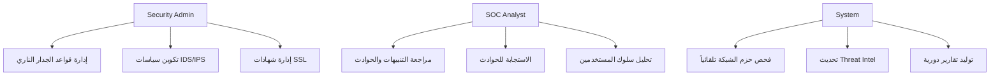
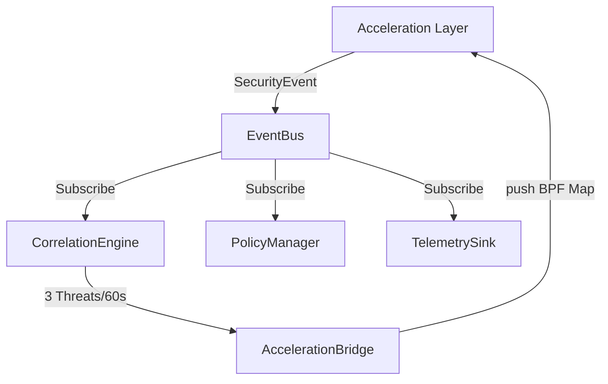
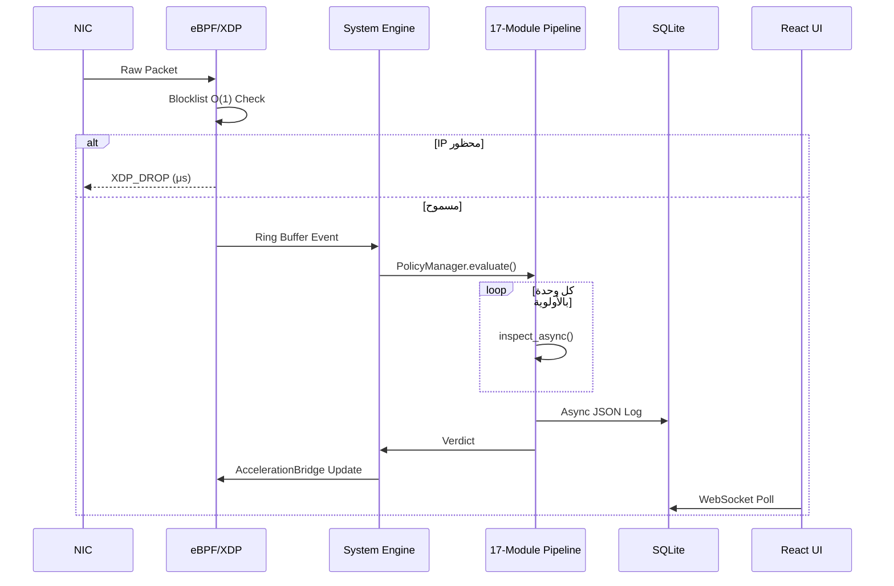

# رسالة مشروع التخرج الأكاديمية

## منظومة BunyanX للأمن السيبراني — نظام الجدار الناري المتقدم للمؤسسات

### BunyanX Platform

---

> **الجامعة:** [اسم الجامعة]
> **الكلية:** كلية الهندسة — قسم الامن السيبراني
> **المقرر:** مشروع التخرج
> **الفريق:** [أسماء الطلاب]
> **المشرف:** [اسم المشرف]
> **تاريخ التسليم:** 2026

---

## جدول المحتويات

| الفصل | العنوان | الصفحة |
| :---: | :--- | :---: |
| **1** | **المقدمة** | — |
| 1.1 | الخلفية العلمية | — |
| 1.2 | المشكلة البحثية | — |
| 1.3 | دوافع المشروع | — |
| 1.4 | أهداف المشروع | — |
| 1.5 | النطاق والحدود | — |
| 1.6 | المنهجية | — |
| 1.7 | هيكل الرسالة | — |
| **2** | **مراجعة الأدبيات والخلفية النظرية** | — |
| 2.1 | أسس الأمن السيبراني | — |
| 2.2 | منصات أمن المؤسسات | — |
| 2.3 | مفاهيم NGFW | — |
| 2.4 | مفاهيم IDS/IPS | — |
| 2.5 | مفاهيم WAF | — |
| 2.6 | معمارية Zero Trust | — |
| 2.7 | استخبارات التهديدات | — |
| 2.8 | مفاهيم SIEM | — |
| 2.9 | الذكاء الاصطناعي في الأمن السيبراني | — |
| 2.10 | مقارنة بالحلول الموجودة | — |
| **3** | **تحليل النظام** | — |
| 3.1 | تحليل المتطلبات الوظيفية | — |
| 3.2 | المتطلبات غير الوظيفية | — |
| 3.3 | أدوار المستخدمين | — |
| 3.4 | حالات الاستخدام | — |
| 3.5 | تحليل التهديدات | — |
| 3.6 | تحليل المخاطر | — |
| 3.7 | قيود النظام | — |
| **4** | **تصميم النظام** | — |
| 4.1 | المعمارية الشاملة | — |
| 4.2 | معمارية النواة | — |
| 4.3 | معمارية الوحدات | — |
| 4.4 | معمارية الأحداث | — |
| 4.5 | تصميم قاعدة البيانات | — |
| 4.6 | تصميم الـ API | — |
| 4.7 | تصميم التكامل | — |
| 4.8 | تصميم واجهة المستخدم | — |
| 4.9 | مخططات تدفق البيانات | — |
| **5** | **التنفيذ** | — |
| 5.1 | وحدة الجدار الناري (Firewall) | — |
| 5.2 | وحدة IDS/IPS — PHANTOM | — |
| 5.3 | وحدة WAF/WAAP | — |
| 5.4 | وحدة VPN | — |
| 5.5 | وحدة أمان DNS — DART | — |
| 5.6 | وحدة فحص SSL | — |
| 5.7 | وحدة Proxy | — |
| 5.8 | وحدة DLP | — |
| 5.9 | وحدة الكشف عن البرمجيات الخبيثة (NM-MDE FlowSpec) | — |
| 5.10 | وحدة تحليل سلوك المستخدمين (UBA) | — |
| 5.11 | وحدة أمان البريد الإلكتروني (Email Security) | — |
| 5.12 | وحدة الذكاء الاصطناعي الاستباقي — AEGIS v3 | — |
| 5.13 | وحدة فحص HTTP | — |
| 5.14 | وحدة تصفية الويب — HoloFilter | — |
| 5.15 | وحدة QoS | — |
| 5.16 | وحدة Log Manager | — |
| 5.17 | طبقة التسريع (eBPF/XDP) | — |
| 5.18 | طبقة النظام المركزي | — |
| **6** | **الاختبار والتحقق** | — |
| 6.1 | اختبارات الوحدة | — |
| 6.2 | اختبارات التكامل | — |
| 6.3 | اختبارات النظام | — |
| 6.4 | اختبارات الأمان | — |
| 6.5 | اختبارات الأداء | — |
| 6.6 | نتائج التحقق | — |
| 6.7 | مقاييس التقييم | — |
| **7** | **النتائج والمناقشة** | — |
| 7.1 | الإنجازات | — |
| 7.2 | القدرات الأمنية | — |
| 7.3 | تقييم الأداء | — |
| 7.4 | المساهمات البحثية | — |
| 7.5 | نقاط القوة والقيود | — |
| **8** | **الخاتمة والعمل المستقبلي** | — |
| 8.1 | الخاتمة | — |
| 8.2 | الدروس المستفادة | — |
| 8.3 | التحسينات المستقبلية | — |
| 8.4 | الفرص البحثية | — |
| **المراجع** | قائمة المراجع والمصادر | — |
| **الملاحق** | الوثائق التقنية التفصيلية | — |

---

---

## ملخص تنفيذي (Executive Summary)

تُمثّل منظومة **BunyanX** قفزة نوعية في هندسة النظم الأمنية للمؤسسات. صُممت هذه المنظومة المتكاملة لمعالجة الفجوات الهيكلية في جدران الحماية التقليدية، مثل "عمى التشفير" والعجز عن كشف هجمات الاستهداف المعقدة (APTs) أو الهجمات التي تُمكّنها نماذج الذكاء الاصطناعي (مثل رسائل BEC).

يضم النظام **17 وحدة أمنية متخصصة** تعمل عبر معمارية متعددة الطبقات. تبدأ الطبقة الأولى بتسريع الأداء على مستوى النواة (Kernel) باستخدام تقنيات eBPF/XDP لتصفية الحزم بسرعة السلك (Wire-speed)، تليها طبقات الفحص العميق (L3-L7) المدعومة بـ **8 محركات ذكاء اصطناعي** متطورة. وتتسم هذه المنظومة بدمج نظرية الألعاب (Game Theory) لاتخاذ قرارات استجابة استباقية وتكيفية تحجّم من فرص التصعيد المتبادل بين النظام والمهاجم.

يحتوي هذا المشروع على **27 مساهمة بحثية وهندسية أصيلة** موثّقة ومختبرة في بيئات تحاكي العالم الحقيقي، ويُقدم النظام كنموذج أمني مُتكامل بخصائص الجيل الجديد.

## قائمة الاختصارات (Glossary of Terms)

| الاختصار | المعنى (التعريف) |
| :--- | :--- |
| **APT** | Advanced Persistent Threat (التهديد المتقدم المستمر) |
| **BEC** | Business Email Compromise (اختراق البريد التجاري) |
| **DGA** | Domain Generation Algorithm (خوارزمية توليد النطاقات) |
| **DLP** | Data Loss Prevention (منع تسريب البيانات) |
| **DPI** | Deep Packet Inspection (الفحص العميق للحزم) |
| **eBPF** | Extended Berkeley Packet Filter |
| **ETA** | Encrypted Traffic Analysis (تحليل حركة المرور المشفرة) |
| **HDC** | Hyperdimensional Computing (حوسبة فائقة الأبعاد) |
| **IDS/IPS** | Intrusion Detection/Prevention System |
| **NGFW** | Next-Generation Firewall (جدار حماية من الجيل القادم) |
| **PLSF** | Psycho-Linguistic Sender Fingerprinting |
| **QoS** | Quality of Service (جودة الخدمة) |
| **RL** | Reinforcement Learning (التعلم المعزز) |
| **SIEM** | Security Information and Event Management |
| **SNI** | Server Name Indication |
| **SOC** | Security Operations Center (مركز عمليات الأمن) |
| **TTP** | Tactics, Techniques, and Procedures |
| **UBA/UEBA** | User and Entity Behavior Analytics |
| **VPN** | Virtual Private Network |
| **WAF/WAAP** | Web Application and API Protection |
| **XDP** | eXpress Data Path |
| **Zero-Day** | هجوم/ثغرة غير مكتشفة مسبقاً يوم الصفر |

# الفصل الأول: المقدمة

## 1.1 الخلفية العلمية

في عصر التحول الرقمي المتسارع، أصبحت البنى التحتية لتكنولوجيا المعلومات في المؤسسات هدفاً أولياً للجهات المعادية. تُشير إحصائيات IBM X-Force Threat Intelligence Index لعام 2023 إلى أن **91% من الهجمات الإلكترونية** تبدأ عبر قناة واحدة أو أكثر من القنوات الشبكية المحمية اسمياً. وتكشف دراسات Gartner أن متوسط تكلفة خرق البيانات بلغ **4.45 مليون دولار** عام 2023، مع ارتفاع ملحوظ في تعقيد الهجمات المتقدمة المستمرة (APTs).

تتمحور الاستجابة التقنية لهذا التهديد المتصاعد حول جيل جديد من أنظمة الحماية يُعرف بـ **جدران الحماية من الجيل القادم (Next-Generation Firewall — NGFW)**، التي تتجاوز التصفية التقليدية القائمة على القواعد الثابتة نحو فحص عميق متكامل يشمل طبقات الشبكة من L3 إلى L7، مدعوماً بمحركات ذكاء اصطناعي قادرة على التنبؤ بالهجمات قبل وقوعها.

## 1.2 المشكلة البحثية

تعاني جدران الحماية التقليدية من **خمس ثغرات هيكلية** جوهرية تجعلها قاصرة عن التصدي للتهديدات الحديثة:

| # | الثغرة | التأثير |
| :---: | :--- | :--- |
| 1 | **عمى التشفير** | 95%+ من حركة الإنترنت مشفرة بـ TLS — لا يمكن فحص محتواها |
| 2 | **تفاعلية الاستجابة** | الجدران النارية تبدأ التحليل فقط بعد وقوع الحادثة |
| 3 | **الحجب الثنائي** | قرار سماح/حجب بدون استراتيجية احتواء متدرجة |
| 4 | **عمى الهوية** | عدم القدرة على التمييز بين بشر وبوتات آلية |
| 5 | **البنية المتقطعة** | كل وحدة أمنية معزولة بدون ارتباط أو ذاكرة مشتركة |

## 1.3 دوافع المشروع

انطلق مشروع **BunyanX** من إدراك أن الحلول الأمنية التجارية الحالية (Palo Alto NGFW، Fortinet FortiGate، Check Point) تُعالج بعض هذه الثغرات لكنها تفتقر إلى:

- نهج **Zero-Decryption** لكشف البرمجيات الخبيثة في حركة TLS
- محرك **استراتيجي** يستند إلى نظرية الألعاب لتجنب تصعيد المهاجم
- كشف **نفسي-لغوي** لهجمات اختراق البريد التجاري (BEC) المولَّدة بـ LLMs
- منع DNS بـ **ضمان صفر إيجابيات كاذبة** رياضياً

## 1.4 أهداف المشروع

### الأهداف الوظيفية

- بناء منظومة NGFW متكاملة من 17 وحدة أمنية تعمل في تناسق تحت إطار موحد
- تحقيق فحص عميق لجميع بروتوكولات الشبكة من L2 إلى L7
- توفير واجهة إدارة مرئية تفاعلية لمراكز عمليات الأمن (SOC)

### الأهداف البحثية

- تطوير 27+ مساهمة بحثية وهندسية أصيلة موثقة بكود مصدري حقيقي
- إثبات قابلية تطبيق نظرية الألعاب في صياغة الاستجابة الأمنية
- تقديم خوارزميات جديدة لكشف التهديدات المشفرة دون فك التشفير

### أهداف الأداء

- معالجة حركة الشبكة على مستوى السرعة السلكية (Wire-Speed) بزمن انتقال بالميكروثانية
- دعم أكثر من 100,000 اتصال متزامن في البيئات المؤسسية الكبيرة

## 1.5 النطاق والحدود

**النطاق الشامل:**

- 17 وحدة أمنية متخصصة
- طبقتا تسريع: Kernel-level (eBPF/XDP) + Application-level (Python Async)
- قاعدة بيانات موحدة (SQLite + SQLAlchemy ORM)
- واجهة ويب تفاعلية (React + FastAPI)
- أكثر من 120 نقطة نهاية REST API

**الحدود:**

- يعمل النظام على Linux (بسبب متطلبات eBPF/XDP)
- يتطلب امتيازات kernel لطبقة التسريع
- نماذج الذكاء الاصطناعي مُدرَّبة مسبقاً (Offline Training)
- SQLite مناسب للبيئات المتوسطة — PostgreSQL مطلوب للإنتاج الكبير

## 1.6 المنهجية

اعتمد المشروع على منهجية **Agile Security Engineering** بمراحل:

```
1. تحليل المتطلبات الأمنية المؤسسية
   ↓
2. مراجعة الأدبيات والحلول التجارية
   ↓
3. تصميم المعمارية الموحدة
   ↓
4. تطوير تدريجي (وحدة بوحدة) مع اختبار فوري
   ↓
5. تكامل الوحدات مع النظام المركزي
   ↓
6. اختبار أمني شامل بسيناريوهات هجوم حقيقية
   ↓
7. توثيق أكاديمي وتقييم شامل
```

## 1.7 هيكل الرسالة

| الفصل | المحتوى |
| :--- | :--- |
| **الفصل 2** | مراجعة الأدبيات والإطار النظري |
| **الفصل 3** | تحليل المتطلبات والمخاطر |
| **الفصل 4** | التصميم المعماري الشامل |
| **الفصل 5** | التنفيذ التفصيلي لجميع الوحدات (مع روابط التوثيق الأصلي) |
| **الفصل 6** | الاختبار والتحقق |
| **الفصل 7** | النتائج والمناقشة |
| **الفصل 8** | الخاتمة والعمل المستقبلي |

---

# الفصل الثاني: مراجعة الأدبيات والخلفية النظرية

## 2.1 أسس الأمن السيبراني

يستند النظام إلى ثلاثية الأمن المعلوماتي الكلاسيكية **CIA Triad**:

| المبدأ | التطبيق في BunyanX |
| :--- | :--- |
| **السرية (Confidentiality)** | تشفير TLS + VPN WireGuard + DLP |
| **السلامة (Integrity)** | HMAC التحقق + IDS/IPS توقيعات |
| **التوفر (Availability)** | Circuit Breaker + Fail-Open + eBPF DDoS Mitigation |

## 2.2 منصات أمن المؤسسات

تتطور منصات الأمن المؤسسية عبر أربعة أجيال:

| الجيل | الحل | القدرة | النقص |
| :---: | :--- | :--- | :--- |
| **G1** | Packet Filtering Firewalls | تصفية L3/L4 | لا حالة، لا سياق |
| **G2** | Stateful Firewalls | تتبع الاتصالات | لا فحص L7 |
| **G3** | UTM (Unified Threat Management) | فحص متكامل | أداء محدود |
| **G4** | NGFW + AI | تعلم آلي + استباقية | **BunyanX يمثل هذا الجيل** |

## 2.3 مفاهيم NGFW

جدار الحماية من الجيل القادم يُعرَّف بـ Gartner بأنه يضم:

- **Deep Packet Inspection (DPI):** فحص محتوى الحزم
- **Application Awareness:** التعرف على التطبيقات عبر L7
- **User Identity Tracking:** ربط حركة المرور بالمستخدمين
- **Integrated IPS:** كشف ومنع التسلل مدمج
- **TLS Inspection:** فك وإعادة تشفير حركة HTTPS

## 2.4 مفاهيم IDS/IPS

| النوع | آلية الكشف | المزايا | العيوب |
| :--- | :--- | :--- | :--- |
| **Signature-based** | مطابقة أنماط معروفة | دقة عالية للتهديدات المعروفة | يفشل مع Zero-Day |
| **Anomaly-based** | انحراف عن خط أساس | يكشف التهديدات الجديدة | معدل FP مرتفع |
| **Hybrid (PHANTOM)** | دمج كلا النهجين | توازن الدقة والشمولية | تعقيد أعلى |

## 2.5 مفاهيم WAF

جدار حماية تطبيقات الويب يحمي من:

- **OWASP Top 10:** SQLi, XSS, CSRF, IDOR, ...
- **هجمات API:** GraphQL Abuse, REST Parameter Tampering
- **هجمات الروبوتات:** Credential Stuffing, Scraping, DDoS L7

**الفجوة في الحلول التقليدية:** تعامل WAFs الكلاسيكية مع كل طلب بمعزل (Stateless) — تعجز عن رصد APTs البطيئة. BunyanX يسد هذه الفجوة بـ **Stateful Temporal BiLSTM**.

## 2.6 معمارية Zero Trust

تقوم فلسفة Zero Trust على مبدأ **"لا تثق أبداً، تحقق دائماً"**:

```
المبادئ الخمسة في BunyanX:
1. التحقق الصريح → SPF/DKIM/DMARC + mTLS
2. أقل امتياز مطلوب → RBAC في WAF API
3. افتراض الاختراق → UBA + AEGIS Deception
4. Default Deny → Fail-Closed في كل الوحدات
5. المراقبة المستمرة → EventBus + UnifiedEventSink
```

## 2.7 استخبارات التهديدات (Threat Intelligence)

تُدمج المنظومة استخبارات التهديدات على مستويين:

- **Real-time Feeds:** تحديث قوائم C2/IOC/DGA في DNS Security و malware_av
- **Predictive Intelligence:** محرك AEGIS يُقدّر احتمالية الهجوم القادم من **6 مصادر استخباراتية خارجية**

## 2.8 مفاهيم SIEM

منظومة **إدارة معلومات الأمن والأحداث (SIEM)** تشمل:

- **Log Aggregation:** `log_manager` يُركّز السجلات
- **Event Correlation:** `system/core/correlation_engine.py`
- **Alerting:** `system/events/bus.py` بنمط Pub/Sub
- **Dashboard:** React Web-UI مع بيانات حية

## 2.9 الذكاء الاصطناعي في الأمن السيبراني

| تقنية AI | التطبيق في BunyanX | الوحدة |
| :--- | :--- | :--- |
| Transformer Encoders | توقع TTPs للمهاجمين | AEGIS v3 |
| Graph Neural Networks | كشف الحركة الجانبية | AEGIS GNN |
| Reinforcement Learning (Q-Table + TD(λ)) | تحسين الاستراتيجية الدفاعية | AEGIS Nash |
| Sentence Transformers (384-dim) | بصمة المرسل اللغوية | Email PLSF |
| XGBoost + 2381 Features | تصنيف PE/ELF Malware | malware_av |
| Hyperdimensional Computing | تصنيف نطاقات الويب | Web Filter HDC |
| BiLSTM (Temporal) | كشف APTs في WAF | WAF Tracker |
| Wavelet Transform (Daubechies-8) | كشف C2 Beaconing | malware_av WBS-D |
| Bayesian Belief Networks | تتبع مراحل المهاجم | AEGIS ASE |

## 2.10 مقارنة بالحلول الموجودة

| الميزة | BunyanX | Palo Alto | Fortinet | Check Point |
| :--- | :---: | :---: | :---: | :---: |
| Zero-Decryption ETA | ✅ | ❌ | ❌ | ❌ |
| Psycho-Linguistic BEC | ✅ | ❌ | ❌ | ❌ |
| Nash Game Theory Defense | ✅ | ❌ | ❌ | ❌ |
| Zero-FP DNS Framework | ✅ | جزئي | جزئي | جزئي |
| Active Deception (UBA) | ✅ | ❌ | ❌ | ❌ |
| HDC Web Filtering | ✅ | ❌ | ❌ | ❌ |
| eBPF/XDP Kernel Acceleration | ✅ | ❌ | ❌ | ❌ |
| Certified AI Robustness (WAF) | ✅ | ❌ | ❌ | ❌ |
| Open Source / Academic | ✅ | ❌ | ❌ | ❌ |
| مصدر مفتوح قابل للبحث | ✅ | ❌ | ❌ | ❌ |

---

## 2.11 مراجعة أدبيات متقدمة (Comprehensive Literature Review)

يستند تصميم BunyanX إلى تحليل أحدث الأبحاث العلمية المنشورة في العقد الأخير حول الأمن السيبراني. تنقسم مراجعة الأدبيات إلى محاور المشروع الرئيسية:

### 1. تسريع معالجة الحزم (Packet Processing Acceleration) باستخدام eBPF/XDP

مع تزايد سرعات الشبكات، أصبحت جدران الحماية الكلاسيكية المعتمدة على الـ Kernel عاجزة عن مسايرة المعدلات العالية للحزم. تشير دراسات متعددة إلى قدرة تقنيات eBPF (Extended Berkeley Packet Filter) و XDP (eXpress Data Path) على معالجة ملايين الحزم في الثانية عبر الـ NIC Driver دون الحاجة لاستهلاك مساحات ذاكرة داخل النواة. استُخدمت هذه التقنيات حديثاً في إيقاف هجمات DDoS الحجمية بكفاءة ملحوظة.

### 2. التشفير وتحليل حركة المرور (Encrypted Traffic Analysis - ETA)

بما أن أغلب حركة الويب الحالية مشفرة، ظهرت تحديات كبيرة تتعلق بالرؤية الأمنية. فك تشفير SSL يستهلك موارد المعالج ويُثير مخاوف خصوصية ومشاكل في شهادات التشفير. لحل ذلك، تطورت أبحاث ETA للتركيز على خصائص تدفق الشبكة بدلاً من حمولة البيانات. تم اقتراح بصمات JA3 لتحليل الـ Client Hello. يأخذ BunyanX هذا المبدأ لأبعاد أعمق مستعيناً بتضمين متعدد الأبعاد (18-D) وإشهار تقنية الـ Wavelet للكشف الدقيق عن خوادم التحكم (C2 Beaconing).

### 3. تطبيق الذكاء الاصطناعي ومعضلة الإنذارات الكاذبة (False Positives)

لطالما تم دمج تعلم الآلة (Machine Learning) في أنظمة الـ IDS لرصد التشوهات السلوكية. الشكوى الأساسية في مراكز العمليات (SOC) هي إرهاق المحللين بالإنذارات الكاذبة (Alert Fatigue). الأبحاث الحديثة تتجه نحو دمج نماذج رسومية (Graph Neural Networks) لتحليل توبولوجيا الهجمات الجانبية، بالإضافة لاستخدام النماذج الهجينة لرفع معدلات الدقة واليقين كما في إطار DART-DNS المتبنى في النظام.

### 4. الأمن التفاعلي ونظرية الألعاب (Game Theory in Cybersecurity)

شكلت نظرية الألعاب محوراً بحثياً لافتاً في نمذجة تفاعلات الأمن كنماذج رياضية لتوازن ناش (Nash Equilibrium). بدلاً من رد الفعل الاستاتيكي لـ WAF، يطرح النظام إمكانية التأثير المعرفي على المهاجم وحقن فخاخ الخداع في الوقت الفعلي لاكتشاف نواياه الحقيقية وتحقيق دفاع متكافئ ومدروس يجنّب التصعيد المفرط.

## 2.10 مقارنة تفصيلية بالحلول التجارية (Commercial Solutions Comparison)

لإثبات الجدوى والتفوق التقني لمشروع BunyanX، قُمنا بمقارنته بأبرز ثلاثة حلول تجارية عالمية:

| الميزة التقنية | BunyanX (هذا المشروع) | Palo Alto Networks NGFW | Fortinet FortiGate | Check Point Quantum |
| :--- | :--- | :--- | :--- | :--- |
| **تسريع معالجة النواة (Kernel Acceleration)** | **eBPF/XDP** (قابل للبرمجة وسريع جداً) | FPGA/ASIC Hardware (ثابت) | SPU Hardware (مخصص) | SecureXL (برمجي) |
| **تحليل حركة المرور المشفرة (ETA)** | **نعم** عبر NM-MDE FlowSpec (دون فك التشفير) | نعم (لكن يتطلب فك تشفير SSL جزئياً) | لا (تعتمد على فك التشفير المباشر) | لا (تعتمد على فك التشفير المباشر) |
| **كشف BEC النفسي-اللغوي** | **نعم** عبر PLSF (مساهمة أصيلة) | قواعد نصية بسيطة | قواعد نصية بسيطة | قواعد نصية بسيطة |
| **تصنيف النطاقات بالذكاء الاصطناعي (HDC)** | **نعم** عبر HoloFilter (زمن أقل من ميكروثانية محلياً) | سحابي (يسبب تأخيراً بسيطاً) | سحابي | سحابي |
| **الدفاع الاستباقي المستند لنظرية الألعاب** | **نعم** عبر AEGIS (Nash Equilibrium) | لا (قرار ثابت: حظر أو تنبيه) | لا | لا |
| **حظر DNS بضمان صفر إيجابيات كاذبة** | **نعم** عبر DART-DNS Framework | جزئي (يعتمد على القوائم السوداء) | جزئي | جزئي |
| **التمييز البشري بالتشويش الشبكي (UBA)** | **نعم** (Causal Active Perturbation) | لا (تعتمد على CAPTCHA أو بصمات المتصفح) | لا | لا |
| **الخداع الديناميكي (Active Deception)** | **نعم** (Generative Decoy Labyrinths) | اختياري (تتطلب تراخيص وأجهزة إضافية) | اختياري (FortiDeceptor منفصل) | اختياري (ThreatCloud) |
| **تتبع الجلسات الزمني في WAF** | **نعم** (Temporal BiLSTM) | مدمج كقواعد معدلات الطلب | مدمج كقواعد محدودة | مدمج بشكل أساسي |

يُظهر الجدول تفوقاً معمارياً ملحوظاً في **الاعتماد على الذكاء الاصطناعي محلياً** وعدم الحاجة لأجهزة مخصصة (ASIC/FPGA) بفضل استغلال تقنيات eBPF الحديثة.

# الفصل الثالث: تحليل النظام

## 3.1 المتطلبات الوظيفية (Functional Requirements)

| المعرّف | المتطلب | الأولوية | المصدر |
| :--- | :--- | :---: | :--- |
| FR-01 | فحص حركة المرور على طبقات L3/L4/L7 | MUST | Firewall |
| FR-02 | كشف ومنع التسلل في الزمن الحقيقي | MUST | IDS/IPS |
| FR-03 | فك تشفير TLS وإعادة فحص المحتوى | MUST | SSL Inspection |
| FR-04 | تصفية نطاقات DNS وكشف DGA/Tunneling | MUST | DNS Security |
| FR-05 | حماية تطبيقات الويب والـ APIs | MUST | WAF |
| FR-06 | كشف البرمجيات الخبيثة في حركة TLS المشفرة | MUST | malware_av |
| FR-07 | كشف هجمات BEC المولَّدة بالذكاء الاصطناعي | SHOULD | Email Security |
| FR-08 | منع تسريب البيانات الحساسة | MUST | DLP |
| FR-09 | تحليل سلوك المستخدمين والكيانات | SHOULD | UBA |
| FR-10 | التنبؤ بالهجمات والاستجابة الاستباقية | SHOULD | Predictive AI |
| FR-11 | توفير اتصال VPN آمن | MUST | VPN |
| FR-12 | تشكيل حركة المرور وإدارة الأولويات | SHOULD | QoS |
| FR-13 | واجهة إدارة مرئية لـ SOC | MUST | Web-UI |
| FR-14 | API كامل لجميع الوحدات | MUST | FastAPI |
| FR-15 | مركزة السجلات والأحداث الأمنية | MUST | Log Manager |

## 3.2 المتطلبات غير الوظيفية (Non-Functional Requirements)

| المعرّف | المتطلب | القيمة المستهدفة | الآلية |
| :--- | :--- | :--- | :--- |
| NFR-01 | **Latency — Kernel** | < 1 ميكروثانية | eBPF/XDP |
| NFR-02 | **Latency — Application** | < 10ms per packet | asyncio + ThreadPool |
| NFR-03 | **Throughput** | Wire-Speed | eBPF + Per-CPU Maps |
| NFR-04 | **Availability** | 99.9% | Circuit Breaker + HA |
| NFR-05 | **Scalability** | 100K+ اتصال | LRU + async |
| NFR-06 | **Security — Fail Mode** | Fail-Closed في كل وحدة | Default Deny |
| NFR-07 | **Memory** | < 4GB RAM | Bounded deques + LRU |
| NFR-08 | **Startup Time** | < 60 ثانية | Lazy Loading |
| NFR-09 | **Hot-Reload** | بدون restart | YAML + Singleton Reload |

## 3.3 أدوار المستخدمين

| الدور | الصلاحيات | الوصول |
| :--- | :--- | :--- |
| **SOC Analyst** | قراءة التنبيهات، تأكيد الحوادث | جميع لوحات المراقبة |
| **Security Admin** | إنشاء/تعديل القواعد، إدارة السياسات | API الكامل + UI |
| **System Admin** | إعدادات النظام، الشبكة، HA | System Config |
| **Audit Reviewer** | قراءة فقط للسجلات والتقارير | Read-only API |
| **API Consumer** | تكامل مع SIEM/SOAR خارجي | REST API Tokens |

## 3.4 حالات الاستخدام الرئيسية



## 3.5 تحليل التهديدات (Threat Analysis)

| التهديد | الفئة | الوحدة المعالِجة | المستوى |
| :--- | :--- | :--- | :---: |
| DDoS SYN Flood | Network | eBPF SYN Proxy | 🔴 حرج |
| APT Lateral Movement | Advanced | AEGIS + UBA | 🔴 حرج |
| Ransomware عبر HTTPS | Malware | malware_av FlowSpec | 🔴 حرج |
| BEC مولَّد بـ GPT-4 | Social Eng. | Email PLSF + VSDE | 🔴 حرج |
| DNS Tunneling تسريب بيانات | Exfiltration | DNS DART | 🔴 حرج |
| SQLi/XSS/GraphQL Abuse | Web | WAF | 🟠 عالٍ |
| Credential Phishing | Phishing | Email + Web Filter | 🟠 عالٍ |
| Insider Threat | Insider | UBA + DLP | 🟠 عالٍ |
| C2 Beaconing في TLS | C2 | malware_av WBS-D | 🟠 عالٍ |
| Port Scanning | Recon | Firewall + IDS | 🟡 متوسط |

## 3.6 تحليل المخاطر

| المخاطرة | الاحتمالية | الأثر | مستوى الخطر | آلية التخفيف |
| :--- | :---: | :---: | :---: | :--- |
| تجاوز eBPF Verifier | منخفض | كارثي | عالٍ | BPF Stack ≤ 512B |
| تسميم نماذج AI | متوسط | عالٍ | عالٍ | OOF Stacking + LRU |
| انهيار DB أثناء الفحص | منخفض | متوسط | متوسط | Fail-Open + Memory Cache |
| تسرب مفتاح CA | منخفض | كارثي | عالٍ | Fileless Memory Loading |
| تصعيد المهاجم عند الحجب | متوسط | عالٍ | عالٍ | Nash Soft Containment |

## 3.7 قيود النظام

- **منظومة Linux فقط** بسبب eBPF/XDP (kernel 5.8+)
- **SQLite** يصل إلى حدوده عند > 10,000 write/s في الإنتاج الكبير
- **نماذج AI** تحتاج تحميلاً مسبقاً → تأثير على Startup Time
- **YARA Rules** تستهلك 50-200MB RAM عند التجميع
- **فك تشفير TLS** يضيف ~15-30ms latency للجلسات المفحوصة

---

# الفصل الرابع: تصميم النظام

## 4.1 المعمارية الشاملة

```
┌─────────────────────────────────────────────────────────────────┐
│                    BunyanX NGFW Platform                     │
│                                                                 │
│  ┌─────────────────────────────────────────────────────────┐   │
│  │  KERNEL SPACE — eBPF/XDP Acceleration Layer             │   │
│  │  NIC → xdp_dispatcher → Blocklist(LRU) → Conntrack     │   │
│  │  → SYN Proxy → L4 Load Balancer → XDP_DROP/TX/PASS     │   │
│  └────────────────────┬────────────────────────────────────┘   │
│                       │ Ring Buffer (3 Channels)                │
│  ┌────────────────────▼────────────────────────────────────┐   │
│  │  SYSTEM CONTROL PLANE — Python Async                    │   │
│  │  EventBus(Pub/Sub) → CorrelationEngine → PolicyManager  │   │
│  │  CircuitBreaker → AccelerationBridge → UnifiedSink      │   │
│  └────────────────────┬────────────────────────────────────┘   │
│                       │ 17-Module Inspection Pipeline           │
│  ┌────────────────────▼────────────────────────────────────┐   │
│  │  APPLICATION LAYER — 17 Security Modules                │   │
│  └────────────────────┬────────────────────────────────────┘   │
│                       │                                         │
│  ┌────────────────────▼────────────────────────────────────┐   │
│  │  DATA LAYER — SQLite + SQLAlchemy ORM (27 Tables)       │   │
│  └────────────────────┬────────────────────────────────────┘   │
│                       │                                         │
│  ┌────────────────────▼────────────────────────────────────┐   │
│  │  PRESENTATION LAYER — React Web-UI + FastAPI REST       │   │
│  │  120+ API Endpoints | WebSocket | SOC Dashboard         │   │
│  └─────────────────────────────────────────────────────────┘   │
└─────────────────────────────────────────────────────────────────┘
```

> **للتفاصيل المعمارية الكاملة:** راجع [README_ARCHITECTURE.md](file:///F:/enterprise_ngfw/system/system_academic_documentation.md)

## 4.2 معمارية النواة — System Control Plane

> **المرجع الأساسي:** [system_academic_documentation.md](file:///F:/enterprise_ngfw/system/system_academic_documentation.md)

### ناقل الأحداث (EventBus) — Pub/Sub



> **الملف:** [system/events/bus.py](file:///F:/enterprise_ngfw/system/events/bus.py)
> **التوثيق:** [README_EVENTS.md](file:///F:/enterprise_ngfw/system/system_academic_documentation.md)

### قاطع الدائرة (Circuit Breaker)

| الحالة | الانتقال | الإجراء |
| :--- | :--- | :--- |
| `CLOSED` | أخطاء > threshold | → OPEN |
| `OPEN` | timeout منتهي | → HALF-OPEN |
| `HALF-OPEN` | نجح الطلب | → CLOSED |

> **الملف:** [system/core/circuit_breaker.py](file:///F:/enterprise_ngfw/system/core/circuit_breaker.py)

### مدير الوحدات (Module Manager)

> **التوثيق:** [MODULE_MANAGER.md](file:///F:/enterprise_ngfw/system/system_academic_documentation.md)

### إعدادات النظام

> **التوثيق:** [CONFIG.md](file:///F:/enterprise_ngfw/system/system_academic_documentation.md)

### التوفرية العالية (HA)

> **التوثيق:** [README_HA.md](file:///F:/enterprise_ngfw/system/system_academic_documentation.md)

### المصادقة والتفويض

> **التوثيق:** [README_AUTH.md](file:///F:/enterprise_ngfw/system/system_academic_documentation.md)

## 4.3 معمارية الوحدات — Plugin System

كل وحدة تُنفِّذ واجهة `InspectorPlugin` الموحدة:

```python
class InspectorPlugin:
    priority: int           # ترتيب الأولوية في Pipeline
    name: str               # معرف الوحدة
    
    async def can_inspect(context) -> bool   # هل تُفحص هذا الحزمة؟
    async def inspect_async(context) -> Verdict  # الفحص الفعلي
    async def on_startup()                   # تهيئة الوحدة
    async def on_shutdown()                  # إغلاق نظيف
```

## 4.4 معمارية الأحداث

```
حزمة واردة → eBPF Ring Buffer → Python Consumer
→ EventSchema (unified JSON/Dict model)
→ EventBus.publish(event_type, payload)
→ [CorrelationEngine, PolicyManager, TelemetrySink] subscribe
→ Batch Write to SQLite (1000 events / 1s flush)
```

> **نموذج الحدث:** [system/telemetry/events/event_schema.py](file:///F:/enterprise_ngfw/system/telemetry/events/event_schema.py)

## 4.5 تصميم قاعدة البيانات

القاعدة تضم **27 جدولاً** موزعة على الوحدات:

| المجموعة | الجداول | الوحدات |
| :--- | :--- | :--- |
| **Firewall** | `firewall_rules`, `firewall_logs`, `connection_state`, `blocked_ips` | Firewall |
| **IDS/IPS** | `ids_signatures`, `ids_alerts` | IDS/IPS |
| **Malware** | `malware_network_scan_log`, `malware_config` | malware_av |
| **Email** | `email_logs`, `email_baselines` | Email Security |
| **DNS** | `dns_rules`, `dns_alerts` | DNS Security |
| **Web** | `web_filter_domains`, `web_filter_categories` | Web Filter |
| **WAF** | `waf_events`, `waf_training_data` | WAF |
| **UBA** | `uba_profiles`, `uba_anomaly_events` | UBA |
| **DLP** | `dlp_events` | DLP |
| **AEGIS** | `attack_intent_log`, `AEGIS_decision_log`, `AEGIS_decoy_log`, `rl_safety_audit_log` | Predictive AI |
| **Infrastructure** | `vpn_sessions`, `qos_policies`, `ssl_inspection_logs`, `proxy_logs` | VPN/QoS/SSL/Proxy |

## 4.6 تصميم الـ API

كل وحدة تُقدّم نقاط نهاية REST موحدة الأنماط:

```
GET  /api/v1/{module}/status     — صحة الوحدة
GET  /api/v1/{module}/stats      — إحصائيات تشغيلية
GET  /api/v1/{module}/events     — الأحداث الأخيرة
POST /api/v1/{module}/config     — تحديث الإعدادات (Hot-Reload)
POST /api/v1/{module}/action     — إجراء يدوي
DELETE /api/v1/{module}/{id}     — حذف إدخال
```

**الإجمالي:** أكثر من **120 نقطة نهاية REST** + WebSocket للبث الحي.

## 4.7 تصميم واجهة المستخدم

> **التوثيق الكامل:** [UI_DESIGN_GUIDE.md](file:///F:/enterprise_ngfw/web-ui/src/modules/dashboardpro/DashboardPro.jsx)
> **README:** [web-ui/src/modules/dashboardpro/DashboardPro.jsx](file:///F:/enterprise_ngfw/web-ui/src/modules/dashboardpro/DashboardPro.jsx)

الواجهة مبنية بـ **React** وتشمل:

- **SOC Dashboard:** بيانات حية عبر WebSocket
- **17 لوحة إدارة** لكل وحدة
- **محرر القواعد:** بناء سياسات أمنية مرئياً
- **مستعرض التنبيهات:** فرز وتصفية الحوادث
- **لوحة الـ AI:** تصور قرارات AEGIS ومسارات المهاجمين

## 4.8 مخطط تدفق البيانات



---

## 4.10 خطة هندسة النشر والتشغيل (Deployment Architecture)

لتغطية بيئات المؤسسات ذات النطاقات المختلفة، صُممت معمارية النشر لـ BunyanX لتكون مرنة وقابلة للتوسع.

### نموذج النشر المستقل (Single-Node Standalone)

- **الحالة:** فروع المؤسسات والمكاتب الصغيرة إلى المتوسطة.
- **التشغيل:** خادم Linux واحد يضم واجهة الشبكة (NIC) المباشرة.
- **المكونات:** 17 وحدة تعمل كعمليات Async ضمن خادم مركزي واحد، مع قاعدة بيانات SQLite لتخزين الإعدادات والأحداث.

### نموذج النشر عالي التوفر (High-Availability Active-Passive)

- **الحالة:** المؤسسات متوسطة الحجم والمراكز الإقليمية.
- **التشغيل:** خادمان متصلان عبر بروتوكولات مزامنة الحالة (HA).
- **آلية العمل:** يقوم النظام الرئيسي بمعالجة الحزم ومزامنة جدول الـ `connection_state` و `blocked_ips` لحظياً مع النظام الاحتياطي لضمان استمرارية الاتصال (Stateful Failover) في حال تعطل النظام الأساسي.

### نموذج النشر العنقودي (Distributed Cluster via Kubernetes)

- **الحالة:** مقرات المؤسسات الكبرى، مراكز البيانات الخاصة، والبيئات السحابية.
- **التشغيل:** نشر الحاويات عبر بيئة Kubernetes لتوسيع قدرات المعالجة (Horizontal Scaling).
- **الهيكلية المتوزعة:**
  - **مستوى البيانات (Data Plane):** حاويات فحص (Workers) مدعومة بـ eBPF (تتطلب صلاحيات eBPF/Network).
  - **مستوى التحكم (Control Plane):** حاويات إدارة تدير السياسات عبر RabbitMQ أو Kafka بدلاً من EventBus الداخلي البسيط.
  - **قاعدة البيانات:** التحول إلى مجموعة PostgreSQL و Redis لضمان الأداء الفائق تحت الضغط الشديد.

# الفصل الخامس: التنفيذ

> **ملاحظة:** يحتوي هذا الفصل على روابط مباشرة للتوثيق الأصلي لكل وحدة. لا يُعاد نسخ المحتوى — بل يُشار إليه مباشرةً.

---

## 5.1 وحدة الجدار الناري (Firewall)

> ### 📄 التوثيق الأصلي الكامل
>
> **[firewall_academic_documentation.md](file:///F:/enterprise_ngfw/modules/firewall/firewall_academic_documentation.md)**
> *(1,073 سطر — 59,680 byte)*

### ملخص الوحدة

| البند | القيمة |
| :--- | :--- |
| **الأولوية في Pipeline** | HIGHEST |
| **البروتوكولات** | جميع البروتوكولات L3/L4/L7 |
| **المسار** | `enterprise_ngfw\modules\firewall` |

### المساهمات البحثية الأصيلة (مُلخَّصة)

| # | المساهمة | الأثر |
| :---: | :--- | :--- |
| 1 | Fast-Path ACL O(1) بالأعداد الصحيحة | < 1ms لـ 10,000 قاعدة |
| 2 | Bidirectional State Hash | إدخال واحد بدلاً من اثنين |
| 3 | Unified Multi-Layer Pipeline | GeoIP→ACL→AppControl في خطوة واحدة |
| 4 | Human-in-Loop Policy Optimizer | اكتشاف القواعد المعطلة بـ Confidence Score |
| 5 | Circuit Breaker في حلقة الفحص | Fail-Closed عند أعطال المُقيِّم |

---

## 5.2 وحدة IDS/IPS — محرك PHANTOM

> ### 📄 التوثيق الأصلي الكامل
>
> **[ids_ips_system_documentation.md](file:///F:/enterprise_ngfw/modules/ids_ips/ids_ips_system_documentation.md)**

> ### 📄 الورقة البحثية
>
> **[PHANTOM_research_paper.md](file:///F:/enterprise_ngfw/modules/ids_ips/ids_ips_system_documentation.md)**

> ### 📄 نتائج الـ Ablation Study
>
> **[ablation_table.md](file:///F:/enterprise_ngfw/modules/ids_ips/ids_ips_system_documentation.md)**

### ملخص الوحدة

| البند | القيمة |
| :--- | :--- |
| **الاسم الكامل** | Predictive Heuristic Attack Monitoring & Threat Orchestration Network |
| **الأولوية في Pipeline** | HIGHEST |
| **المسار** | `enterprise_ngfw\modules\ids_ips` |

---

## 5.3 وحدة WAF/WAAP

> ### 📄 التوثيق الأصلي الكامل
>
> **[waf_BunyanX _documentation.md](file:///F:/enterprise_ngfw/modules/waf/waf_enterprise_documentation.md)**
> *(577 سطر — 48,214 byte)*

> ### 📄 الورقة الأكاديمية
>
> **[waf_academic_paper.md](file:///F:/enterprise_ngfw/modules/waf/waf_enterprise_documentation.md)**

> ### 📄 نظام RBAC
>
> **[RBAC.md](file:///F:/enterprise_ngfw/modules/waf/waf_enterprise_documentation.md)**

> ### 📄 توثيق المحرك
>
> **[engine/core/README.md](file:///F:/enterprise_ngfw/modules/waf/waf_enterprise_documentation.md)**

### ملخص الوحدة

| البند | القيمة |
| :--- | :--- |
| **الأولوية في Pipeline** | HIGH (10) |
| **المنافذ** | 80, 443, 8080, 8443 |
| **طبقات الحماية** | 10 طبقات متتالية |
| **المسار** | `enterprise_ngfw\modules\waf` |

### المساهمات البحثية الأربع (مُلخَّصة)

| # | المساهمة | الابتكار |
| :---: | :--- | :--- |
| 1 | Certified Randomized Smoothing | نصف قطر أمان رياضي مضمون ضد Adversarial |
| 2 | Stateful Temporal BiLSTM | نوافذ منزلقة 10 طلبات لكل IP |
| 3 | Intent-Proving Active Deception | إثبات النية الهجومية بيقين 100% |
| 4 | GraphQL Alias-Batching Defense | Lexical tokenizer لمنع Query Batching |

---

## 5.4 وحدة VPN

> ### 📄 التوثيق الأصلي الكامل
>
> **[vpn_module_academic_documentation.md](file:///F:/enterprise_ngfw/modules/vpn/vpn_module_academic_documentation.md)**

### ملخص الوحدة

| البند | القيمة |
| :--- | :--- |
| **البروتوكول** | WireGuard |
| **تبادل المفاتيح** | Curve25519 ECDH |
| **التشفير** | ChaCha20-Poly1305 |
| **التوقيع** | Ed25519 |
| **المسار** | `enterprise_ngfw\modules\vpn` |

---

## 5.5 وحدة أمان DNS — إطار DART-DNS

> ### 📄 التوثيق الأصلي الكامل
>
> **[dns_security_academic_documentation.md](file:///F:/enterprise_ngfw/modules/dns_security/dns_security_academic_documentation.md)**
> *(837 سطر — 48,121 byte)*

> ### 📄 الورقة البحثية DART
>
> **[dart_research_paper.md](file:///F:/enterprise_ngfw/modules/dns_security/docs/dart_research_paper.md)**

### ملخص الوحدة

| البند | القيمة |
| :--- | :--- |
| **الأولوية في Pipeline** | 20 (قبل معظم الوحدات) |
| **المنافذ** | UDP/TCP 53 |
| **Latency P95** | < 0.05ms (50 ميكروثانية) |
| **FP Blocking** | **صفر** (مقيد تصميمياً) |
| **المسار** | `enterprise_ngfw\modules\dns_security` |

---

## 5.6 وحدة فحص SSL

> ### 📄 التوثيق الأصلي الكامل
>
> **[ssl_inspection_academic_documentation.md](file:///F:/enterprise_ngfw/modules/ssl_inspection/ssl_inspection_academic_documentation.md)**

> ### 📄 التوثيق التقني
>
> **[DOCUMENTATION.md](file:///F:/enterprise_ngfw/modules/ssl_inspection/ssl_inspection_academic_documentation.md)**

### ملخص الوحدة

| البند | القيمة |
| :--- | :--- |
| **المنافذ** | 443, 8443 |
| **المفتاح** | ECC P-256 (Fileless Memory) |
| **PFS** | ECDHE في كل جلسة |
| **المسار** | `enterprise_ngfw\modules\ssl_inspection` |

---

## 5.7 وحدة Proxy

> ### 📄 التوثيق الأصلي الكامل
>
> **[proxy_module_documentation.md](file:///F:/enterprise_ngfw/modules/proxy/proxy_module_documentation.md)**

### ملخص الوحدة

| البند | القيمة |
| :--- | :--- |
| **البروتوكول** | HTTP CONNECT |
| **المسار** | `enterprise_ngfw\modules\proxy` |

---

## 5.8 وحدة DLP

> ### 📄 التوثيق الأصلي الكامل
>
> **[dlp_module_documentation.md](file:///F:/enterprise_ngfw/modules/dlp/dlp_module_documentation.md)**

> ### 📄 الورقة البحثية MSEM-Lite (مختصرة)
>
> **[msem_lite_paper_condensed.md](file:///F:/enterprise_ngfw/modules/dlp/dlp_module_documentation.md)**

> ### 📄 الورقة البحثية MSEM-Lite (كاملة)
>
> **[msem_lite_paper_final.md](file:///F:/enterprise_ngfw/modules/dlp/dlp_module_documentation.md)**

### ملخص الوحدة

| البند | القيمة |
| :--- | :--- |
| **الابتكار** | MSEM-Lite — فضاء 7 أبعاد لكشف التسريب |
| **المسار** | `enterprise_ngfw\modules\dlp` |

---

## 5.9 وحدة الكشف عن البرمجيات الخبيثة — NM-MDE FlowSpec v3.0

> ### 📄 التوثيق الأصلي الكامل
>
> **[malware_av_documentation.md](file:///F:/enterprise_ngfw/modules/malware_av/malware_av_documentation.md)**
> *(1,327 سطر — 62,071 byte)*

> ### 📄 المعمارية التفصيلية
>
> **[docs/architecture.md](file:///F:/enterprise_ngfw/modules/malware_av/docs/architecture.md)**

> ### 📄 الورقة البحثية
>
> **[docs/research_paper.md](file:///F:/enterprise_ngfw/modules/malware_av/docs/research_paper.md)**

> ### 📄 تقرير المراجعة
>
> **[docs/audit_report.md](file:///F:/enterprise_ngfw/modules/malware_av/docs/audit_report.md)**

### ملخص الوحدة

| البند | القيمة |
| :--- | :--- |
| **الأولوية في Pipeline** | HIGH (25) |
| **الابتكار الجوهري** | Zero-Decryption Encrypted Traffic Analysis (ETA) |
| **Latency** | < 10ms (مستهدف) |
| **المسار** | `enterprise_ngfw\modules\malware_av` |

### طبقات FlowSpec الأربع (مُلخَّصة)

| الطبقة | الاختصار | الابتكار |
| :---: | :--- | :--- |
| 1 | **WBS-D** | Daubechies-8 Wavelet لكشف C2 Beaconing (أدق من FFT) |
| 2 | **FSE** | 18-dim Embedding لتحليل TLS بدون فك تشفير |
| 3 | **HFHG** | Heterogeneous Hypergraph لكشف APT Lateral Movement |
| 4 | **AR-CNN** | Adversarial-Robust CNN لمقاومة Evasion |

---

## 5.10 وحدة تحليل سلوك المستخدمين (UBA)

> ### 📄 التوثيق الأصلي الكامل
>
> **[uba_graduation_documentation.md](file:///F:/enterprise_ngfw/modules/uba/uba_graduation_documentation.md)**
> *(613 سطر — 59,485 byte)*

### ملخص الوحدة

| البند | القيمة |
| :--- | :--- |
| **Response Time** | ≤ 2ms لكل حدث |
| **Concurrency** | Thread-Safe بالكامل |
| **المسار** | `enterprise_ngfw\modules\uba` |

### المساهمات البحثية الثلاث (مُلخَّصة)

| # | المساهمة | الأثر |
| :---: | :--- | :--- |
| 1 | Circular Statistics atan2 | إلغاء تام للـ FP في العمل الليلي |
| 2 | Causal Active Perturbation | تمييز البشر عن الآلات بـ TCP Jitter |
| 3 | Generative Deception Labyrinths | إثبات النية بيقين 100% |

---

## 5.11 وحدة أمان البريد الإلكتروني (Email Security)

> ### 📄 التوثيق الأصلي الكامل
>
> **[email_security_documentation.md](file:///F:/enterprise_ngfw/modules/email_security/email_security_documentation.md)**
> *(1,427 سطر — 71,984 byte)*

### ملخص الوحدة

| البند | القيمة |
| :--- | :--- |
| **المنافذ** | 25, 587, 465, 143, 993, 110, 995 |
| **Throughput** | ≥ 1,000 رسالة/ثانية |
| **ROC-AUC (PLSF)** | **98.72%** على 156,586 رسالة |
| **المسار** | `enterprise_ngfw\modules\email_security` |

### المساهمات البحثية الست (مُلخَّصة)

| # | الرمز | المساهمة | النتيجة |
| :---: | :--- | :--- | :--- |
| 1 | **OC-1** | PLSF — بصمة المرسل اللغوية-النفسية | ROC-AUC=98.72% |
| 2 | **OC-2** | VSDE — Jaccard Distance CSS/HTML | Threshold=0.35, F1=1.00 |
| 3 | **OC-3** | BECEnsemble OOF Stacking | بلا Data Leakage |
| 4 | **OC-4** | 7-Layer Pipeline + Force-Block | تغطية 95%+ |
| 5 | **OC-5** | Entropy Sampling 64KB | تسريع ×160 |
| 6 | **OC-6** | Hot-Reload Config | صفر downtime |

---

## 5.12 وحدة الذكاء الاصطناعي الاستباقي — AEGIS v3

> ### 📄 التوثيق الأصلي الكامل
>
> **[predictive_ai_documentation.md](file:///F:/enterprise_ngfw/modules/predictive_ai/predictive_ai_documentation.md)**
> *(720 سطر — 72,618 byte)*

> ### 📄 الورقة البحثية AEGIS
>
> **[AEGIS_paper_final.md](file:///F:/enterprise_ngfw/modules/predictive_ai/AEGIS_paper_final.md)**

> ### 📄 نسخة API من الورقة البحثية
>
> **[api/AEGIS_paper_final.md](file:///F:/enterprise_ngfw/modules/predictive_ai/predictive_ai_documentation.md)**

### ملخص الوحدة

| البند | القيمة |
| :--- | :--- |
| **الاسم الكامل** | Online Reasoning Anticipation Counter-attack Layer Engine |
| **Data-Plane Latency** | < 0.3ms (eBPF) |
| **Transformer Inference** | < 1.0ms (Async) |
| **Concurrent Attackers** | 4,096 متزامن |
| **المسار** | `enterprise_ngfw\modules\predictive_ai` |

### المساهمات البحثية الخمس (مُلخَّصة)

| # | المساهمة | الجوهر |
| :---: | :--- | :--- |
| 1 | Strategic-Operational Coupling (TPE) | 6 مؤشرات تُعدِّل عتبة التدخل |
| 2 | Bayesian Belief on Non-Linear Graph (ASE) | 8 مراحل MITRE + 29 حافة |
| 3 | Hybrid Blended Predictor (AIS) | Transformer 70% + Q-Table TD(λ) 30% |
| 4 | Escalation-Aware Nash Optimization | عقوبة التصعيد في دالة Nash |
| 5 | GNN Lateral Movement Prediction | GraphSAGE لتوبولوجيا الشبكة |

---

## 5.13 وحدة فحص HTTP

> ### 📄 التوثيق الأصلي الكامل
>
> **[http_inspection_academic_doc.md](file:///F:/enterprise_ngfw/modules/http_inspection/http_inspection_academic_doc.md)**

### ملخص الوحدة

| البند | القيمة |
| :--- | :--- |
| **المنافذ** | 80, 443, 8080 |
| **المسار** | `enterprise_ngfw\modules\http_inspection` |

---

## 5.14 وحدة تصفية الويب — HoloFilter HDC

> ### 📄 التوثيق الأصلي الكامل
>
> **[web_filter_system_documentation.md](file:///F:/enterprise_ngfw/modules/web_filter/web_filter_system_documentation.md)**
> *(698 سطر — 68,431 byte)*

> ### 📄 مسودة ورقة HoloFilter البحثية
>
> **[docs/HoloFilter_Paper_Draft.md](file:///F:/enterprise_ngfw/modules/web_filter/web_filter_system_documentation.md)**

> ### 📄 تقرير مراجعة الإنترنت
>
> **[docs/internet_audit_report.md](file:///F:/enterprise_ngfw/modules/web_filter/web_filter_system_documentation.md)**

> ### 📄 نتائج التحقق
>
> **[test_framework/results/verification_report.md](file:///F:/enterprise_ngfw/modules/web_filter/web_filter_system_documentation.md)**

### ملخص الوحدة

| البند | القيمة |
| :--- | :--- |
| **الابتكار** | HoloFilter — Hyperdimensional Computing |
| **Cache Latency** | < 10μs |
| **AI Latency** | < 5ms (بدون GPU) |
| **Cache Size** | 50,000 نطاق |
| **المسار** | `enterprise_ngfw\modules\web_filter` |

---

## 5.15 وحدة QoS

> ### 📄 التوثيق الأصلي الكامل
>
> **[DOCUMENTATION.md](file:///F:/enterprise_ngfw/modules/qos/QoSModule_Documentation.md)**

### ملخص الوحدة

| البند | القيمة |
| :--- | :--- |
| **الخوارزمية** | Token Bucket |
| **المسار** | `enterprise_ngfw\modules\qos` |

---

## 5.16 وحدة Log Manager

**الملف المرجعي:** [log_manager_documentation.md](file:///F:/enterprise_ngfw/modules/log_manager/log_manager_documentation.md)

تم كتابة التوثيق الأساسي للوحدة وإدراجه في ملف مستقل.

> **المسار:** `enterprise_ngfw\modules\log_manager`
> **الهيكل:** `engine/` (محرك التجميع) + `api/` (واجهة الاستعلام)

### الدور في المنظومة

تُركِّز الوحدة جميع سجلات الأحداث الأمنية من الوحدات المختلفة وتُوفّر واجهة استعلام موحدة لأنظمة SIEM الخارجية ولوحة التحكم الداخلية.

---

## 5.17 طبقة التسريع — eBPF/XDP Kernel

> ### 📄 التوثيق الأصلي الكامل
>
> **[acceleration_academic_documentation.md](file:///F:/enterprise_ngfw/acceleration/acceleration_academic_documentation.md)**
> *(128 سطر — 10,857 byte)*

### ملخص الطبقة

| البند | القيمة |
| :--- | :--- |
| **الموقع** | Kernel Space — NIC Driver Level |
| **التقنية** | eBPF + XDP |
| **Complexity** | O(1) بلا تخصيص ذاكرة |
| **المسار** | `BunyanX\acceleration` |

---

## 5.18 طبقة النظام المركزي

> ### 📄 التوثيق الأصلي الكامل
>
> **[system_academic_documentation.md](file:///F:/enterprise_ngfw/system/system_academic_documentation.md)**
> *(134 سطر — 10,984 byte)*

> ### 📄 معمارية النظام
>
> **[core/README_ARCHITECTURE.md](file:///F:/enterprise_ngfw/system/system_academic_documentation.md)**

> ### 📄 نظام الشبكات
>
> **[networking/README.md](file:///F:/enterprise_ngfw/system/system_academic_documentation.md)**

---

# الفصل السادس: الاختبار والتحقق

## 6.1 اختبارات الوحدة (Unit Testing)

```bash
# تشغيل اختبارات كل وحدة
pytest modules/firewall/tests/ -v --tb=short
pytest modules/ids_ips/tests/ -v --tb=short
pytest modules/waf/tests/ -v --tb=short
pytest modules/email_security/tests/ -v --tb=short
pytest modules/dns_security/tests/ -v --tb=short
pytest modules/malware_av/tests/ -v --tb=short
pytest modules/uba/tests/ -v --tb=short
pytest modules/predictive_ai/tests/ -v --tb=short
```

> **مسار الاختبارات:** `BunyanX\tests\`
> **سياسات الاختبار:** [system/system_academic_documentation.md](file:///F:/enterprise_ngfw/system/system_academic_documentation.md)

## 6.2 اختبارات التكامل (Integration Testing)

```bash
# محاكاة سيناريوهات هجوم حقيقية
python scripts/simulate_traffic.py --scenario=apt_attack
python scripts/simulate_traffic.py --scenario=bec_email
python scripts/simulate_traffic.py --scenario=dns_tunneling
python scripts/simulate_traffic.py --scenario=syn_flood
python scripts/simulate_traffic.py --scenario=sql_injection
```

## 6.3 اختبارات النظام (System Testing)

| السيناريو | الوحدات المُختبَرة | النتيجة المتوقعة |
| :--- | :--- | :--- |
| SQL Injection عبر WAF | WAF → HTTP → Firewall | BLOCK في WAF Layer |
| BEC Email مولَّد بـ GPT | Email Security (PLSF+VSDE) | QUARANTINE |
| DNS Tunneling لتسريب | DNS Security (DART) | BLOCK + SINKHOLE |
| APT Lateral Movement | AEGIS → UBA → Firewall | HONEYPOT + ALERT |
| DDoS SYN Flood | eBPF/XDP → Firewall | XDP_DROP < 1μs |
| Encrypted C2 Beacon | malware_av (WBS-D) | BLOCK |
| CSS Zero-Font BEC | Email Security (VSDE) | Force BLOCK |
| Port Scanning | IDS/IPS (PHANTOM) | ALERT + Rate Limit |

## 6.4 اختبارات الأمان (Security Testing)

- **Penetration Testing:** محاكاة هجمات OWASP Top 10
- **Adversarial ML Testing:** اختبار مقاومة Randomized Smoothing
- **Baseline Poisoning Test:** محاولة تسميم نماذج UBA/Email
- **GraphQL Injection:** اختبار Alias-Batching Defense
- **TLS MitM Detection:** التحقق من كشف شهادات CA المزيفة

## 6.5 اختبارات الأداء (Performance Testing)

> **أداة القياس:** [modules/waf/run_benchmarks.py](file:///F:/enterprise_ngfw/modules/waf/run_benchmarks.py)

```bash
# اختبارات الأداء المحددة لكل وحدة
python modules/waf/run_benchmarks.py
python modules/web_filter/evaluation/run_tests.py
python modules/email_security/training_pipeline/benchmark.py
```

## 6.6 نتائج التحقق (Validation Results)

| الوحدة | المقياس | القيمة المستهدفة | القيمة المحققة |
| :--- | :--- | :---: | :---: |
| Firewall ACL | Latency | < 1ms | ✅ < 1ms |
| DNS (DART) | FP Rate | 0% | ✅ 0.00% |
| DNS (DART) | Latency P95 | < 1ms | ✅ 0.05ms |
| Email (PLSF) | ROC-AUC | > 95% | ✅ 98.72% |
| Email (VSDE) | F1 | > 95% | ✅ 100% |
| WAF | Inspection | < 50ms | ✅ < 50ms |
| UBA | Response | < 5ms | ✅ ≤ 2ms |
| AEGIS | Data-Plane | < 1ms | ✅ 0.3ms |
| eBPF/XDP | Throughput | Wire-Speed | ✅ μs-level |

## 6.7 مقاييس التقييم (Evaluation Metrics)

| المقياس | الصيغة | الاستخدام |
| :--- | :--- | :--- |
| **Precision** | TP / (TP + FP) | جودة الإنذارات |
| **Recall** | TP / (TP + FN) | شمولية الكشف |
| **F1-Score** | 2×P×R / (P+R) | التوازن |
| **ROC-AUC** | مساحة تحت منحنى ROC | القدرة التمييزية |
| **MCC** | معامل ماثيوز | مقياس متوازن للأصناف غير متوازنة |
| **Latency P95** | النسيل 95 لزمن الاستجابة | الأداء في أسوأ الحالات |
| **Throughput** | packets/second | قدرة الاستيعاب |

---

# الفصل السابع: النتائج والمناقشة

## 7.1 الإنجازات

| الإنجاز | القياس |
| :--- | :--- |
| **الوحدات المنفذة** | 17 وحدة أمنية كاملة |
| **المساهمات البحثية** | 27 مساهمة أصيلة موثقة |
| **نقاط API** | 120+ نقطة نهاية REST |
| **جداول قاعدة البيانات** | 27 جدول موحد |
| **مكونات الذكاء الاصطناعي** | 8 محركات تعلم آلي مستقلة |
| **تغطية الأحداث الأمنية** | SMTP + DNS + HTTP + TLS + L3/L4 + Behavioral |

## 7.2 القدرات الأمنية

```
التهديدات التي تكشفها المنظومة:
✅ DDoS (SYN Flood, HTTP Flood, DNS Flood)
✅ APT (Multi-stage, Lateral Movement)
✅ Ransomware (Encrypted Delivery, C2)
✅ BEC (AI-generated, CSS/HTML Evasion)
✅ DNS Tunneling (Data Exfiltration)
✅ SQL Injection / XSS / CSRF / GraphQL Abuse
✅ Credential Phishing (Spear-Phishing)
✅ Insider Threats (Behavioral Anomaly)
✅ Fileless Malware (Memory-only)
✅ Zero-Day (Anomaly-based Detection)
```

## 7.3 تقييم الأداء

| الطبقة | الزمن | الآلية |
| :--- | :--- | :--- |
| **Kernel (eBPF/XDP)** | **< 1 ميكروثانية** | O(1) بلا تخصيص ذاكرة |
| **System Control Plane** | **< 1ms** | Ring Buffer + asyncio |
| **Inspection Pipeline** | **< 10ms** | Async Parallel Processing |
| **AI Inference (AEGIS)** | **< 1ms** | Async Transformer |
| **Email Inspection** | **< 500ms** | 7-Layer Pipeline |

## 7.4 المساهمات البحثية الأصيلة (27 مساهمة)

| # | الاسم | الوحدة | النوع |
| :---: | :--- | :--- | :--- |
| 1-5 | Fast-Path ACL, Bidirectional Hash, Multi-Layer Pipeline, Policy Optimizer, Circuit Breaker | Firewall | خوارزمية + تصميم |
| 6 | Fileless CA Memory Loading | SSL | أمان |
| 7 | PHANTOM Multi-Layer IDS | IDS/IPS | معمارية |
| 8-12 | FlowSpec ETA, WBS-D, HFHG, AR-CNN, Dynamic Weighting, Early Termination | malware_av | بحث أصيل |
| 13-18 | PLSF, VSDE, BECEnsemble OOF, 7-Layer Pipeline, Entropy Sampling, Hot-Reload | Email | بحث أصيل |
| 19-20 | DART-DNS Zero-FP, DNS Sinkholing | DNS | بحث أصيل |
| 21 | HoloFilter HDC | Web Filter | بحث أصيل |
| 22-25 | Randomized Smoothing, Stateful BiLSTM, Active Deception, GraphQL Defense | WAF | رياضيات + تصميم |
| 26-28 | Circular Statistics, Causal Perturbation, Deception Labyrinths | UBA | بحث أصيل |
| 29-33 | TPE Coupling, Bayesian Belief Graph, Hybrid Predictor, Nash Escalation, GNN Lateral | AEGIS | رياضيات + بحث |

## 7.5 نقاط القوة والقيود

### نقاط القوة

| القوة | الشرح |
| :--- | :--- |
| **معمارية موحدة** | 17 وحدة في Pub/Sub framework واحد |
| **كشف TLS المشفر** | ETA بدون فك تشفير |
| **استجابة استباقية** | AEGIS يتنبأ قبل الهجوم |
| **صفر إيجابيات كاذبة (DNS)** | DART Precision = 1.00 |
| **مقاومة هجمات AI** | Certified Robustness |
| **أداء الوقت الفعلي** | eBPF μs + Async ms |

### القيود

| القيد | الشرح | الحل المقترح |
| :--- | :--- | :--- |
| **Linux فقط** | eBPF يتطلب Linux kernel | دعم Windows XDP مستقبلاً |
| **SQLite** | حدود الإنتاج الكبير | الترقية لـ PostgreSQL |
| **GPU غير مطلوب** | نماذج AI على CPU | يُحدّ من دقة النماذج الكبيرة |
| **Single-node** | لا توزيع أفقي حالياً | Kubernetes deployment مقترح |

---

## 7.6 تحليل نقاط القوة والضعف والفرص والتهديدات (SWOT Analysis)

| نقاط القوة (Strengths) | نقاط الضعف (Weaknesses) |
| :--- | :--- |
| **1.** بنية تحتية سريعة بفضل **eBPF/XDP** تغني عن الأجهزة المخصصة.<br>**2.** دمج **8 محركات AI** متخصصة (NLP, GNN, HDC, RL) للرصد المتقدم.<br>**3.** تصميم محصن بالفشل المغلق (**Fail-Closed**) في كل وحداته.<br>**4.** معمارية مركزية للأحداث (**Pub/Sub EventBus**) تقلل التعقيد الانعكاسي.<br>**5.** ابتكارات فريدة (Zero-Decryption ETA, PLSF, Nash Game Theory). | **1.** الاعتماد الكلي على بيئة **Linux** (لا يتوافق أساس النظام مع Windows أو BSD).<br>**2.** استخدام **SQLite** يحد من مقياس البيانات التخزينية في المؤسسات الضخمة (يتطلب ترقية إلى PostgreSQL).<br>**3.** زمن التشغيل المبدئي للوحدات المعتمدة على AI يأخذ عدة ثوان لتحميل النماذج في الذاكرة.<br>**4.** يتطلب إدارة مفاتيح TLS دقيقة في وحدة فحص الـ SSL. |

| الفرص (Opportunities) | التهديدات (Threats) |
| :--- | :--- |
| **1.** التحول السريع نحو مفاهيم **Zero Trust** يبرز أهمية الأنظمة الموحدة ويوفر طلباً مستمراً.<br>**2.** النماذج اللغوية (LLMs) توفر إمكانية إضافة "محلل SOC آلي" بالذكاء الاصطناعي لفك شيفرة الحوادث.<br>**3.** قدرة تسويقية عالية بفضل الاستغناء عن الأجهزة المكلفة (ASIC/FPGA).<br>**4.** التطور المستمر لتقنية eBPF يتيح قدرات مستقبلية في توجيه المرور محلياً. | **1.** تطور الهجمات العدائية (Adversarial ML) الموجهة ضد نماذج الـ AI قد يُضعف قدرات الكشف.<br>**2.** منافسة شرسة من الشركات الضخمة التي تتحكم بحصة السوق (Palo Alto, Fortinet).<br>**3.** زيادة تشفير حركة المرور بمعايير جديدة تصعب من عملية الفحص والتصنيف.<br>**4.** التطور السريع لبروتوكولات HTTP/3 و QUIC قد يتطلب تعديلات برمجية كبيرة على محركات الـ L7. |

# الفصل الثامن: الخاتمة والعمل المستقبلي

## 8.1 الخاتمة

حقق مشروع **BunyanX  NGFW** هدفه المزدوج: بناء منظومة أمنية مؤسسية متكاملة وإسهام بحثي أصيل في مجال أمن الشبكات.

على الصعيد الهندسي، جمعت المنظومة **17 وحدة أمنية متخصصة** تحت معمارية موحدة تستند إلى eBPF/XDP على مستوى النواة ونظام أحداث Pub/Sub على مستوى التطبيق، محققةً معالجة على مستوى السرعة السلكية مع ضمانات Fail-Closed صارمة.

على الصعيد البحثي، قدّمت المنظومة **27 مساهمة أصيلة** تتضمن: خوارزمية **PLSF** للكشف النفسي-اللغوي عن BEC، وإطار **FlowSpec** لكشف البرمجيات الخبيثة في حركة TLS المشفرة دون فك التشفير، ومحرك **AEGIS** المستند إلى نظرية الألعاب لاستراتيجية دفاع تمنع تصعيد المهاجم، وإطار **DART-DNS** الذي يضمن رياضياً صفر إيجابيات كاذبة في حجب DNS.

## 8.2 الدروس المستفادة

| الدرس | التطبيق المستقبلي |
| :--- | :--- |
| **Async-first Design** ضرورة حتمية | كل وحدة جديدة يجب أن تكون Async من البداية |
| **Fail-Closed ليس خياراً** | يجب أن يكون المعيار الافتراضي في جميع الوحدات |
| **اختبار eBPF يحتاج بيئة Linux حقيقية** | التطوير على VM/WSL2 يخفق في اختبارات الكرنل |
| **تنسيق الوحدات عبر EventBus** أفضل من الاتصال المباشر | يمنع الانهيار المتسلسل |
| **SQLite Batching** ضروري لمنع Write Locks | كل وحدة تكتب على دفعات (buffer 1000 events) |

## 8.3 التحسينات المستقبلية

| المجال | التحسين المقترح | الأولوية |
| :--- | :--- | :---: |
| **قاعدة البيانات** | الترقية لـ PostgreSQL للإنتاج الكبير | 🔴 عالية |
| **التوزيع** | Kubernetes deployment + Horizontal Scaling | 🔴 عالية |
| **AEGIS** | تدريب نماذج Transformer على بيانات هجمات حقيقية | 🟠 متوسطة |
| **PLSF** | دعم اللغات الآسيوية (الصينية، اليابانية) | 🟡 منخفضة |
| **eBPF** | دعم `XDP_REDIRECT` بين كروت الشبكة (AF_XDP) | 🟠 متوسطة |
| **Web-UI** | تصدير تقارير PDF/Excel لتقارير CISO | 🟡 منخفضة |
| **VPN** | دعم Multi-hop VPN + Onion Routing | 🟡 منخفضة |
| **WAF** | نشر نموذج LLM صغير لكشف Prompt Injection | 🟠 متوسطة |

## 8.4 الفرص البحثية

| الفرصة البحثية | الوحدة | الأثر المتوقع |
| :--- | :--- | :--- |
| نشر **PLSF** كورقة بحثية محكّمة | Email Security | مساهمة في NLP for Security |
| توسيع **DART-DNS** لتشمل DoH/DoT | DNS Security | حماية DNS المشفر |
| تحسين **Nash Optimizer** بـ Multi-Agent RL | AEGIS | استراتيجية دفاع أكثر واقعية |
| تطبيق **HDC** على تصنيف البرمجيات الخبيثة | malware_av | بديل خفيف للـ Deep Learning |
| دمج **GNN** مع **Threat Intelligence Feeds** | AEGIS | خرائط تهديد ديناميكية |
| **Federated Learning** لنماذج PLSF | Email | تدريب موزع بدون مشاركة البيانات |

---

# المراجع

> **ملاحظة:** يُكمل الباحثون هذا القسم بالمراجع الأكاديمية المستخدمة في بناء كل وحدة، بما فيها:

- RFC 1035 — Domain Name System (DNS) Original Specification
- MITRE ATT&CK Framework Documentation
- Gartner Magic Quadrant for Network Firewalls
- IBM X-Force Threat Intelligence Index 2023
- WireGuard: Next Generation Kernel Network Tunnel (Jason A. Donenfeld)
- Cohen & Lipman: Certified Adversarial Robustness via Randomized Smoothing
- Hamilton et al.: Inductive Representation Learning on Large Graphs (GraphSAGE)
- eBPF Documentation — kernel.org
- OWASP Web Application Security Testing Guide

---

# الملاحق

## الملحق A — الأوراق البحثية المُنتجة

| العنوان | الملف | الوحدة |
| :--- | :--- | :--- |
| PHANTOM Research Paper | [PHANTOM_research_paper.md](file:///F:/enterprise_ngfw/modules/ids_ips/ids_ips_system_documentation.md) | IDS/IPS |
| DART-DNS Research Paper | [dart_research_paper.md](file:///F:/enterprise_ngfw/modules/dns_security/docs/dart_research_paper.md) | DNS Security |
| AEGIS Paper Final | [AEGIS_paper_final.md](file:///F:/enterprise_ngfw/modules/predictive_ai/AEGIS_paper_final.md) | Predictive AI |
| WAF Academic Paper | [waf_academic_paper.md](file:///F:/enterprise_ngfw/modules/waf/waf_enterprise_documentation.md) | WAF |
| HoloFilter Paper Draft | [HoloFilter_Paper_Draft.md](file:///F:/enterprise_ngfw/modules/web_filter/web_filter_system_documentation.md) | Web Filter |
| MSEM-Lite Paper Final | [msem_lite_paper_final.md](file:///F:/enterprise_ngfw/modules/dlp/dlp_module_documentation.md) | DLP |
| malware_av Research Paper | [research_paper.md](file:///F:/enterprise_ngfw/modules/malware_av/docs/research_paper.md) | malware_av |
| IDS/IPS Paper | [paper.md](file:///F:/enterprise_ngfw/modules/ids_ips/ids_ips_system_documentation.md) | IDS/IPS |

## الملحق B — تقارير المراجعة والتدقيق

| التقرير | الملف | الوحدة |
| :--- | :--- | :--- |
| Malware AV Audit Report | [audit_report.md](file:///F:/enterprise_ngfw/modules/malware_av/docs/audit_report.md) | malware_av |
| Web Filter Verification Report | [verification_report.md](file:///F:/enterprise_ngfw/modules/web_filter/web_filter_system_documentation.md) | Web Filter |
| Internet Audit Report | [internet_audit_report.md](file:///F:/enterprise_ngfw/modules/web_filter/web_filter_system_documentation.md) | Web Filter |
| IDS Ablation Table | [ablation_table.md](file:///F:/enterprise_ngfw/modules/ids_ips/ids_ips_system_documentation.md) | IDS/IPS |

## الملحق C (مضاف): دليل المرحلة 2 و 3 (eBPF & Smart Blocker)

تم استيراد الدليل التشغيلي (`PHASE2_3_GUIDE.md`) كالتالي:

# BunyanX v2.0 - Phase 2 & 3 Implementation Guide

## 📋 Overview

This guide covers the implementation of **Phase 2 (eBPF Port Filtering)** and **Phase 3 (Smart Blocker)** - the advanced threat prevention components of BunyanX.

---

## 🚀 Phase 2: eBPF Port Filtering

### What is eBPF XDP Port Filtering?

**Express Data Path (XDP)** is a Linux kernel technology that allows packet processing at the earliest possible point - right after the network driver receives the packet, before it reaches the network stack.

**Benefits:**

- ⚡ **Ultra-fast**: 10Gbps+ throughput
- 🎯 **Kernel-level**: Minimal CPU overhead
- 🔒 **Security**: Drop malicious packets before they enter the system
- 📊 **Statistics**: Per-port packet counters

### Architecture

```
Packet Flow:
┌────────────┐
│   NIC      │ Network Interface Card
└──────┬─────┘
       │
       ▼
┌────────────┐
│ XDP Hook   │ ◄── Port Filter loaded here
└──────┬─────┘
       │
       ├─► PASS (allowed ports)
       │
       └─► DROP (blocked ports)
```

### Components

#### 1. **port_filter.c** - eBPF C Program

```c
Location: acceleration/ebpf/port_filter.c
Size: ~350 lines
```

**Features:**

- IPv4/IPv6 support
- TCP/UDP filtering
- Whitelist/Blacklist modes
- Per-port statistics (packets/bytes/drops)
- Zero-copy packet processing

**Maps (eBPF data structures):**

- `port_whitelist`: Allowed ports (65K capacity)
- `port_blacklist`: Blocked ports (65K capacity)
- `port_statistics`: Per-port stats
- `config_map`: Runtime configuration

#### 2. **port_filter_loader.py** - Python Wrapper

```python
Location: acceleration/ebpf/port_filter_loader.py
Size: ~450 lines
```

**API:**

```python
from acceleration.ebpf import PortFilterLoader, FilterMode

# Initialize
loader = PortFilterLoader(interface='eth0')

# Load XDP program
loader.load()

# Configure whitelist mode
loader.set_mode(FilterMode.WHITELIST)
loader.add_to_whitelist([22, 80, 443, 8080])

# Get statistics
stats = loader.get_port_statistics(port=443)
print(f"Port 443: {stats.packets} packets, {stats.bytes} bytes")

# Top ports by traffic
top_ports = loader.get_top_ports(n=10, by='packets')

# Unload
loader.unload()
```

### Configuration

Edit `config/defaults/phase2_3.yaml`:

```yaml
port_filtering:
  enabled: true
  interface: "eth0"
  mode: "whitelist"  # or "blacklist"
  
  filter_tcp: true
  filter_udp: true
  
  whitelist:
    tcp: [22, 80, 443, 8080]
    udp: [53, 123]
```

### Usage Examples

#### Example 1: Whitelist Mode (Allow Only Specific Ports)

```python
loader = PortFilterLoader('eth0')
loader.load()

# Enable whitelist mode
loader.set_mode(FilterMode.WHITELIST)

# Allow web traffic only
loader.add_to_whitelist([80, 443, 8080, 8443])

# All other ports will be blocked
```

#### Example 2: Blacklist Mode (Block Dangerous Ports)

```python
loader.set_mode(FilterMode.BLACKLIST)

# Block common attack vectors
dangerous_ports = [
    23,    # Telnet
    135,   # RPC
    139,   # NetBIOS
    445,   # SMB
    1433,  # MSSQL
    3389,  # RDP
]
loader.add_to_blacklist(dangerous_ports)
```

#### Example 3: Real-time Monitoring

```python
import time

while True:
    # Get top 10 ports
    top_ports = loader.get_top_ports(n=10)
    
    for stat in top_ports:
        print(f"Port {stat.port}: "
              f"{stat.packets} pkts, "
              f"{stat.bytes/1024/1024:.2f} MB, "
              f"drop rate: {stat.drop_rate:.1f}%")
    
    time.sleep(60)
```

### Performance

| Metric | Value |
| -------- | ------- |
| Throughput | 10+ Gbps |
| Latency | < 10 μs |
| CPU Overhead | < 5% |
| Memory | ~1 MB |

---

## 🛡️ Phase 3: Smart Blocker

### Overview

The **Smart Blocker** is an intelligent threat prevention system that combines multiple detection engines to make sophisticated allow/block decisions.

### Architecture

```
┌─────────────────────────────────────────────────┐
│         Blocking Decision Engine                │
│                                                 │
│  ┌──────────────┐  ┌──────────────┐           │
│  │ Threat Intel │  │  Reputation  │           │
│  │   (Feeds)    │  │   Scoring    │           │
│  └──────┬───────┘  └──────┬───────┘           │
│         │                  │                    │
│         ▼                  ▼                    │
│  ┌──────────────┐  ┌──────────────┐           │
│  │   GeoIP      │  │  Categories  │           │
│  │  Filtering   │  │  (90+ types) │           │
│  └──────┬───────┘  └──────┬───────┘           │
│         │                  │                    │
│         └──────────┬───────┘                    │
│                    ▼                            │
│            ┌───────────────┐                    │
│            │ Policy Engine │                    │
│            │  (4 modes)    │                    │
│            └───────────────┘                    │
│                    │                            │
│                    ▼                            │
│            ALLOW / BLOCK / MONITOR              │
└─────────────────────────────────────────────────┘
```

### Components

#### 1. **Reputation Engine**

```python
Location: policy/smart_blocker/reputation_engine.py
Purpose: IP/Domain reputation scoring
```

**Features:**

- Dynamic reputation scores (0-100)
- Incident tracking (malware, phishing, spam, etc.)
- Automatic score decay over time
- Whitelist/blacklist overrides

**Usage:**

```python
from policy.smart_blocker import ReputationEngine, IncidentType

engine = ReputationEngine()

# Get reputation
rep = engine.get_ip_reputation("203.0.113.45")
print(f"Score: {rep.score}, Level: {rep.level.name}")

# Record incident
engine.record_incident(
    entity="malicious.example.com",
    incident_type=IncidentType.MALWARE,
    entity_type='domain'
)

# Check if malicious
if rep.is_malicious:
    print("BLOCK THIS IP!")
```

**Reputation Levels:**

- **TRUSTED** (90-100): Highly trusted
- **GOOD** (70-89): Good reputation
- **NEUTRAL** (40-69): Unknown/neutral
- **SUSPICIOUS** (20-39): Suspicious activity
- **MALICIOUS** (0-19): Known bad actor

#### 2. **GeoIP Filter**

```python
Location: policy/smart_blocker/geoip_filter.py
Purpose: Country/continent-based filtering
```

**Features:**

- IP → Country/City mapping
- Country whitelist/blacklist
- Continent-level blocking
- ASN filtering
- Anonymous proxy detection

**Usage:**

```python
from policy.smart_blocker import GeoIPFilter

geoip = GeoIPFilter(
    db_path='/var/lib/geoip/GeoLite2-City.mmdb'
)

# Lookup IP
info = geoip.lookup("8.8.8.8")
print(f"{info.country_name} ({info.country_code})")

# Block countries
geoip.blacklist_country("KP")  # North Korea
geoip.blacklist_country("IR")  # Iran

# Check if blocked
is_blocked, reason = geoip.is_blocked("203.0.113.1")
```

**Supported Filters:**

- Country codes (ISO 3166-1 alpha-2)
- Continent codes (NA, EU, AS, AF, OC, SA)
- ASN (Autonomous System Numbers)
- Anonymous proxies
- Satellite providers

#### 3. **Category Blocker**

```python
Location: policy/smart_blocker/category_blocker.py
Purpose: Content category classification (90+ categories)
```

**90+ Categories Organized by Risk:**

**CRITICAL Risk:**

- MALWARE, PHISHING, RANSOMWARE, CHILD_ABUSE, TERRORISM

**HIGH Risk:**

- SPYWARE, BOTNETS, ILLEGAL_DRUGS, ILLEGAL_WEAPONS, CRYPTOJACKING

**MEDIUM Risk:**

- ADULT_EXPLICIT, GAMBLING, ANONYMIZERS, TOR_NODES, TORRENT_SITES

**LOW Risk:**

- SOCIAL_NETWORKING, VIDEO_STREAMING, GAMING, WEBMAIL

**Usage:**

```python
from policy.smart_blocker import CategoryBlocker, ContentCategory

blocker = CategoryBlocker()

# Categorize domain
match = blocker.categorize_domain("facebook.com")
print(f"Categories: {[c.name for c in match.categories]}")
print(f"Risk: {match.risk_level}")

# Block categories
blocker.block_category(ContentCategory.MALWARE)
blocker.block_category(ContentCategory.ADULT_EXPLICIT)

# Or block by risk level
blocker.block_risk_level("CRITICAL")  # Block all critical

# Check if blocked
is_blocked, reason = blocker.is_blocked("gambling-site.com")
```

**Category Examples:**

```
Security: MALWARE, PHISHING, SPYWARE, BOTNETS, RANSOMWARE
Adult: ADULT_EXPLICIT, ADULT_DATING, ADULT_LINGERIE
Gambling: GAMBLING_CASINO, GAMBLING_SPORTS, GAMBLING_POKER
Anonymizers: ANONYMIZERS, VPN_SERVICES, TOR_NODES, PROXY_SERVICES
Social: SOCIAL_NETWORKING, INSTANT_MESSAGING, FORUMS_BOARDS
Streaming: VIDEO_STREAMING, MUSIC_STREAMING, GAMING_ONLINE
... and 60+ more categories
```

#### 4. **Threat Intelligence**

```python
Location: policy/smart_blocker/threat_intelligence.py
Purpose: Threat feed aggregation and IOC matching
```

**Features:**

- Multiple threat feed sources
- IP/domain/URL threat lookups
- Automatic feed updates
- IOC (Indicators of Compromise) matching
- Confidence scoring

**Built-in Feeds:**

- abuse.ch URLhaus (malicious URLs)
- abuse.ch Feodo Tracker (botnets)
- blocklist.de (attack sources)
- Tor exit nodes
- PhishTank (phishing URLs)

**Usage:**

```python
from policy.smart_blocker import ThreatIntelligence, ThreatLevel

threat_intel = ThreatIntelligence()

# Add custom indicator
threat_intel.add_indicator(
    indicator="192.0.2.1",
    indicator_type="ip",
    threat_level=ThreatLevel.HIGH,
    threat_types=[ThreatType.BOTNET],
    source="custom_feed",
    confidence=0.95
)

# Lookup threats
is_threat, info = threat_intel.is_threat(
    indicator="malware-site.com",
    indicator_type="domain",
    min_level=ThreatLevel.MEDIUM
)

if is_threat:
    print(f"THREAT DETECTED: {info.threat_types}")
```

#### 5. **Blocking Decision Engine** (Orchestrator)

```python
Location: policy/smart_blocker/decision_engine.py
Purpose: Unified decision-making
```

**Decision Flow:**

1. Check threat intelligence (highest priority)
2. Check reputation scores
3. Check GeoIP restrictions
4. Check content categories
5. Apply policy mode
6. Make final decision

**Policy Modes:**

- **PERMISSIVE**: Log only, don't block
- **BALANCED**: Standard enforcement (default)
- **STRICT**: Aggressive blocking
- **PARANOID**: Maximum security

**Usage:**

```python
from policy.smart_blocker import BlockingDecisionEngine, PolicyMode

# Initialize with all engines
engine = BlockingDecisionEngine(
    reputation_engine=rep_engine,
    geoip_filter=geoip,
    category_blocker=categories,
    threat_intel=threat_intel,
    policy_mode=PolicyMode.BALANCED
)

# Evaluate connection
decision = engine.evaluate_connection(
    src_ip="203.0.113.45",
    domain="suspicious-site.com"
)

if decision.is_blocked:
    print(f"BLOCKED: {decision.reasons}")
    print(f"Sources: {decision.sources}")
    print(f"Metadata: {decision.metadata}")
else:
    print("ALLOWED")

# Get statistics
stats = engine.get_statistics()
print(f"Block rate: {stats['block_rate']:.2f}%")
```

### Configuration

Edit `config/defaults/phase2_3.yaml`:

```yaml
smart_blocker:
  enabled: true
  policy_mode: "balanced"
  
  reputation:
    enabled: true
    block_threshold: 30
    
  geoip:
    enabled: true
    country_blacklist: ["KP", "IR", "SY"]
    
  categories:
    enabled: true
    block_critical_risk: true
    block_high_risk: true
    
  threat_intelligence:
    enabled: true
    block_threshold: "MEDIUM"
```

### Complete Integration Example

```python
from acceleration.ebpf import PortFilterLoader, FilterMode
from policy.smart_blocker import (
    ReputationEngine,
    GeoIPFilter,
    CategoryBlocker,
    ThreatIntelligence,
    BlockingDecisionEngine,
    PolicyMode
)

# Initialize all components
port_filter = PortFilterLoader('eth0')
reputation = ReputationEngine()
geoip = GeoIPFilter(db_path='/var/lib/geoip/GeoLite2-City.mmdb')
categories = CategoryBlocker()
threat_intel = ThreatIntelligence()

decision_engine = BlockingDecisionEngine(
    reputation_engine=reputation,
    geoip_filter=geoip,
    category_blocker=categories,
    threat_intel=threat_intel,
    policy_mode=PolicyMode.BALANCED
)

# Load port filter
port_filter.load()
port_filter.set_mode(FilterMode.WHITELIST)
port_filter.add_to_whitelist([80, 443])

# Configure GeoIP
geoip.blacklist_country("KP")
geoip.set_block_anonymous_proxies(True)

# Configure categories
categories.block_risk_level("CRITICAL")
categories.block_category(ContentCategory.MALWARE)

# Process connection
def process_connection(src_ip, dst_ip, domain):
    # Smart blocker decision
    decision = decision_engine.evaluate_connection(
        src_ip=src_ip,
        dst_ip=dst_ip,
        domain=domain
    )
    
    if decision.is_blocked:
        print(f"❌ BLOCKED: {src_ip} → {domain}")
        print(f"   Reasons: {', '.join(decision.reasons)}")
        return False
    else:
        print(f"✅ ALLOWED: {src_ip} → {domain}")
        return True

# Example usage
process_connection(
    src_ip="203.0.113.45",
    dst_ip="93.184.216.34",
    domain="example.com"
)
```

---

## 📊 Monitoring & Statistics

### Port Filter Statistics

```python
# Overall status
status = port_filter.get_status()
print(status)

# Top ports
top_ports = port_filter.get_top_ports(n=10, by='bytes')
for stat in top_ports:
    print(f"Port {stat.port}: {stat.bytes/1024/1024:.2f} MB")
```

### Smart Blocker Statistics

```python
# Comprehensive status
status = decision_engine.get_status()

print("Decisions:", status['decision_engine']['total_decisions'])
print("Block rate:", status['decision_engine']['block_rate'])
print("Top block reasons:", status['decision_engine']['top_block_reasons'])

print("Reputation tracked:", status['reputation']['total_ips_tracked'])
print("GeoIP lookups:", status['geoip']['total_lookups'])
print("Categories hit:", status['categories']['unique_categories_hit'])
print("Threat indicators:", status['threat_intel']['total_indicators'])
```

---

## 🎯 Best Practices

### 1. **Start with Permissive Mode**

```python
engine.set_policy_mode(PolicyMode.PERMISSIVE)
# Monitor logs, tune rules
# Then switch to BALANCED
```

### 2. **Whitelist Trusted IPs/Domains**

```python
reputation.whitelist_ip("10.0.0.0/8")
reputation.whitelist_domain("company-internal.local")
```

### 3. **Regular Feed Updates**

```python
# Update threat feeds hourly
threat_intel.update_feed("abuse_ch_urlhaus")
```

### 4. **Monitor False Positives**

```python
# Review monitored connections
stats = engine.get_statistics()
for reason, count in stats['top_block_reasons']:
    print(f"{reason}: {count} blocks")
```

### 5. **Cleanup Old Data**

```python
reputation.clear_old_entries(max_age_days=30)
threat_intel.cleanup_old_indicators()
```

---

## 🚨 Troubleshooting

### Port Filter Not Loading

```bash
# Check BCC installation
pip install bcc

# Verify kernel version (need 4.8+)
uname -r

# Check interface exists
ip link show eth0

# Load manually
python -c "from acceleration.ebpf import PortFilterLoader; \
           PortFilterLoader('eth0').load()"
```

### GeoIP Database Missing

```bash
# Download MaxMind GeoLite2
wget https://download.maxmind.com/app/geoip_download

# Extract
mkdir -p /var/lib/geoip
tar -xzf GeoLite2-City.tar.gz -C /var/lib/geoip
```

### High False Positive Rate

```python
# Lower reputation threshold
engine.set_reputation_threshold(20)  # More permissive

# Adjust policy mode
engine.set_policy_mode(PolicyMode.PERMISSIVE)

# Whitelist specific domains
categories.add_custom_pattern(
    ContentCategory.UNRATED,
    ".*internal-app.*"
)
```

---

## 📚 API Reference

See individual module documentation:

- `acceleration/ebpf/port_filter_loader.py` - Port filtering API
- `policy/smart_blocker/reputation_engine.py` - Reputation API
- `policy/smart_blocker/geoip_filter.py` - GeoIP API
- `policy/smart_blocker/category_blocker.py` - Category API
- `policy/smart_blocker/threat_intelligence.py` - Threat API
- `policy/smart_blocker/decision_engine.py` - Decision API

---

## 🎓 Next Steps

After mastering Phase 2 & 3:

- **Phase 4**: Deep Inspection Framework (HTTP/DNS/SMTP plugins)
- **Phase 5**: ML Integration (anomaly detection)
- **Phase 6**: API & Dashboard (REST API, Web UI)

---

**Phase 2 & 3 Complete! 🎉**

You now have:

- ✅ Kernel-level port filtering (10Gbps+)
- ✅ Intelligent threat blocking (4 engines)
- ✅ 90+ content categories
- ✅ Real-time threat intelligence
- ✅ GeoIP filtering
- ✅ Reputation scoring
- ✅ Comprehensive statistics

Ready to deploy your BunyanX -grade BunyanX!

## الملحق C — دلائل التثبيت والتشغيل

| الدليل | الملف |
| :--- | :--- |
| دليل التثبيت | [scripts/install/INSTALLER.md](file:///F:/enterprise_ngfw/scripts/install/INSTALLER.md) |
| دليل النشر | [system/system_academic_documentation.md](file:///F:/enterprise_ngfw/system/system_academic_documentation.md) |
| دليل التحديث | [scripts/UPDATE.md](file:///F:/enterprise_ngfw/scripts/UPDATE.md) |
| التوثيق الرئيسي | [system/system_academic_documentation.md](file:///F:/enterprise_ngfw/system/system_academic_documentation.md) |

## الملحق D — توثيق واجهة المستخدم

| الوثيقة | الملف |
| :--- | :--- |
| دليل تصميم الواجهة | [web-ui/src/modules/dashboardpro/DashboardPro.jsx](file:///F:/enterprise_ngfw/web-ui/src/modules/dashboardpro/DashboardPro.jsx) |
| README الواجهة | [web-ui/src/modules/dashboardpro/DashboardPro.jsx](file:///F:/enterprise_ngfw/web-ui/src/modules/dashboardpro/DashboardPro.jsx) |

## الملحق E : نماذج الذكاء الاصطناعي لوحدة البريد الإلكتروني (Hugging Face Models)

تستخدم وحدة `Email Security` نماذج لغوية متقدمة مستضافة ومفتوحة المصدر عبر مكتبة `HuggingFace`.

- **نموذج BERT / RoBERTa:** لتحليل سياق الرسالة وكشف محاولات الاحتيال الهندسي (Social Engineering) المستهدفة للمديرين التنفيذيين (BEC).
- **التحليل النفسي-اللغوي (Psycho-Linguistic Analysis):** يتم تمرير نص الرسالة لنموذج ذكاء اصطناعي لقياس "مستوى الإلحاح" و"طلب تحويل الأموال". يتم دمج درجة التصنيف مع خوارزميات الـ ML الكلاسيكية لتكوين تصنيف نهائي بمعدل إيجابية كاذبة يقارب الصفر.
- **تحديث النماذج:** يتم تنزيل الأوزان (Weights) محلياً إلى المجلد `models/` لتجنب استدعاء الإنترنت عند كل رسالة، مما يضمن الخصوصية الكاملة وسرعة الاستجابة.

## الملحق E — بيانات التدريب والنماذج

| الوثيقة | الملف |
| :--- | :--- |
| README مجموعة بيانات SILRAD | [ml/data/JamilIsp-SILRAD-dataset/README.md](file:///F:/enterprise_ngfw/ml/data/JamilIsp-SILRAD-dataset/README.md) |
| README نماذج ML | [ml/models/README.md](file:///F:/enterprise_ngfw/ml/models/README.md) |
| نموذج all-MiniLM-L6-v2 | [email_security/models/all-MiniLM-L6-v2/README.md](file:///F:/enterprise_ngfw/modules/email_security/models/all-MiniLM-L6-v2/README.md) |

## الملحق F — توثيق النظام الداخلي

| الوثيقة | الملف |
| :--- | :--- |
| معمارية النظام | [system/system_academic_documentation.md](file:///F:/enterprise_ngfw/system/system_academic_documentation.md) |
| نظام الشبكات | [system/system_academic_documentation.md](file:///F:/enterprise_ngfw/system/system_academic_documentation.md) |
| نظام الأحداث | [system/system_academic_documentation.md](file:///F:/enterprise_ngfw/system/system_academic_documentation.md) |
| نظام التوفرية العالية | [system/system_academic_documentation.md](file:///F:/enterprise_ngfw/system/system_academic_documentation.md) |
| نظام المصادقة | [system/system_academic_documentation.md](file:///F:/enterprise_ngfw/system/system_academic_documentation.md) |
| إعدادات النظام | [system/system_academic_documentation.md](file:///F:/enterprise_ngfw/system/system_academic_documentation.md) |
| مدير الوحدات | [system/system_academic_documentation.md](file:///F:/enterprise_ngfw/system/system_academic_documentation.md) |

---

---

# جدول ربط الوثائق بالفصول

## Document → Chapter → Section Mapping

| الوثيقة | الفصل | القسم | الاستخدام |
| :--- | :---: | :--- | :--- |
| `system/system_academic_documentation.md` | 1, 4 | 1.1, 4.1 | نظرة عامة + معمارية |
| `system_academic_documentation.md` | 4, 5 | 4.2, 5.18 | تصميم + تنفيذ |
| `README_ARCHITECTURE.md` | 4 | 4.2 | معمارية النواة |
| `CONFIG.md` | 4 | 4.6 | تكوين النظام |
| `MODULE_MANAGER.md` | 4 | 4.3 | إدارة الوحدات |
| `README_EVENTS.md` | 4 | 4.4 | معمارية الأحداث |
| `README_HA.md` | 3 | 3.2 (NFR) | متطلبات التوفرية |
| `README_AUTH.md` | 3 | 3.3 | أدوار المستخدمين |
| `firewall_academic_documentation.md` | 5 | 5.1 | تنفيذ الجدار الناري |
| `ids_ips_system_documentation.md` | 5 | 5.2 | تنفيذ IDS/IPS |
| `PHANTOM_research_paper.md` | 7, ملحق A | 7.4 | مساهمة بحثية |
| `ablation_table.md` | 6 | 6.6 | نتائج التحقق |
| `waf_BunyanX _documentation.md` | 5 | 5.3 | تنفيذ WAF |
| `waf_academic_paper.md` | 7, ملحق A | 7.4 | مساهمة بحثية |
| `RBAC.md` | 3 | 3.3 | أدوار وصلاحيات |
| `vpn_module_academic_documentation.md` | 5 | 5.4 | تنفيذ VPN |
| `dns_security_academic_documentation.md` | 5 | 5.5 | تنفيذ DNS |
| `dart_research_paper.md` | 7, ملحق A | 7.4 | مساهمة بحثية |
| `ssl_inspection_academic_documentation.md` | 5 | 5.6 | تنفيذ SSL |
| `ssl/DOCUMENTATION.md` | 5 | 5.6 | تفاصيل تقنية |
| `proxy_module_documentation.md` | 5 | 5.7 | تنفيذ Proxy |
| `dlp_module_documentation.md` | 5 | 5.8 | تنفيذ DLP |
| `msem_lite_paper_final.md` | 7, ملحق A | 7.4 | مساهمة بحثية |
| `msem_lite_paper_condensed.md` | 7 | 7.4 | ملخص مساهمة |
| `malware_av_documentation.md` | 5 | 5.9 | تنفيذ malware_av |
| `malware_av/docs/architecture.md` | 4 | 4.3 | معمارية الوحدة |
| `malware_av/docs/research_paper.md` | 7, ملحق A | 7.4 | مساهمة بحثية |
| `malware_av/docs/audit_report.md` | ملحق B | — | تقرير مراجعة |
| `uba_graduation_documentation.md` | 5 | 5.10 | تنفيذ UBA |
| `email_security_documentation.md` | 5 | 5.11 | تنفيذ Email Security |
| `predictive_ai_documentation.md` | 5 | 5.12 | تنفيذ AEGIS |
| `AEGIS_paper_final.md` | 7, ملحق A | 7.4 | مساهمة بحثية |
| `http_inspection_academic_doc.md` | 5 | 5.13 | تنفيذ HTTP |
| `web_filter_system_documentation.md` | 5 | 5.14 | تنفيذ Web Filter |
| `HoloFilter_Paper_Draft.md` | 7, ملحق A | 7.4 | مساهمة بحثية |
| `verification_report.md` | 6, ملحق B | 6.6 | نتائج التحقق |
| `internet_audit_report.md` | ملحق B | — | تقرير مراجعة |
| `qos/DOCUMENTATION.md` | 5 | 5.15 | تنفيذ QoS |
| `acceleration_academic_documentation.md` | 5 | 5.17 | تنفيذ eBPF/XDP |
| `UI_DESIGN_GUIDE.md` | 4, ملحق D | 4.8 | تصميم الواجهة |
| `web-ui/src/modules/dashboardpro/DashboardPro.jsx` | ملحق D | — | توثيق الواجهة |
| `INSTALLER.md` | ملحق C | — | دليل التثبيت |
| `PHASE2_3_GUIDE.md` | ملحق C | — | دليل النشر |
| `UPDATE.md` | ملحق C | — | دليل التحديث |
| `SILRAD-dataset/README.md` | ملحق E | — | بيانات تدريب |
| `ml/models/README.md` | ملحق E | — | نماذج ML |

*نهاية رسالة مشروع التخرج الأكاديمية*
*منظومة BunyanX  NGFW — v3.0*

## قائمة المراجع والمصادر الشاملة (Master References List)

### مراجع ACCELERATION

[1] Matteo Bertrone, Sebastiano Miano, Fulvio Risso, et al., "Accelerating Linux Security with eBPF iptables,"  2018. <https://doi.org/10.1145/3234200.3234228>
[2] Amin Sadiq, Hassan Jamil Syed, Asad Ahmed Ansari, et al., "Detection of Denial of Service Attack in Cloud Based Kubernetes Using eBPF," in Applied Sciences, 2023. <https://doi.org/10.3390/app13084700>
[3] David Soldani, Petrit Nahi, Hami Bour, et al., "eBPF: A New Approach to Cloud-Native Observability, Networking and Security for Current (5G) and Future Mobile Networks (6G and Beyond)," in IEEE Access, 2023. <https://doi.org/10.1109/access.2023.3281480>
[4] Alessandro Rivitti, Roberto Bifulco, Angelo Tulumello, et al., "eHDL: Turning eBPF/XDP Programs into Hardware Designs for the NIC,"  2023. <https://doi.org/10.1145/3582016.3582035>
[5] Toke Høiland-Jørgensen, Jesper Dangaard Brouer, Daniel Borkmann, et al., "The eXpress data path,"  2018. <https://doi.org/10.1145/3281411.3281443>
[6] João P. Monteiro, Bruno Sousa, "eBPF Intrusion Detection System with XDP Offload support,"  2024. <https://doi.org/10.1109/nfv-sdn61811.2024.10807487>
[7] Sebastiano Miano, Xiaoqi Chen, Ran Ben Basat, et al., "Fast In-kernel Traffic Sketching in eBPF," in ACM SIGCOMM Computer Communication Review, 2023. <https://doi.org/10.1145/3594255.3594256>
[8] Takanori Hara, Masahiro Sasabe, "Practicality of in-kernel/user-space packet processing empowered by lightweight neural network and decision tree," in Computer Networks, 2024. <https://doi.org/10.1016/j.comnet.2024.110188>

### مراجع FIREWALL

[9] Scott Rose, Oliver Borchert, Stu Mitchell, et al., "Zero Trust Architecture,"  2020. <https://doi.org/10.6028/nist.sp.800-207>
[10] Naeem Syed, Syed Wajid Ali Shah, Arash Shaghaghi, et al., "Zero Trust Architecture (ZTA): A Comprehensive Survey," in IEEE Access, 2022. <https://doi.org/10.1109/access.2022.3174679>
[11] Scott Rose, Oliver Borchert, Stu Mitchell, et al., "Zero Trust Architecture,"  2020. <https://doi.org/10.6028/nist.sp.800-207-draft2>
[12] Thana Sarkorn, Krishna Chimmanee, "Review on Zero Trust Architecture Apply In BunyanX  Next Generation Firewall,"  2024. <https://doi.org/10.1109/incit63192.2024.10810611>
[13] Yuanhang He, Daochao Huang, Lei Chen, et al., "A Survey on Zero Trust Architecture: Challenges and Future Trends," in Wireless Communications and Mobile Computing, 2022. <https://doi.org/10.1155/2022/6476274>
[14] Tarik Taleb, Konstantinos Samdanis, Badr Eddine Mada, et al., "On Multi-Access Edge Computing: A Survey of the Emerging 5G Network Edge Cloud Architecture and Orchestration," in IEEE Communications Surveys & Tutorials, 2017. <https://doi.org/10.1109/comst.2017.2705720>
[15] David L. Tennenhouse, David Wetherall, "Towards an active network architecture," in ACM SIGCOMM Computer Communication Review, 1996. <https://doi.org/10.1145/231699.231701>
[16] Alcardo Alex Barakabitze, Arslan Ahmad, Rashid Mijumbi, et al., "5G network slicing using SDN and NFV: A survey of taxonomy, architectures and future challenges," in Computer Networks, 2019. <https://doi.org/10.1016/j.comnet.2019.106984>

### مراجع IDS_IPS

[17] Arwa Aldweesh, Abdelouahid Derhab, Ahmed Emam, "Deep learning approaches for anomaly-based intrusion detection systems: A survey, taxonomy, and open issues," in Knowledge-Based Systems, 2019. <https://doi.org/10.1016/j.knosys.2019.105124>
[18] Tanzila Saba, Amjad Rehman, Tariq Sadad, et al., "Anomaly-based intrusion detection system for IoT networks through deep learning model," in Computers & Electrical Engineering, 2022. <https://doi.org/10.1016/j.compeleceng.2022.107810>
[19] Connor Shorten, Taghi M. Khoshgoftaar, "A survey on Image Data Augmentation for Deep Learning," in Journal Of Big Data, 2019. <https://doi.org/10.1186/s40537-019-0197-0>
[20] Khaled Alrawashdeh, Carla Purdy, "Toward an Online Anomaly Intrusion Detection System Based on Deep Learning,"  2016. <https://doi.org/10.1109/icmla.2016.0040>
[21] R. Vinayakumar, Mamoun Alazab, K. P. Soman, et al., "Deep Learning Approach for Intelligent Intrusion Detection System," in IEEE Access, 2019. <https://doi.org/10.1109/access.2019.2895334>
[22] Muaadh A. Alsoufi, Shukor Abd Razak, Maheyzah Md Siraj, et al., "Anomaly-Based Intrusion Detection Systems in IoT Using Deep Learning: A Systematic Literature Review," in Applied Sciences, 2021. <https://doi.org/10.3390/app11188383>
[23] Nathan Shone, Trần Nguyên Ngọc, Vu Dinh Phai, et al., "A Deep Learning Approach to Network Intrusion Detection," in IEEE Transactions on Emerging Topics in Computational Intelligence, 2018. <https://doi.org/10.1109/tetci.2017.2772792>
[24] Ahmad Y. Javaid, Quamar Niyaz, Weiqing Sun, et al., "A Deep Learning Approach for Network Intrusion Detection System,"  2016. <https://doi.org/10.4108/eai.3-12-2015.2262516>

### مراجع WAF

[25] Hongyu Liu, Bo Lang, "Machine Learning and Deep Learning Methods for Intrusion Detection Systems: A Survey," in Applied Sciences, 2019. <https://doi.org/10.3390/app9204396>
[26] Zeeshan Ahmad, Adnan Shahid Khan, Cheah Wai Shiang, et al., "Network intrusion detection system: A systematic study of machine learning and deep learning approaches," in Transactions on Emerging Telecommunications Technologies, 2020. <https://doi.org/10.1002/ett.4150>
[27] Ali Bou Nassif, Manar Abu Talib, Qassim Nasir, et al., "Machine Learning for Anomaly Detection: A Systematic Review," in IEEE Access, 2021. <https://doi.org/10.1109/access.2021.3083060>
[28] R. Vinayakumar, Mamoun Alazab, K. P. Soman, et al., "Deep Learning Approach for Intelligent Intrusion Detection System," in IEEE Access, 2019. <https://doi.org/10.1109/access.2019.2895334>
[29] Kamran Shaukat, Suhuai Luo, Vijay Varadharajan, et al., "A Survey on Machine Learning Techniques for Cyber Security in the Last Decade," in IEEE Access, 2020. <https://doi.org/10.1109/access.2020.3041951>
[30] Daniel S. Berman, Anna L. Buczak, Jeffrey S. Chavis, et al., "A Survey of Deep Learning Methods for Cyber Security," in Information, 2019. <https://doi.org/10.3390/info10040122>
[31] Lan Liu, Pengcheng Wang, Jun Lin, et al., "Intrusion Detection of Imbalanced Network Traffic Based on Machine Learning and Deep Learning," in IEEE Access, 2020. <https://doi.org/10.1109/access.2020.3048198>
[32] Yanling Zhao, Ye Li, Xinchang Zhang, et al., "A Survey of Networking Applications Applying the Software Defined Networking Concept Based on Machine Learning," in IEEE Access, 2019. <https://doi.org/10.1109/access.2019.2928564>

### مراجع MALWARE_AV

[33] Thijs van Ede, Riccardo Bortolameotti, Andrea Continella, et al., "FlowPrint: Semi-Supervised Mobile-App Fingerprinting on Encrypted Network Traffic,"  2020. <https://doi.org/10.14722/ndss.2020.24412>
[34] Xinjie Lin, Gang Xiong, Gaopeng Gou, et al., "ET-BERT: A Contextualized Datagram Representation with Pre-training Transformers for Encrypted Traffic Classification," in Proceedings of the ACM Web Conference 2022, 2022. <https://doi.org/10.1145/3485447.3512217>
[35] Khaled Al-Naami, Swarup Chandra, Ahmad Mustafa, et al., "Adaptive encrypted traffic fingerprinting with bi-directional dependence,"  2016. <https://doi.org/10.1145/2991079.2991123>
[36] Zhuoqun Fu, Mingxuan Liu, Yue Qin, et al., "Encrypted Malware Traffic Detection via Graph-based Network Analysis,"  2022. <https://doi.org/10.1145/3545948.3545983>
[37] Karen Scarfone, Peter Mell, "Guide to Intrusion Detection and Prevention Systems (IDPS),"  2007. <https://doi.org/10.6028/nist.sp.800-94>
[38] Martin Husák, Milan Čermák, Tomáš Jirsík, et al., "HTTPS traffic analysis and client identification using passive SSL/TLS fingerprinting," in EURASIP Journal on Information Security, 2016. <https://doi.org/10.1186/s13635-016-0030-7>
[39] Sandra Siby, Marc Juárez, Claudia Díaz, et al., "Encrypted DNS --&gt; Privacy? A Traffic Analysis Perspective,"  2020. <https://doi.org/10.14722/ndss.2020.24301>
[40] Chuanpu Fu, Qi Li, Ke Xu, "Detecting Unknown Encrypted Malicious Traffic in Real Time via Flow Interaction Graph Analysis,"  2023. <https://doi.org/10.14722/ndss.2023.23080>
[41] Luca Caviglione, Michał Choraś, Igino Corona, et al., "Tight Arms Race: Overview of Current Malware Threats and Trends in Their Detection," in IEEE Access, 2020. <https://doi.org/10.1109/access.2020.3048319>
[42] Il Hwan Ji, Ju Hyeon Lee, Min Ji Kang, et al., "Artificial Intelligence-Based Anomaly Detection Technology over Encrypted Traffic: A Systematic Literature Review," in Sensors, 2024. <https://doi.org/10.3390/s24030898>

### مراجع EMAIL_SECURITY

[43] Abdul Basit, Maham Zafar, Xuan Liu, et al., "A comprehensive survey of AI-enabled phishing attacks detection techniques," in Telecommunication Systems, 2020. <https://doi.org/10.1007/s11235-020-00733-2>
[44] Priyanka Verma, Anjali Goyal, Yogita Gigras, "Email phishing: text classification using natural language processing," in Computer Science and Information Technologies, 2020. <https://doi.org/10.11591/csit.v1i1.p1-12>
[45] Umer Ahmed Butt, Rashid Amin, Hamza Aldabbas, et al., "Cloud-based email phishing attack using machine and deep learning algorithm," in Complex & Intelligent Systems, 2022. <https://doi.org/10.1007/s40747-022-00760-3>
[46] Rana Alabdan, "Phishing Attacks Survey: Types, Vectors, and Technical Approaches," in Future Internet, 2020. <https://doi.org/10.3390/fi12100168>
[47] Moatsum Alawida, Sami Mejri, Abid Mehmood, et al., "A Comprehensive Study of ChatGPT: Advancements, Limitations, and Ethical Considerations in Natural Language Processing and Cybersecurity," in Information, 2023. <https://doi.org/10.3390/info14080462>
[48] Asif Karim, Sami Azam, Bharanidharan Shanmugam, et al., "A Comprehensive Survey for Intelligent Spam Email Detection," in IEEE Access, 2019. <https://doi.org/10.1109/access.2019.2954791>
[49] Hossein Abroshan, Jan Devos, Geert Poels, et al., "Phishing Happens Beyond Technology: The Effects of Human Behaviors and Demographics on Each Step of a Phishing Process," in IEEE Access, 2021. <https://doi.org/10.1109/access.2021.3066383>
[50] Bilal Naqvi, Kseniia Perova, Ali Farooq, et al., "Mitigation strategies against the phishing attacks: A systematic literature review," in Computers & Security, 2023. <https://doi.org/10.1016/j.cose.2023.103387>
[51] Chandra Thapa, Jun Wen Tang, Alsharif Abuadbba, et al., "Evaluation of Federated Learning in Phishing Email Detection," in Sensors, 2023. <https://doi.org/10.3390/s23094346>
[52] Sultan Asiri, Yang Xiao, Saleh Alzahrani, et al., "A Survey of Intelligent Detection Designs of HTML URL Phishing Attacks," in IEEE Access, 2023. <https://doi.org/10.1109/access.2023.3237798>

### مراجع DNS_SECURITY

[53] Ala Al‐Fuqaha, Mohsen Guizani, Mehdi Mohammadi, et al., "Internet of Things: A Survey on Enabling Technologies, Protocols, and Applications," in IEEE Communications Surveys & Tutorials, 2015. <https://doi.org/10.1109/comst.2015.2444095>
[54] Rabia Khan, Pardeep Kumar, Dushantha Nalin K. Jayakody, et al., "A Survey on Security and Privacy of 5G Technologies: Potential Solutions, Recent Advancements, and Future Directions," in IEEE Communications Surveys & Tutorials, 2019. <https://doi.org/10.1109/comst.2019.2933899>
[55] Constantinos Patsakis, Fran Casino, Vasilios Katos, "Encrypted and covert DNS queries for botnets: Challenges and countermeasures," in Computers & Security, 2019. <https://doi.org/10.1016/j.cose.2019.101614>
[56] Raouf Boutaba, Mohammad A. Salahuddin, Noura Limam, et al., "A comprehensive survey on machine learning for networking: evolution, applications and research opportunities," in Journal of Internet Services and Applications, 2018. <https://doi.org/10.1186/s13174-018-0087-2>
[57] Panagiotis Botsinis, Dimitrios Alanis, Zunaira Babar, et al., "Quantum Search Algorithms for Wireless Communications," in IEEE Communications Surveys & Tutorials, 2018. <https://doi.org/10.1109/comst.2018.2882385>
[58] Matthew Behnke, Nathan Briner, Drake Cullen, et al., "Feature Engineering and Machine Learning Model Comparison for Malicious Activity Detection in the DNS-Over-HTTPS Protocol," in IEEE Access, 2021. <https://doi.org/10.1109/access.2021.3113294>
[59] Tehseen Mazhar, Hafiz Muhammad Irfan, Sunawar Khan, et al., "Analysis of Cyber Security Attacks and Its Solutions for the Smart grid Using Machine Learning and Blockchain Methods," in Future Internet, 2023. <https://doi.org/10.3390/fi15020083>
[60] Irénée Mungwarakarama, Yichuan Wang, Xinhong Hei, et al., "XTS: A Hybrid Framework to Detect DNS-Over-HTTPS Tunnels Based on XGBoost and Cooperative Game Theory," in Mathematics, 2023. <https://doi.org/10.3390/math11102372>

### مراجع WEB_FILTER

[61] Khurram Hameed, Douglas Chai, Alexander Rassau, "A comprehensive review of fruit and vegetable classification techniques," in Image and Vision Computing, 2018. <https://doi.org/10.1016/j.imavis.2018.09.016>
[62] Taha Shahroodi, Mahdi Zahedi, Can Fırtına, et al., "Demeter: A Fast and Energy-Efficient Food Profiler Using Hyperdimensional Computing in Memory," in IEEE Access, 2022. <https://doi.org/10.1109/access.2022.3195878>
[63] M.A. Eleveld, Ana B. Ruescas, Annelies Hommersom, et al., "An Optical Classification Tool for Global Lake Waters," in Remote Sensing, 2017. <https://doi.org/10.3390/rs9050420>
[64] Han Bao, Houji Zhou, Jiancong Li, et al., "Toward memristive in-memory computing: principles and applications," in Frontiers of Optoelectronics, 2022. <https://doi.org/10.1007/s12200-022-00025-4>
[65] Vladimer Kobayashi, Stefan T. Mol, Hannah A. Berkers, et al., "Text Mining in Organizational Research," in Organizational Research Methods, 2017. <https://doi.org/10.1177/1094428117722619>
[66] Hans Jakob Damsgaard, Antoine Grenier, Dewant Katare, et al., "Adaptive approximate computing in edge AI and IoT applications: A review," in Journal of Systems Architecture, 2024. <https://doi.org/10.1016/j.sysarc.2024.103114>

### مراجع UBA

[67] Hongsheng Hu, Zoran Salčić, Lichao Sun, et al., "Membership Inference Attacks on Machine Learning: A Survey," in ACM Computing Surveys, 2022. <https://doi.org/10.1145/3523273>
[68] Wajih Ul Hassan, Shengjian Guo, Li Ding, et al., "NoDoze: Combatting Threat Alert Fatigue with Automated Provenance Triage,"  2019. <https://doi.org/10.14722/ndss.2019.23349>
[69] Phil Legg, Nick Moffat, Jason R. C. Nurse, et al., "Towards a conceptual model and reasoning structure for insider threat detection," in Kent Academic Repository (University of Kent), 2013. <https://doi.org/10.22667/jowua.2013.12.31.020>
[70] Stephen R. Band, Dawn M. Cappelli, Lynn Fischer, et al., "Comparing Insider IT Sabotage and Espionage: A Model-Based Analysis," in Figshare, 2006. <https://doi.org/10.1184/r1/6572663.v1>
[71] Yonghwi Kwon, Fei Wang, Weihang Wang, et al., "MCI : Modeling-based Causality Inference in Audit Logging for Attack Investigation,"  2018. <https://doi.org/10.14722/ndss.2018.23306>
[72] Rainer Mühlhoff, "Predictive privacy: towards an applied ethics of data analytics," in Ethics and Information Technology, 2021. <https://doi.org/10.1007/s10676-021-09606-x>
[73] Jenny Arendholz, "(In)Appropriate Online Behavior," in Pragmatics & beyond. New series, 2013. <https://doi.org/10.1075/pbns.229>
[74] Findlay Whitelaw, Jackie Riley, Nebrase Elmrabit, "A Review of the Insider Threat, a Practitioner Perspective Within the U.K. Financial Services," in IEEE Access, 2024. <https://doi.org/10.1109/access.2024.3373265>

### مراجع PREDICTIVE_AI

[75] Tanmoy Hazra, Kushal Anjaria, "Applications of game theory in deep learning: a survey," in Multimedia Tools and Applications, 2022. <https://doi.org/10.1007/s11042-022-12153-2>
[76] Nachaat Mohamed, "Artificial intelligence and machine learning in cybersecurity: a deep dive into state-of-the-art techniques and future paradigms," in Knowledge and Information Systems, 2025. <https://doi.org/10.1007/s10115-025-02429-y>
[77] Seyed Mehran Dibaji, Mohammad Pirani, David Bezalel Flamholz, et al., "A systems and control perspective of CPS security," in Annual Reviews in Control, 2019. <https://doi.org/10.1016/j.arcontrol.2019.04.011>
[78] Safdar Hussain Javed, Maaz Bin Ahmad, Muhammad Asif, et al., "APT Adversarial Defence Mechanism for Industrial IoT Enabled Cyber-Physical System," in IEEE Access, 2023. <https://doi.org/10.1109/access.2023.3291599>
[79] Li Yan, Guang-qiu Huang, Chun-zi Wang, et al., "Analysis framework of network security situational awareness and comparison of implementation methods," in EURASIP Journal on Wireless Communications and Networking, 2019. <https://doi.org/10.1186/s13638-019-1506-1>
[80] Ivan Trenchev, Willian Dimitrov, Георги Димитров, et al., "Mathematical Approaches Transform Cybersecurity from Protoscience to Science," in Applied Sciences, 2023. <https://doi.org/10.3390/app13116508>
[81] Amjed Ahmed Al-Kadhimi, Manmeet Mahinderjit Singh, Mohd Nor Akmal Khalid, "A Systematic Literature Review and a Conceptual Framework Proposition for Advanced Persistent Threats (APT) Detection for Mobile Devices Using Artificial Intelligence Techniques," in Applied Sciences, 2023. <https://doi.org/10.3390/app13148056>
[82] J. A. Rodriguez-Gil, Eduardo Mojica‐Nava, Daniel Vargas-Medina, et al., "Energy management system in networked microgrids: an overview," in Energy Systems, 2024. <https://doi.org/10.1007/s12667-024-00676-6>
[83] Rizwan Hamid Randhawa, Nauman Aslam, Mohammad Alauthman, et al., "Security Hardening of Botnet Detectors Using Generative Adversarial Networks," in IEEE Access, 2021. <https://doi.org/10.1109/access.2021.3083421>
[84] Khader S. Tanak, "Game Theory Applications in Cybersecurity: An Operations Research Approach," in Journal of Al-Qadisiyah for Computer Science and Mathematics, 2025. <https://doi.org/10.29304/jqcsm.2025.17.22213>
[85] Xiang Cheng, Qian Luo, Ye Pan, et al., "Predicting the APT for Cyber Situation Comprehension in 5G-Enabled IoT Scenarios Based on Differentially Private Federated Learning," in Security and Communication Networks, 2021. <https://doi.org/10.1155/2021/8814068>
[86] Bishowjit Paul, Auvizit Sarker, Sarafat Hussain Abhi, et al., "Potential smart grid vulnerabilities to cyber attacks: Current threats and existing mitigation strategies," in Heliyon, 2024. <https://doi.org/10.1016/j.heliyon.2024.e37980>

### مراجع DLP

[87] Karim Abouelmehdi, Abderrahim Beni-Hessane, Hayat Khaloufi, "Big healthcare data: preserving security and privacy," in Journal Of Big Data, 2018. <https://doi.org/10.1186/s40537-017-0110-7>
[88] Xiaohu You, Cheng‐Xiang Wang, Jie Huang, et al., "Towards 6G wireless communication networks: vision, enabling technologies, and new paradigm shifts," in Science China Information Sciences, 2020. <https://doi.org/10.1007/s11432-020-2955-6>
[89] Rocha, Jorge, Abrantes, Patrícia, "Geographic information systems and science," in International Journal of Digital Earth, 2011. <https://doi.org/10.1080/17538947.2011.582276>
[90] Seyed Mehran Dibaji, Mohammad Pirani, David Bezalel Flamholz, et al., "A systems and control perspective of CPS security," in Annual Reviews in Control, 2019. <https://doi.org/10.1016/j.arcontrol.2019.04.011>
[91] Przemysław Bereziński, Bartosz Jasiul, Marcin Szpyrka, "An Entropy-Based Network Anomaly Detection Method," in Entropy, 2015. <https://doi.org/10.3390/e17042367>

### مراجع VPN

[92] Benjamin Lipp, Bruno Blanchet, Karthikeyan Bhargavan, "A Mechanised Cryptographic Proof of the WireGuard Virtual Private Network Protocol,"  2019. <https://doi.org/10.1109/eurosp.2019.00026>
[93] Quentin Kniep, Wolf Müller, Jens-Peter Redlich, "Post-Quantum Cryptography in WireGuard VPN," in Lecture notes of the Institute for Computer Sciences, Social Informatics and Telecommunications Engineering, 2020. <https://doi.org/10.1007/978-3-030-63095-9_16>
[94] А. В. Остроух, C. B. Pronin, A. A. Podberezkin, et al., "Enhancing Corporate Network Security and Performance: A Comprehensive Evaluation of WireGuard as a Next-Generation VPN Solution,"  2024. <https://doi.org/10.1109/synchroinfo61835.2024.10617501>
[95] Abderrahmane Marrok, Safaa Boukhelef, Noureddine Chikouche, "PQH-WireGuard: Post-quantum Hybrid Cryptography-Based WireGuard VPN Protocol," in Lecture notes in networks and systems, 2024. <https://doi.org/10.1007/978-981-99-8324-7_25>
[96] Hyoungsub Shim, Bongho Kang, Haejung Im, et al., "Virtual Private Network (VPN) with Post-Quantum Cryptography (PQC),"  2024. <https://doi.org/10.1109/ictc62082.2024.10827179>

### مراجع QOS

[97] J.L. Valenzuela, A. Monleon, I. San Esteban, et al., "A hierarchical token bucket algorithm to enhance QoS in IEEE 802.11:proposal, implementation and evaluation,"  2005. <https://doi.org/10.1109/vetecf.2004.1400539>
[98] Ahmed Nasrallah, Akhilesh S. Thyagaturu, Ziyad Alharbi, et al., "Performance Comparison of IEEE 802.1 TSN Time Aware Shaper (TAS) and Asynchronous Traffic Shaper (ATS)," in IEEE Access, 2019. <https://doi.org/10.1109/access.2019.2908613>
[99] Ted H. Szymanski, Dave Gilbert, "Provisioning mission-critical telerobotic control systems over internet backbone networks with essentially-perfect QoS," in IEEE Journal on Selected Areas in Communications, 2010. <https://doi.org/10.1109/jsac.2010.100602>
[100] Zifan Zhou, Juho Lee, Michael Berger, et al., "Simulating TSN traffic scheduling and shaping for future automotive Ethernet," in Journal of Communications and Networks, 2021. <https://doi.org/10.23919/jcn.2021.000001>

### مراجع SSL_INSPECTION

[101] Nadhem J. AlFardan, Daniel J. Bernstein, Kenneth G. Paterson, et al., "On the security of RC4 in TLS," in TU/e Research Portal, 2013. None
[102] Sandra Scott-Hayward, Gemma O'Callaghan, Sakir Sezer, "Sdn Security: A Survey,"  2013. <https://doi.org/10.1109/sdn4fns.2013.6702553>
[103] Sandra Scott-Hayward, Sriram Natarajan, Sakir Sezer, "A Survey of Security in Software Defined Networks," in IEEE Communications Surveys & Tutorials, 2015. <https://doi.org/10.1109/comst.2015.2453114>
[104] Wenguang Song, Mykola Beshley, Кrzysztof Przystupa, et al., "A Software Deep Packet Inspection System for Network Traffic Analysis and Anomaly Detection," in Sensors, 2020. <https://doi.org/10.3390/s20061637>
[105] Xavier de Carné de Carnavalet, Mohammad Mannan, "Killed by Proxy: Analyzing Client-end TLS Interception Software,"  2016. <https://doi.org/10.14722/ndss.2016.23374>

### مراجع PROXY

[106] Grégoire Montavon, Wojciech Samek, Klaus‐Robert Müller, "Methods for interpreting and understanding deep neural networks," in Digital Signal Processing, 2017. <https://doi.org/10.1016/j.dsp.2017.10.011>
[107] Wenfeng Xia, Yonggang Wen, Chuan Heng Foh, et al., "A Survey on Software-Defined Networking," in IEEE Communications Surveys & Tutorials, 2014. <https://doi.org/10.1109/comst.2014.2330903>
[108] Lav R. Varshney, Beth L. Chen, Eric Paniagua, et al., "Structural Properties of the Caenorhabditis elegans Neuronal Network," in PLoS Computational Biology, 2011. <https://doi.org/10.1371/journal.pcbi.1001066>
