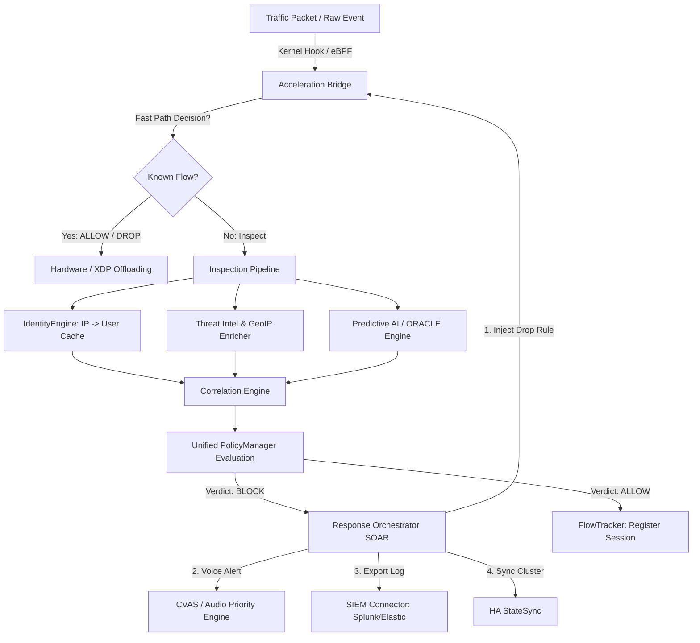

# توثيق تقني ومعماري متقدم: طبقة التحكم وتنسيق النظام (System Control & Orchestration Plane)

**منظومة جدار الحماية المؤسسي: Enterprise BunyanX Next-Generation Firewall (NGFW)**

---

## 1. المقدمة والرؤية المعمارية (Introduction & Architectural Vision)

تُمثل طبقة النظام (`F:\enterprise_ngfw\system`) العقل المدبر والجهاز العصبي المركزي لمنظومة جدار الحماية المؤسسي (BunyanX NGFW). فبينما تتولى طبقة التسريع (`acceleration`) تصفية الحزم في مستويات العتاد والنواة، وتختص طبقة الوحدات (`modules`) بمهام الفحص التخصصي، تتكفل طبقة النظام بإدارة وتنسيق كافة هذه المكونات، وتوفير بيئة تشغيلية موحدة فائقة الكفاءة.

### الفلسفة المعمارية لمكونات النظام:
1. **التصميم المستقل واللامركزي (Decoupling Architecture):** إلغاء التبعيات المباشرة بين المكونات الأمنية، وتطوير كافة المحركات لتعمل بتوافق عبر حاوية الخدمات (`ServiceContainer`) وشجرة التبعيات الموجهة (`ModuleRegistry` / DAG).
2. **النمط الموجه بالأحداث (Event-Driven Architecture):** استخدام ناقل الأحداث غير المتزامن (`EventBus`) بنمط (Pub/Sub) لتمرير التليمتري والقرارات الأمنية بين المحركات دون التسبب في اختناقات (Non-blocking I/O).
3. **المعالجة فائقة السرعة والتسريع النواتي (Kernel & Hardware Offloading):** ربط طبقة التحكم المركزية مباشرة مع طبقة eBPF/XDP لتفريغ قرارات الحظر والسيطرة إلى مستوى بطاقة الشبكة والنواة فور اتخاذها.
4. **التوافرية العالية والقضاء على نقطة الفشل الواحدة (High Availability & Zero SPoF):** ضمان استمرار عمل النظام وسلامة اتصالات المستخدمين الحية أثناء الفشل الطارئ عبر مزامنة الجلسات لحظياً وانتخاب القائد الآلي.

---

## 2. المكونات المعمارية الشاملة والقدرات التشغيلية (Subsystems & Core Capabilities)

تتكون طبقة النظام من 16 محركاً وفرعاً تقنياً متكاملاً تعمل بجاهزية عالية:

```
                                ┌───────────────────────────┐
                                │    bunyanxApplication     │
                                └─────────────┬─────────────┘
                                              │
       ┌──────────────────────────────────────┼──────────────────────────────────────┐
       │                                      │                                      │
 ┌─────▼──────────────┐             ┌─────────▼──────────┐             ┌─────────────▼──────┐
 │ ServiceContainer   │             │   ConfigManager    │             │   DatabaseManager  │
 │ (Dependency Inj.)  │             │ (4-Tier Hierarchy) │             │ (SQLAlchemy Pool)  │
 └─────┬──────────────┘             └─────────┬──────────┘             └─────────────┬──────┘
       │                                      │                                      │
       ├──────────────────────────────────────┼──────────────────────────────────────┤
       │                                      │                                      │
 ┌─────▼──────────────┐             ┌─────────▼──────────┐             ┌─────────────▼──────┐
 │  ModuleRegistry    │             │      EventBus      │             │   PolicyManager    │
 │ (DAG Discovery)    │             │ (NATS/Kafka/Mem)   │             │ (Unified Evaluator)│
 └─────┬──────────────┘             └─────────┬──────────┘             └─────────────┬──────┘
       │                                      │                                      │
       └──────────────────────────────────────┼──────────────────────────────────────┘
                                              │
                                ┌─────────────▼─────────────┐
                                │ IdentityCorrelation Engine│
                                │ (IP -> AD/VPN User Sync)  │
                                └───────────────────────────┘
```

---

### أ. العصب المركزي وإدارة دورة الحياة (System Core & Lifecycle Engine)

- **المحرك الرئيسي التطبيقي (`bunyanxApplication` - `core/engine.py`):** المحرك القيادي المنظم لدورة حياة الجدار الناري بالكامل. يتولى تهيئة قواعد البيانات، إقلاع خدمات النواة، تسجيل التلييمتري، وإدارة مراحل الإيقاف الآمن عبر مستويات شجرة التبعيات (DAG Tiers).
- **حاوية الخدمات (`ServiceContainer` - `core/service_container.py`):** نمط حقن التبعيات المركزي (Dependency Injection Singleton) الذي يسمح لكل مكون في المنظومة بالوصول إلى الخدمات المشتركة (مثل قواعد البيانات، مدير الإعدادات، وناقل الأحداث) دون الحاجة لاستيراد كود كلاساتي مباشر.
- **سجل الموديولات الديناميكي (`ModuleRegistry` - `core/module_registry.py`):** محرك كشف وتحميل الموديولات الأمنية القائم على رسم بياني موجه غير دائري (DAG). يحسب التبعيات تلقائياً لمنع حالات السباق (Race Conditions) ويتيح التحديث والتسخين التلقائي دون إعادة تشغيل (Hot-Reloading).
- **خط فحص البيانات (`InspectionPipeline` - `core/framework/pipeline.py`):** الممر الرئيسي المكون من مراحل متعددة لمعالجة الحزم وتطبيق الفحص: (Decryption/SSL Inspection -> DPI -> Threat Intel -> Predictive AI -> Policy Evaluation -> Action Enforcement).
- **متتبع تدفق الاتصالات (`FlowTracker` - `core/flow_tracker.py`):** محرك Stateful مبتكر لتتبع حالة الاتصالات الحية وسجل الجلسات وربط كل حزمة بمعطيات الجلسة الأصلية.
- **بيئة الإضافات المعزولة (`PluginSandbox` - `core/plugin_sandbox.py`):** بيئة رملية آمنة تسمح بتشغيل إضافات وملحقات أمنية من أطراف خارجية تحت قيود صارمة للموارد والذاكرة (Zero-Trust Sandbox Execution).

---

### ب. تسريع النواة والعتاد (Kernel & Hardware Acceleration Bridge)

- **جسر التسريع النواتي (`AccelerationBridge` - `core/acceleration_bridge.py`):** حلقة الوصل المباشرة بين طبقة التحكم في المستخدم (User-space) وخريطة eBPF/XDP في النواة (Kernel-space). يتيح دفع سياسات الحظر والتوجيه المباشر إلى كروت الشبكة ليتم الحظر في مستوى الميكروثانية.
- **تحسين استجابة المعالج (`CoreAffinity` - `networking/core_affinity.py`):** تقنية ربط الخيوط والعمليات بالنوى (CPU Pinning)، وتوزيع مقاطعات شبكة العتاد (IRQ Balancing)، مع تحسين أداء الوصول لذاكرة NUMA لمنع الاختناقات أثناء أحمال المرور المليونية.
- **قاطع الدائرة الهيكلي (`CircuitBreaker` - `core/circuit_breaker.py`):** هيكل دفاعي قائم على حالة من ثلاث مراحل (`CLOSED`, `OPEN`, `HALF_OPEN`) يراقب معدلات الخطأ والاستجابة لكل وحدة أمنية لحمايتها عند تعرضها للضغط ولإلغاء الانهيارات المتسلسلية (Cascading Failure Protection).

---

### ج. ارتباط التهديدات والاستجابة الآلية (Threat Correlation & SOAR Orchestration)

- **محرك ارتباط الأحداث (`CorrelationEngine` - `core/correlation_engine.py`):** دمج التحليلات الأمنية الموزعة (مثل: مسح المنافذ + التقييم السلبي من الذكاء الاصطناعي + محاولات دخول فاشلة) لحساب درجة Threat Score انزلاقية عبر زمن متكيف للقبض على الهجمات المركبة.
- **منسق الاستجابة الآلية (`ResponseOrchestrator` - `response/orchestrator.py`):** محرك SOAR لتشغيل خطط استجابة آلية (Playbooks) بمجرد اكتشاف التهديدات الحرجة؛ يشمل ذلك الحظر الفوري على Kernel، عزل المضيف، تعليق حسابات AD، وإصدار تنبيهات SOC.
- **محرك الخداع الأمني الموحد (`UnifiedEngine` - `core/deception/unified_engine.py`):** نشر أهداف مزيفة وشرك أمني (Honeytokens / Decoys) داخل الهيكل الشبكي لإيقاع المهاجمين ومستكشفي الشبكة في الفخ قبل وصولهم للبيانات الحقيقية.

---

### د. إدارة الهوية المركزية وربط المستخدمين (`system/auth`)

- **محرك ربط الهوية (`IdentityEngine` - `auth/identity_engine.py`):** الربط الديناميكي المركزي بين عنوان الـ IP الموقعي وهوية المستخدم الحقيقية، المجموعات، والصلاحيات من مختلف المصادر.
- **بوابة المصادقة الشبكية (`CaptivePortalBridge` - `auth/captive_portal_bridge.py`):** إدارة مصادقة المستخدمين عبر متصفح الويب، دعم بروتوكولات 2FA/MFA، وإدارة صلاحيات الجلسات الزمنية.
- **مزود مصادقة وتزامن LDAP (`LDAPAuth` & `LDAPUserSync` - `auth/ldap_*.py`):** المزامنة التلقائية المستمرة لخريطة المستخدمين والمجموعات مع سيرفرات Active Directory و LDAP خلف الكواليس.
- **مستمع محاسبة RADIUS (`RADIUSAccounting` - `auth/radius_accounting.py`):** الاستماع الفوري لرسائل RADIUS Accounting الصادرة من محولات الشبكة (Switches) ونقاط الـ Wi-Fi Access Points لتتبع دخول وخروج الأجهزة لحظياً.
- **كاش الهوية فائق السرعة (`IdentityCache` - `auth/identity_cache.py`):** مخزن هوية موزع في الذاكرة الرئسية يتيح جلب هوية المستخدم المرتبط بالـ IP في زمن استجابة متناهي الصغر أقل من 1 ملي ثانية.

---

### هـ. التوافرية العالية ومزامنة الجلسات (`system/ha`)

- **محرك انتخاب القائد (`LeaderElection` - `ha/leader_election.py`):** نظام توزيع الإجماع التواسطي لإدارة عناقيد الجدران النارية بوضعيات (Active-Passive / Active-Active) وتنفيذ التحويل الآلي التلقائي عند الفشل (Failover).
- **نظام نبضات القلب (`Heartbeat` - `ha/heartbeat.py`):** المراقبة التبادلية بين العقد لكشف الأعطال في أقل من 100 ملي ثانية مع حماية الشبكة من ظاهرة انقسام الدماغ (Split-Brain Prevention).
- **مزامنة حالة الجلسات الحية (`StateSync` - `ha/state_sync.py`):** التكرار اللحظي لجداول اتصالات Stateful TCP/UDP بين العقد المتعددة لضمان استمرار الاتصالات القائمة دون انقطاع أو حاجة المستخدم لإعادة الاتصال عند سقوط النود الرئيسي (Zero-Downtime Session Sync).

---

### و. نظام الإنذار الصوتي المؤسسي (`system/cvas` & `system/audio`)

- **خدمة الإنذار الصوتي المركزية (`CVASService` - `cvas/cvas_service.py`):** أول نظام إنذار صوتي مؤسسي مخصص لغرف عمليات الأمان (SOC) يقدم تنبيهات صوتية طبيعية ومصممة هندسياً للإبلاغ عن التهديدات الحساسة.
- **محرك تحويل النص إلى كلام (`TTSWorker` & `PhraseEngine` - `cvas/tts_worker.py`):** مولد صوتي ذكي يدعم لغات متعددة (من بينها العربية والإنجليزية)، يترجم السجلات المعقدة إلى جمل شفهية واضحة تشرح طبيعة الهجوم والمصدر.
- **مصفوفة الأولويات وملفات الصوت (`PriorityEngine` & `Audio Profiles` - `audio/`):** تنظيم طابور الإنذارات الصوتية وتطبيق ملفات تعريف صوتية مرنة (مثل Stealth Mode, Urgent SOC, Night Mode) لتجنب الضوضاء وإبراز الإنذارات الحرجة فقط.

---

### ز. استخبارات التهديدات والدعم الجغرافي (`system/threat_intel`)

- **مدير استخبارات التهديدات (`IntelManager` - `threat_intel/intel_manager.py`):** تجميع خلاصات التهديدات العالمية عبر بروتوكولات STIX/TAXII و MISP و AbuseIPDB، وفحص مؤشرات الاختراق (IPs, Domains, Hashes) مباشرة في الذاكرة.
- **المحرك الجغرافي (`GeoIP Enricher` - `threat_intel/geoip/`):** إثراء السجلات بالدولة ومزود الخدمة (ASN) وتفعيل الحظر الجغرافي الفوري (Geo-Blocking).

---

### ح. البنية التحتية والشبكات والأتمتة (`system/networking`)

- **إدارة الواجهات وقواعد النواة (`InterfaceManager` & `NetfilterManager`):** الإنشاء والتعديل البرمجي لبطاقات الشبكة والـ VLANs والـ Bonding، وحقن قواعد `nftables` الذرية في النواة بدون إعادة تشغيل الجدار.
- **المعد التلقائي للشبكة (`NetworkAutoConfigurator`):** اكتشاف النطاقات واختبار الشبكات وصناعة الإعدادات تلقائياً عند الإقلاع دون حاجة للتدخل البشري (Zero-Touch Provisioning).
- **التوازن وتطبيق النطاقات TLS (`SNIUtils`):** فحص واستخراج أسماء النطاقات (SNI) من اتصالات TLS المشفرة لتوجيهها وتطبيق سياسات الفحص المناسبة.

---

### ط. الأمان، التشفير، والبنية التحتية للمفاتيح (`system/pki` & `system/security`)

- **إدارة التشفير المتبادل (`mTLSManager` - `pki/mtls_manager.py`):** البنية التحتية الداخلية للتشفير (Internal PKI)، إصدار وتدوير الشهادات الرقمية لتأمين الاتصال بين العقد، وتزويد موديول فحص SSL Inspection بشهادات Root CA موثوقة.
- **مدقق الإقلاع الأمني (`StartupValidator` - `security/startup_validator.py`):** فحص نزاهة الملفات والتحقق من التوقيعات الرقمية وصلاحيات المفاتيح وقدرات النواة قبل السماح للجدار الناري بالعمل.

---

### ي. قواعد البيانات والسجلات والمراقبة الشاملة (`database`, `siem`, `telemetry`, `config`)

- **مدير قاعدة البيانات غير المتزامن (`DatabaseManager` - `database/database.py`):** إدارة الاتصال بـ SQLite/PostgreSQL عبر Async SQLAlchemy مع دعم المزامنة التلقائية والـ Migrations بـ Alembic.
- **موصل أنظمة SIEM المتقدم (`SIEMConnector` - `siem/siem_connector.py`):** تصدير السجلات والحوادث الأمنية بصيغ قياسية (CEF, LEEF, JSON) إلى منصات Splunk HEC, Elastic, Microsoft Sentinel مع مخزن مؤقت (Buffer Queue) للحماية من فقدان البيانات عند انقطاع الشبكة.
- **نظام التليمتري والمقاييس (`Telemetry & Observability` - `telemetry/`):** توليد مقاييس أداء Prometheus، التتبع الموزع للطلبات عبر OpenTelemetry Tempo، واختبارات الصحة الفردية لجميع المكونات (`HealthChecker`).
- **إدارة الإعدادات المتعاقبة (`ConfigManager` - `config/config_manager.py`):** محرك دمج الإعدادات المكون من 4 مستويات (Defaults -> YAML File -> Environment Variables -> Database Overrides)، مع دعم تفعيل وإيقاف الميزات ديناميكياً (`Feature Flags`).

---

## 3. آلية العمل وتدفق البيانات الشامل (Comprehensive Workflow)

توضح الرسمة المعمارية التالية التدفق الكامل للحزمة والحدث الأمني بدءاً من الدخول وحتى التسريع والحظر والإبلاغ الصوتي والتصدير لـ SIEM:



---

## 4. مصفوفة القوة والقدرات التنافسية (System Capabilities & Power Matrix)

| التحدي التشغيلي / الأمني | آلية الحماية والقوة المعمارية داخل طبقة النظام (`system`) |
| :--- | :--- |
| **الهجمات فائقة السرعة (DDoS / Line-Rate Attacks)** | **تفريغ النواة (Fast-Path Offloading):** يتم دفع قواعد الحظر فوراً عبر `AccelerationBridge` لكرت الشبكة ببروتوكول eBPF/XDP لتسريع الحظر وتجنب استهلاك المعالج. |
| **الانهيار المتسلسل للمحركات (Cascading Failures)** | **قاطع الدائرة الذكي (`CircuitBreaker`):** عزل الموديولات المتعثرة تلقائياً وتفعيل مسارات التوافرية البديلة (`Fail-Open` أو `Fail-Closed`). |
| **الهجمات المعقدة الصامتة (Multi-Stage APTs)** | **محرك الارتباط والمحرك التنبؤي (`CorrelationEngine` + `ORACLE`):** نافذة انزلاقية تجمع المؤشرات البسيطة المنفصلة لتشخيص التهديد المركب واحتسابه. |
| **انقطاع الخادم الرئيسي (Cluster Node Failure)** | **المزامنة اللحظية بدون توقف (`HA StateSync`):** تكرار حالة جلسات TCP/UDP لحظياً بين الأجهزة لمنع الانقطاع الفعلي للاتصالات القائمة. |
| **غياب هوية المستخدم خلف عناوين IP** | **محرك الهوية المتعدد (`IdentityEngine`):** التعرّف الفوري على اسم المستخدم ومجموعاته من AD و RADIUS و Captive Portal في زمن تتبع أقل من 1 ملي ثانية. |
| **تأخر استجابة ضباط مركز عمليات الأمان (SOC)** | **الإنذار الصوتي التفاعلي (`CVAS` System):** تحويل التنبيهات الشديدة لرسائل صوتية واضحة ومسموعة بلغات متعددة لتنبيه المسؤولين في الوقت الفعلي. |
| **فقدان السجلات أثناء انقطاع الـ SIEM** | **التخزين المؤقت المرن (`SIEM Buffer Queue`):** الاحتفاظ بالسجلات في ذاكرة مؤقتة على القرص وإعادة إرسالها تلقائياً عند عودة اتصال سيرفر الـ SIEM. |

---

## 5. مرجع الاستدلال والتكامل البرمجي (Developer Integration APIs)

تسمح طبقة النظام بالتكامل مع محركاتها عبر 3 آليات رئيسية:

### أ. الاستدعاء عبر حاوية الخدمات (`ServiceContainer`)

```python
from system.core.service_container import ServiceContainer

# 1. جلب كائن حاوية الخدمات الموحد
container = ServiceContainer.instance()

# 2. الوصول إلى محرك السياسات وقواعد البيانات وعناصر النظام
policy_mgr   = container.get('policy_manager')
db_manager   = container.get('db')
identity_eng = container.get('identity_engine')

# 3. الاستعلام عن هوية المستخدم المرتبط بـ IP معين
user_identity = identity_eng.resolve_identity("192.168.1.105")
if user_identity:
    print(f"المستخدم: {user_identity.user_id} | المجموعات: {user_identity.groups}")
```

---

### ب. النشر والاستماع عبر ناقل الأحداث غير المتزامن (`EventBus`)

```python
from system.events.bus import EventBus
from system.events.topics import Topics

async def handle_security_events():
    bus = await EventBus.instance()

    # 1. الاستماع لأحداث الحظر
    async def on_threat_detected(payload: dict):
        print(f"🚨 تم كشف تهديد من {payload.get('src_ip')} - القرار: {payload.get('action')}")

    await bus.subscribe(Topics.THREAT_DETECTED, on_threat_detected)

    # 2. إرسال حدث أمني جديد
    await bus.publish(Topics.THREAT_DETECTED, {
        "src_ip": "10.0.0.99",
        "event_type": "EXPLOIT_ATTEMPT",
        "severity": "CRITICAL",
        "action": "BLOCK"
    })
```

---

### ج. تقييم السياسات المباشر عبر `PolicyManager`

```python
from system.policy.manager import PolicyManager

policy_mgr = PolicyManager.get_instance()

# تقييم حركة مرور شبكية
verdict = policy_mgr.evaluate({
    "src_ip": "192.168.1.50",
    "dst_ip": "203.0.113.5",
    "dst_port": 443,
    "protocol": "TCP",
    "domain": "malicious-domain.com"
})

print(f"القرار النهائي: {verdict['action']} | السبب: {verdict['reason']}")
```

---

## 6. الخلاصة (Conclusion)

تُمثل طبقة `F:\enterprise_ngfw\system` النموذج المعماري الحديث لأحدث منصات الحماية المؤسسية (Mission-Critical Next-Generation Firewalls). إن التحول الكامل من النمط التجميعي التقليدي (Monolithic Architecture) إلى معمارية مرنة، غير متزامنة، وموجهة بالأحداث (Event-Driven Async Architecture)، أتاح للمنظومة تقديم معالجة أمنية عالية الدقة والسرعة.

وبجمعها الاستثنائي بين **التسريع على مستوى النواة (eBPF/XDP)**، **محرك الارتباط والذكاء التنبؤي**، **التوافرية العالية بدون توقف المزامنة**، و**نظام التنبيه الصوتي المبتكر (CVAS)**، تنتقل منصة BunyanX NGFW من مجرد جدار حماية تقليدي لتصبح بيئة أمنية متكاملة وقادرة على ردع أعتى التهديدات المتقدمة (APTs) وتوفير أعلى مستويات الاعتمادية والأمان للمؤسسات.
